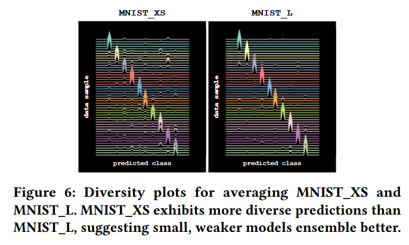

# Notes on AmigoLUT

ACM FPGA25’

## Part 1: Background and Challenges

### 1.1 Background

*   Domains like high-energy physics, cybersecurity and autonomous vehicles require** extremely high throughput and low latency** ML models. FPGA becomes an ideal candidate.
*   Previous LUT-based NNs like LogicNets and NeuralLUT meet this demand by carefully mapping neurons to LUTs.
*   LUT-based NN has **exponential LUT usage** with respect to neuron’s fan-in. A minimal accuracy increase of a denser NN utilizes far more LUT resource on a FPGA. (throughput also decreases)
*   Ensembling weak NNs together increases accuracy and LUT usage only **linear to the number of ensembled members**.
*   Ensembled NNs’** diversity** is crucial in accuracy improvement.
*   AmigoLUT doesn’t outperform SOTA(LogicNets、PolyLUT) but has lower resource usage on certain low accuracy benchmark.

### 1.2 Challenges

*   Which ensembling method: averaging, bagging or AdaBoost?

    *   Averaging!

*   How to analyze ensemble performance?

    *   Diversity plot!

*   How to implement ensemble models on FPGA efficiently?

    *   AmigoLUT!

## Part 2: Innovation and Contribution

### 2.1 Preliminaries

*   Ensembling Method

    *   **Averaging**: averaging the output of each member, train them dependently together(backpropagate)
    *   **Bagging**: averaging the output of each member, train them independently with unique dataset respectively(sampling data from the father dataset with replacement)
    *   **Adaboost**: weighted averaging the output of each member, train the members in a sequence. the latter model is trained with the data with less accuracy from previous model.

*   LUT-based NNs

    *   **LUTNet**: replacing XNOR with learnable K-LUT boolean operation. LUTNet improves NNs performance but scales exponentially with respect to the number of LUT input.
    *   **WNNs**: Its neurons are made up of logical LUTs. Poor scalability and the ability to generalize. DWNs improve the generalization ability.
    *   **Ensembling WNNs: **can improve accuracy but quickly hit diminishing returns as ensemble size increases.
    *   **LogicNet** & **NullaNet**: implement a neuron in a LUT
    *   **PolyLUT** & **NeuralLUT**: successors of the previous 2, piece-wise polynomial function to mimic neurons.
    *   Unfortunately, **the previous solution scales exponentially**.

### 2.2 Ensembling Method Analysis

**Ensemble LogicNet**

**Qualitative Method: Diversity Plot**

*   each line stands for a data
*   the higher the arrow is, this data is more predicted to the same data by ensemble members
*   0 error plot should be all arrows placed at diagonal line

**Quantify Method**

Diversity can be quantified by DER:

$$
DER = \frac{E_{m_i,m_j\sim\rho}[Disagreement(m_i,m_j)]}{E_{m_i\sim\rho}[Error(m_i)]}
$$

$$
Disagreement(m_i,m_j) = E_{x\sim D}[1\{m_i(x)\neq m_j(x)\}]
$$

$$
Error(m_i) = E_{x,y\sim D}[1\{m_i(x)\neq y\}]
$$

### 2.3 Quantization Architecture Tradeoffs

*   quantization is done by Brevitas, which quantize the input into target bit-width and then learn a floating-point scale factor.
*   Intuitively, this can be done as the left architecture on the left. But this solution requires significant resource overhead for unique quantization scheme and DSP for different scale factors.
*   To reduced the resource overhead, we can share the quantization module and abandon DSP. This solution, however, seriously damage accuracy.

### 2.4 AmigoLUT

*   A middle point between unique quantizer and shared quantizer.
*   Quantize to 6 bit first, then give the data to embedded members.
*   Additional NN layer is added to make sure the members are getting the addable result.

