# Notes on FlightVGM

## Part 1: Challenges and Goals

### 1.1 Goals

Achieve the efficient VGM inference on FPGA by exploiting its inherent sparsity

1.  VGMs are compute-bound due to the DiT structure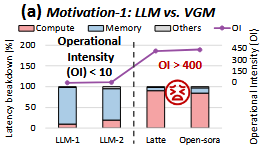

2.  GPU architecture fails to take advantage of sparsity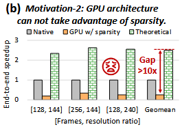

### 1.2 Challenges

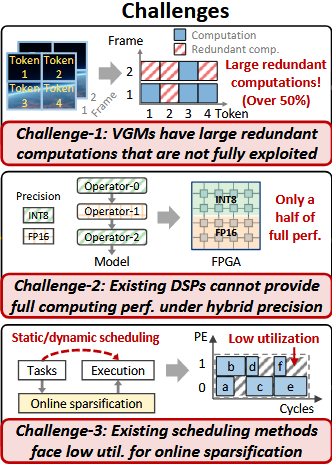

### 1.3 Preliminaries

1.  DiT-based VGM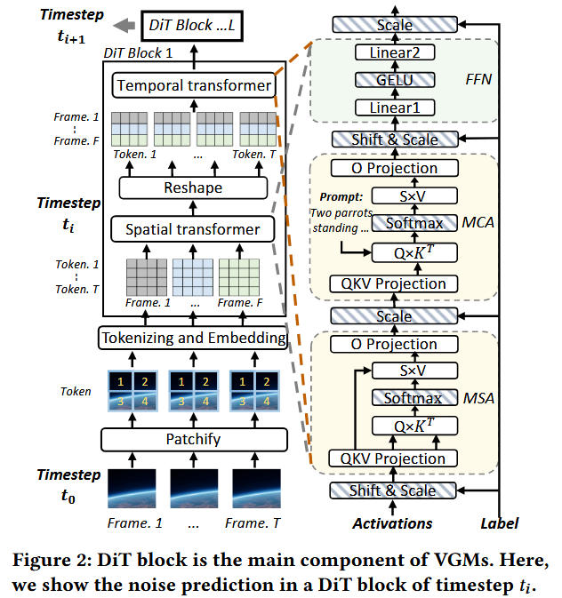

    *   VGM = cascaded DiT;
    *   DiT = spatial transformer+ temporal transformer;
    *   Both transformer = MSA + MCA + FFN;
    *   MSA for attention computation;
    *   MCA = MSA + embedded prompt’s influence

2.  Compression Method

    *   Activation Sparsification

        *   Previous work focus only on temporal dimension compression
        *   Both temporal and spatial dimensions should be concerned

    *   Hybrid Precision Quantization

        *   Int8 precision within DiT blocks
        *   FP16 precision outside DiT
        *   A balance between accuracy and cost savings
        *   FPGA implementation struggles at hybrid precision calculation

### 1.4 Design Methodology Overview

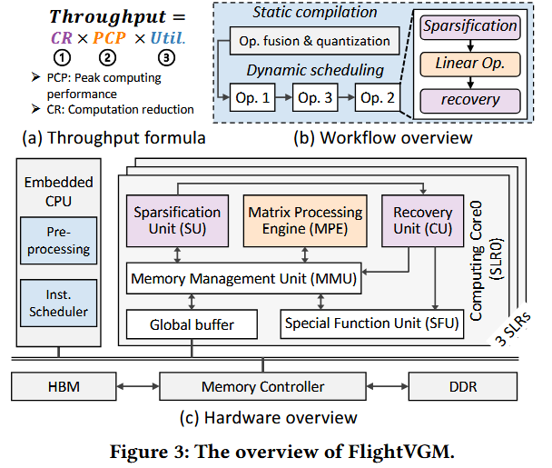

**Computation Reduction(CR) Oriented**

*   **Sparsification Unit(SU)** exploits the similarity between and within frames to achieve activation sparsification and computation reduction.
*   **Recovery Unit(RU)** recovers the output activation according to the index tables generated by the SU.

**Peak Computing Performance(PCP) Boosting Oriented**

*   **Matrix Processing Engine(MPE)** comprises a heterogeneous DSP array supporting FP16-INT8 hybrid precision to efficiently execute the compressed matrix multiplications.

**Utilization(Util) Improvement Oriented**

*   **Static compilation** implements the operator fusion and weight quantization
*   **Dynamic scheduling** adjust the execution order between operators to maximize utilization with sparsification

**Others**

*   **Special Function Unit(SFU)** supports non-linear operations (e.g., softmax, layernorm, and GELU).
*   **Memory Management Unit(MMU)** handles data transmission between the global buffer and the computing units.
*   **The embedded CPU** (e.g., the dual-core A72 processor on the V80 FPGA \[9]) is in charge of online instruction scheduling for workload balancing.

## Part 2: Innovations and Contributions

### 2.1 Spatial-Temporal Activation Sparsification

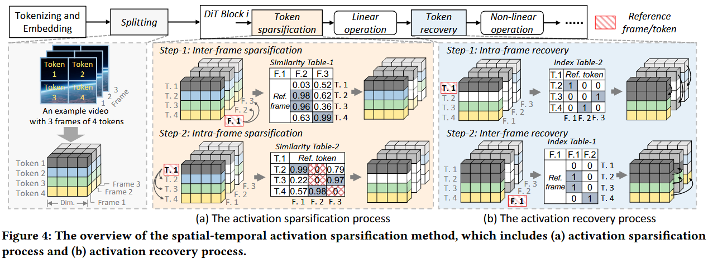

The sparsification process consists of sparsification and recovery.  The sequence of the process is shown in fig4. The idea of sparsification is **reducing the calculation of similar tokens by sharing the result of only one of them** in both inter-frame and intra-frame dimensions.

Degree of similarity:

$$
Sim = \frac{V_{ref}\cdot V_{in}}{||V_{ref}||\cdot||V_{in}||}
$$

If the similarity between a token with its reference token is above a threshold, its address would be recorded in a index table. Later in the recovery process, the linear operation’s result of the reference token would be shared with the sparsed one.

Detail of Hardware Units:

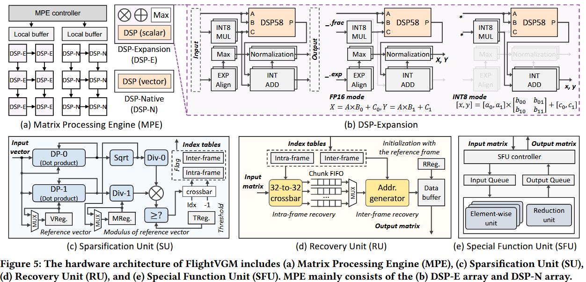

*   MPE computes linear operators: $Q\times K^T,\ S\times V$ and $shift\&scale$

    *   DSP-N(Native) is based on the native DSP58 and configured as the vector fixed-point ALU mode, 3 INT8 MACs parallel computation.
    *   DSP-E(Expansion) can be configured in INT8 mode and FP16 mode, which respectively support four INT8 MACs or two FP16 MACs.

*   SU computes similarity and compares it with programmed threshold

    *   output index table which contains the address of sparsed token
    *   store reference token’s value and its modulus in VReg and MReg separately

*   RU recover the computation results with index table

    *   data is initialized in RReg at first
    *   multi-cast input activation according to index table given by SU
    *   casting is done by crossbar and chunk FIFO

*   SFU performs non-linear operations: softmax, layer normalization…

    *   vector level parallelism
    *   pipelining matrix multiplication and non-linear operation

### 2.2 Hybrid Precision DSP58 Architecture

AMD V80 FPGA provides IP DSP58, which cannot be configured in run-time. Therefore a hybrid precision architecture is proposed, DSP58 with 2 external INT8 multipliers. It can configured to INT8 mode or FP16 mode at run-time.

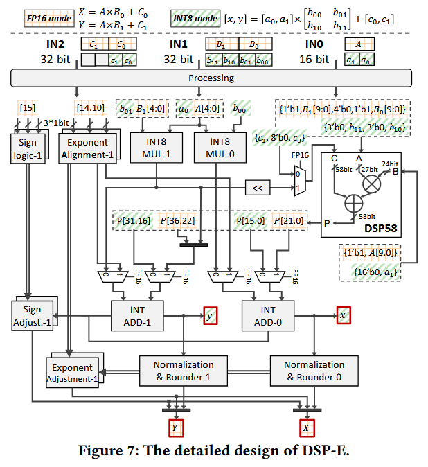

At FP16 mode, external INT8 multipliers are used to recover corrupted bits:

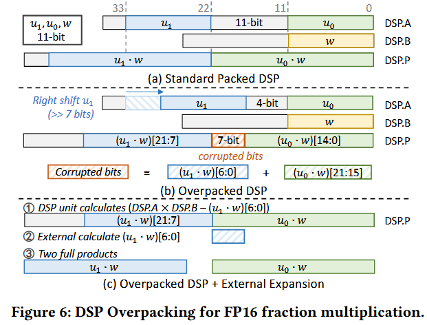

### 2.3 Dynamic-Static Adaptive Scheduling

ISA Categories:

*   Storage Management

    *   Commands: ST (store), LD (load), MOVE
    *   Computation Commands: MM (matrix multiply), SF (specialized function)
    *   Tensor Processing Commands: TS (tensor sparsification), TLT (tensor layout transformation)

*   Operator Execution Pipeline

    *   Weight Pre-loading (WL)

        *   Focus: Prepare weights for computation.

    *   Computation (COM)

        *   Focus: Execute core computational tasks (e.g., matrix operations).

    *   Tensor Processing (TP)

        *   Focus: Sparsify activations and reformat tensors for downstream use.

*   Compiler-Generated Instruction Sequences

    *   WL Instruction Sequence

        *   Sequence: LD → \[Optional MOVE] Stages:
        *   Load weights. Move weights on-chip (conditional step).

    *   COM Instruction Sequence

        *   Sequence: \[Optional LD] → MM/SF → TLT → \[Optional ST] Actions:
        *   Execute heavy computational tasks (matrix multiply/specialized functions). Restore data format via TLT. Conditionally store results.

    *   TP Instruction Sequence

        *   Sequence: \[Optional LD] → TS → TLT → \[Optional ST] Actions:
        *   Perform activation sparsification (TS). Convert compressed tensors to dense matrices compatible with MPE (Memory Processing Engine).

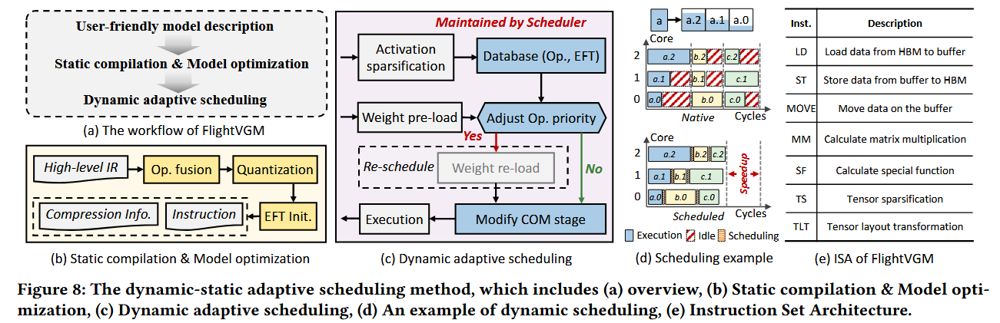

Dynamic Adaptive Scheduling Method

*   Core Objective

    *   Optimize computational utilization by dynamically adjusting operator execution order based on real-time workloads.
    *    Address scheduling challenges from online sparsification in compute-bound Vision Graph Models (VGMs).

*   Key Mechanism

    *   Priority Assignment: Operators with higher actual Estimated Finish Time (EFT) receive higher scheduling priority.
    *   Fallback: Uses predicted EFT for sorting if actual EFT is unavailable.

*   Scheduler Strategies

    *   Pre-load weights early to overlap Weight Loading (WL) and Computation (COM) phases.
    *   Assign high-priority operators to the earliest available computing cores.
    *   Trigger dynamic rescheduling when actual EFT differs significantly from predictions (prioritizing shorter EFT operators).

*   Database & Workflow

    *   Maintains a database containing:
    *   Operator types
    *   Predicted vs. actual EFT values
    *   Updates priorities in real time based on activation sparsification results.

*   Execution Phases

    *   Phase 1: Execute WL phase of operator (e.g., OpA) using predicted EFT (static info).
    *   Phase 2: After input activation’s Tensor Processing (TP) completes, obtain actual EFT of OpA.
    *   Rescheduling: Adjust priority and execute WL phase of newly prioritized operators if EFT changes.

*   Key Benefit

    *   Improves computational utilization compared to static/native mapping (Fig. 8(d)).
    *   Balances latency advantages of dynamic scheduling against memory access overhead in VGMs.

## Part 3: Performance

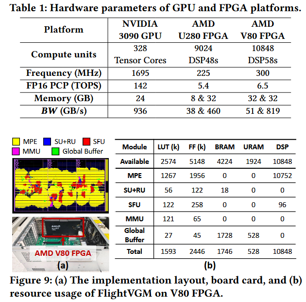

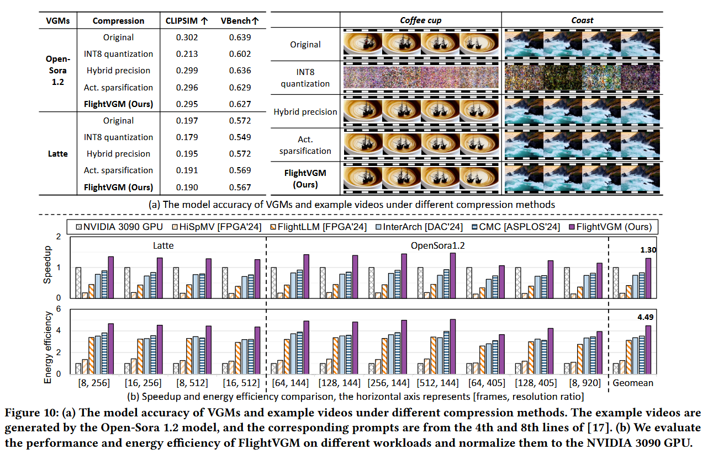

Ablation Studies and Discussion

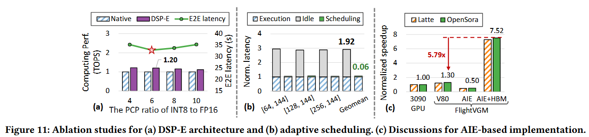
