# Notes on TreeLUT

ACM FPGA25’

## Part 1: Motivation and Objectives

## 1.1 Motivation

*   Machine learning is computation intensive, needs device like FPGA to accelerate
*   Former works are done to implement NNs on FPGA. These approaches need heavily quantized (thus hurting accuracy) and have time-consuming training process
*   GBDT performs equally well (outperform in some cases) as NNs
*   Former works of GBDT’s implementation on FPGA are either complex memory-based or have dramatic synthesis time

## 1.2 Objectives

*   Open source python library: training model -> RTL (edge to edge)
*   3-layer architecture: modular, scalable and efficient
*   Insert pipelining stages

## Part 2: Innovation and Contribution

## 2.1 Pre-knowledge

1.  Grandient Boosting Decision Trees (GBDT)

    *   DT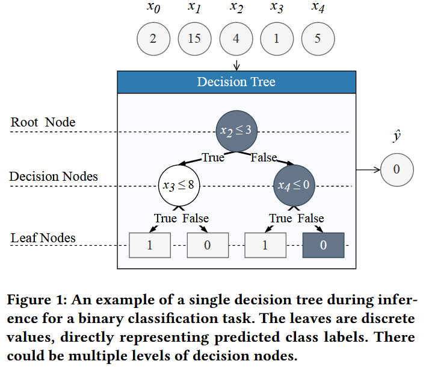

    *   GB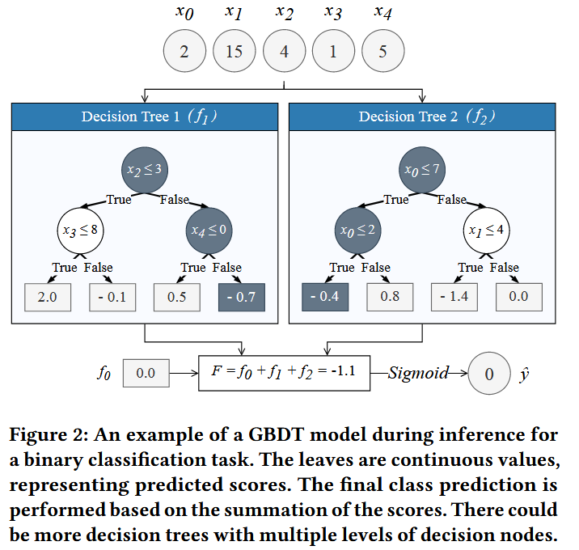the final prediction value is given as follows:

        $$
        F(X) = f_0 + \sum^{M}_{m=1}f_m(X)
        $$

    *   Binary classification = regression + sigmoid

    *   Multi-class classification = one-vs-all + softmax

2.  Quantization

    *   Threshold Quantization

        *   Boosting algorithm gives quantized threshold if the training data is quantized

        *   Quantization before training

        *   min-max normalization + w\_feature quantization:

            $$
            X_{normalization} = \frac{X-min(X)}{max(X) - min(X)}
            $$

            $$
            X_{quantizied} = round(X_{normalization}\times (2^{w\_feature}-1))
            $$

    *   Binary Classification Leaf Quantization

        *   Use the sum of every tree’s minimum leaf value for shifting

            $$
            \forall m \in {1,...,M},\ minLeaf_m = min_{X}(f_m(X))
            $$

            $$
            \begin{aligned}
            F(X) = & f_0 + \sum_{m = 1}f_m(X) & \\
            	 = & f_0 + \sum_{m=1}^{M}[f_m(X) - minLeaf_m] + \sum_{m=1}^{M}minLeaf_m & \\
            = & [f_0 + \sum_{m=1}^{M}minLeaf_m] + \sum_{m=1}^{M}[f_m(X) - minLeaf_m] & \\
            F(X) = & b + \sum_{m = 1}f_m'(X) & \\
            \end{aligned}

            $$

        *   Use the maximum of all tree’s biggest leaf value for scalingHyper parameter: w\_tree

            $$
            binaryScale = \frac{2^{w\_tree}-1}{max_{i,X}(f_i'(X))}
            $$

            $$
            \begin{aligned}F^{\prime}(X) & =F(X) \times \text { binaryScale } \\& =b \times \text { binaryScale }+\sum_{m=1}^{M} f_{m}^{\prime} \times \text { binaryScale } \\F^{\prime}(X) & =b^{\prime}+\sum_{m=1}^{M} f_{m}^{\prime \prime}(X)\end{aligned}
            $$

            $$
            \begin{array}{l}
            F^{\prime}(X) \approx Q F(X)=\operatorname{round}\left(b^{\prime}\right)+\sum_{m=1}^{M} \operatorname{round}\left(f_{m}^{\prime \prime}(X)\right) \\
            Q F(X)=q b+\sum_{m=1}^{M} q f_{m}(X)
            \end{array}
            $$

        *   example:

            $$
            \hat{y} \approx\left\{\begin{array}{ll}
            1 & Q F(X) \geq 0 \\
            0 & Q F(X)<0
            \end{array} \quad ; Q F(X)=q b+\sum_{m=1}^{M} q f_{m}(X)\right.
            $$

            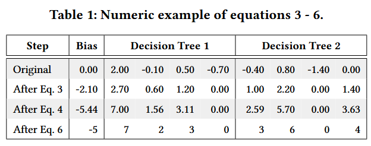

    *   Multi-class Classification Leaf Quantization

        *   the classifier is different:

            $$
            \hat{y}=\operatorname{argmax}_{n}\left(F_{n}(X)\right) ; F_{n}(X)=f_{0}+\sum_{m=1}^{M} f_{n, m}(X)
            $$

        *   Use the sum of every tree’s minimum leaf value for shifting (for each class)

            $$
            \begin{aligned}
            F(X) = & f_0 + \sum_{m = 1}f_{n,m}(X) & \\
            	 = & f_0 + \sum_{m=1}^{M}[f_{n,m}(X) - minLeaf_{n,m}] + \sum_{m=1}^{M}minLeaf_{n,m} & \\
            = & [f_0 + \sum_{m=1}^{M}minLeaf_{n,m}] + \sum_{m=1}^{M}[f_{n,m}(X) - minLeaf_{n,m}] & \\
            F(X) = & b + \sum_{m = 1}f_{n,m}'(X) & \\
            \end{aligned}

            $$

        *   Use the maximum of all tree’s biggest leaf value for scaling (for all classes)Hyper parameter: w\_tree

            $$
            multiScale = \frac{2^{w\_tree}-1}{max_{i,j,X}(f_{i,j}'(X))}
            $$

            $$
            \begin{aligned}F_n^{\prime}(X) & =F_n(X) \times \text { multiScale } \\& =b_n \times \text { multiScale }+\sum_{m=1}^{M} f_{n,m}^{\prime} \times \text { multiScale } \\F_n^{\prime}(X) & =b_n^{\prime}+\sum_{m=1}^{M} f_{n,m}^{\prime \prime}(X)\end{aligned}
            $$

        *   final result:

            $$
            \begin{array}{l}
            F_n^{\prime}(X) \approx Q F_n(X)=\operatorname{round}\left(b_n^{\prime}\right)+\sum_{m=1}^{M} \operatorname{round}\left(f_{n,m}^{\prime \prime}(X)\right) \\
            Q F_n(X)=q b_n+\sum_{m=1}^{M} q f_{n,m}(X)
            \end{array}
            $$

            $$
            \hat{y}=\operatorname{argmax}_{n}\left(QF_{n}(X)\right) ; QF_{n}(X)=qb_n+\sum_{m=1}^{M} qf_{n, m}(X)
            $$

3.  Hardware Architecture

    *   Overall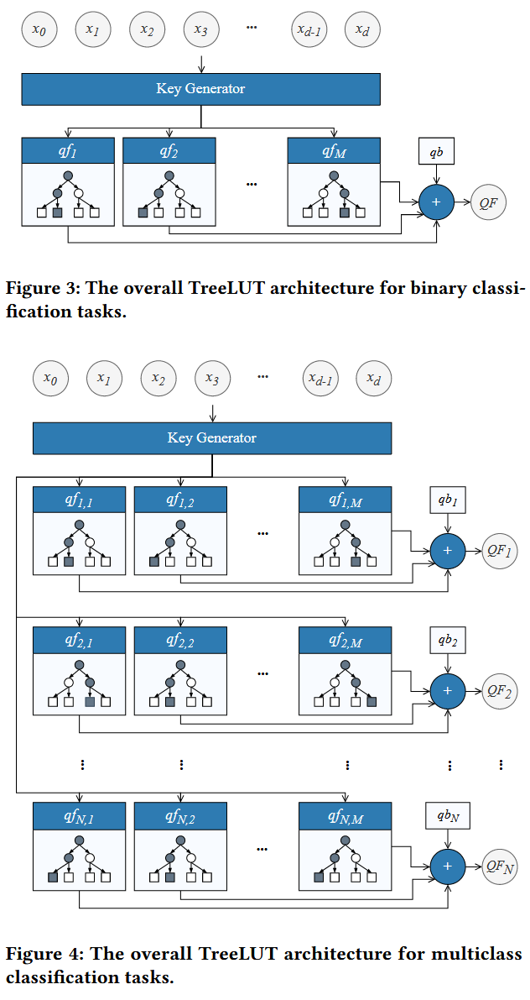

    *   Key Generator

        *   fully unrolled parallel comparators, each comparator’s output is 1 bit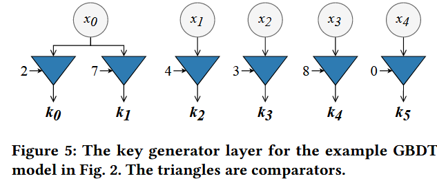

    *   Decision Tree

        *   fully unrolled parallel sets of MUX, each tree’s input is the key generated before: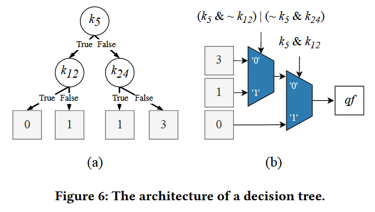

    *   Adder

        *   Use adder tree structure
        *   In binary classification, we can compare bias with accumulated trees’ output instead of adding up bias

4.  Pipelining

    *   \[p0, p1 ,p2] are hyper-parameters

    *   <a href="zotero://open/library/items/I6CVLCM6?page=6">“p0 and p1 show if there are any pipelining stages after the key generator and decision tree modules, respectively.”</a>(<a href="zotero://select/library/items/3SWQS9A4">Khataei 和 Bazargan, 2025, p. 5</a>)

    *   The parameter p2 controls the number of pipelining stages in adder tree modules. Rather than inserting registers at every level, they are uniformly distributed across select levels according to the adder tree depth. For instance, when the adder tree depth is 6 and p2=1, only the third level contains a pipelining stage after the adders.

2.2 Tool Flow

A python library(edge to edge) is open-sourced. Users first decide quantization parameters and boosting parameters to obtain a target accuracy. Then, decide the pipeline parameters manually.

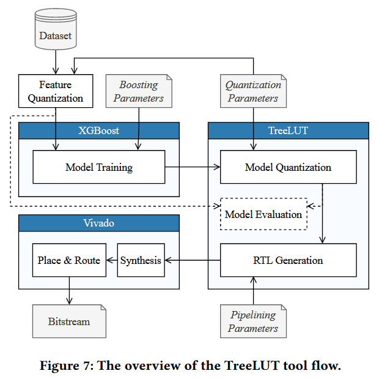

## Part 3: Performance

3.1 Model Training and Quantization

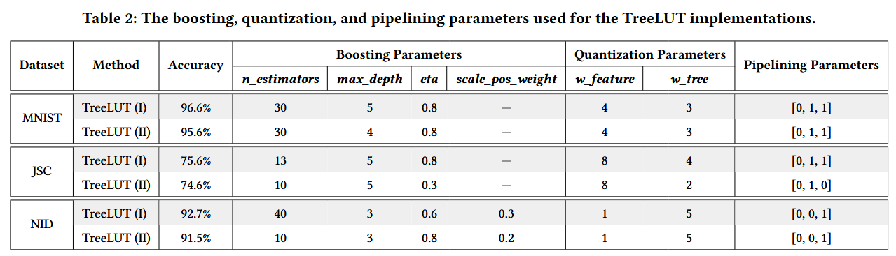

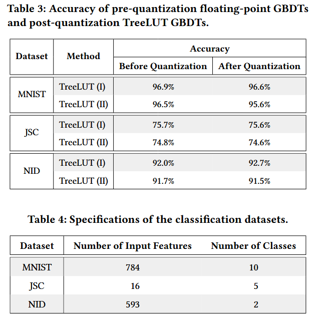

3.2 Hardware Implementation

*   <a href="zotero://open/library/items/I6CVLCM6?page=7">“we used the xcvu9p-flgb2104-2-i FPGA part with the Flow_PerfOptimized_high settings in the Out-of-Context (OOC) synthesis mode.”</a>(<a href="zotero://select/library/items/3SWQS9A4">Khataei 和 Bazargan, 2025, p. 6</a>)

3.3 Discussion

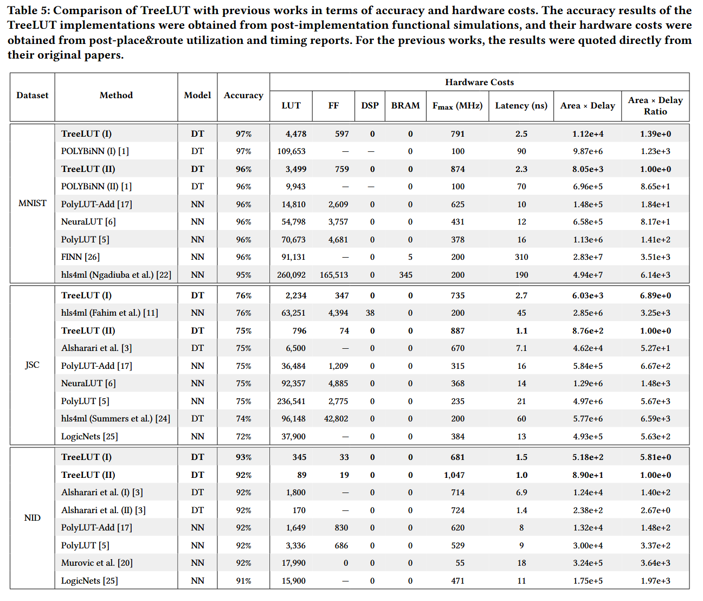

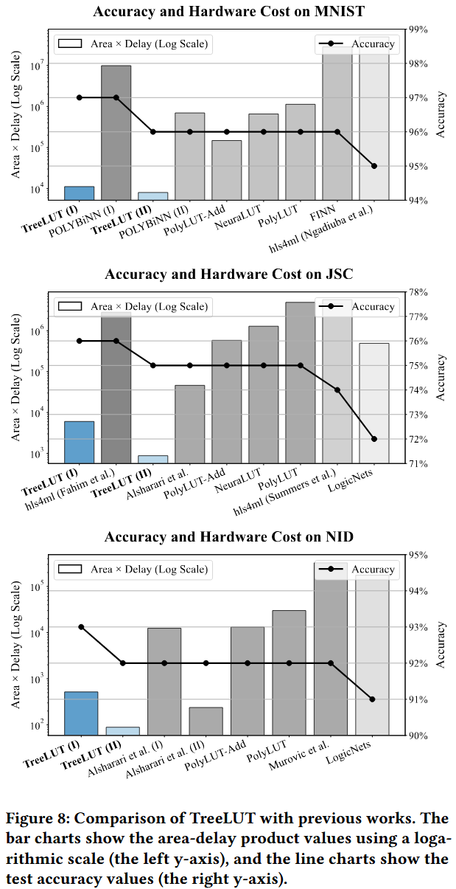

TreeLUT performs better in terms of scalability:

*   Hardware cost hardly increases as accuracy increase
*   TreeLUT tool directly generate RTL without HLS
*   A simpler version of GBDT is used here

TreeLUT has lower area-delay product then DWN when they have the same accuracy.

<a href="zotero://open/library/items/I6CVLCM6?page=10">“DWN [8] is a recent LUT-based NN work. In this method, input data is binarized using a distributive thermometer encoding scheme [7], consisting of a set of comparisons with thresholds.”</a> (<a href="zotero://select/library/items/3SWQS9A4">Khataei 和 Bazargan, 2025, p. 9</a>)
