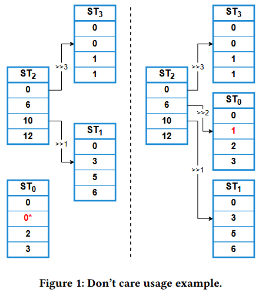
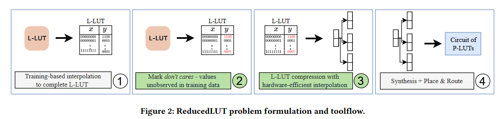
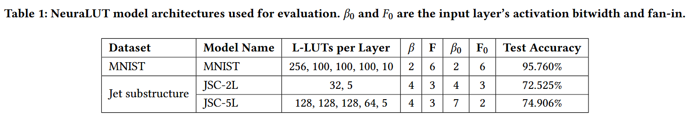
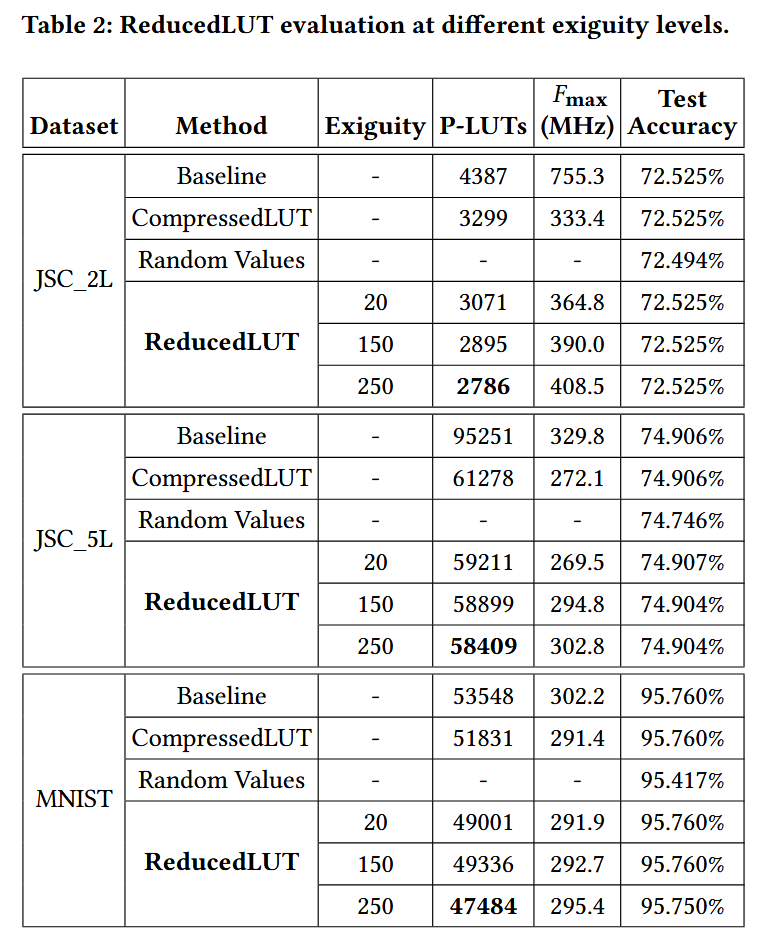
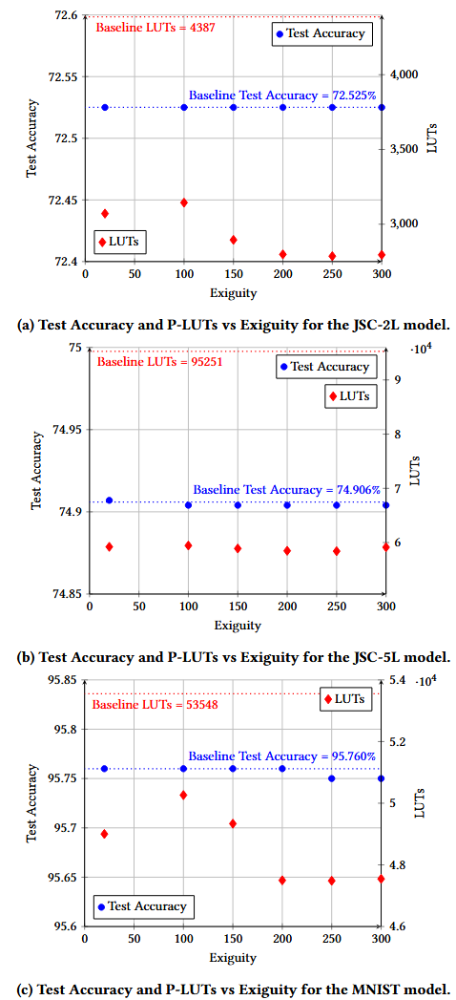

# Notes  on ReducedLUT

ACM FPGA25�

## Part 1: Motivation and Objectives

## 1.1 Motivation

* L-LUT(logical LUT) is composed of many P-LUT(physical LUT)
* Traditional compression methods utilize the target NNs� self-similarity and redundancies to break down L-LUT into smaller components
* Recent NNs have poor self-similarity, traditional methods are proven inefficient

## 1.2 Objectives

* Introduce ReducedLUT, an open-sourced L-LUT compression method that leverages don’t care conditions
* Near-zero accuracy drop, yet huge drop in terms of P-LUT utilization
* Make NNs� implementation on FPGA easier than former approach

## Part 2: Innovation and Contribution

### 2.1 Pre-knowledge

2.1.1 LUT-based NN

* L-LUT in NNs� implementation on FPGA has great advances (latency�)
* Prior works� solutions are absorbing neurons or even entire sub-networks into a L-LUT
* Exponential growth in L-LUTs� size and input dimensions makes L-LUT to be irregular, lacking predictable patterns and logic simplification freedom

2.1.2 LUT compression

* The original table T is decomposed into a  $T_{bias}$  and a group of  $T_{st}$
* $T_{bias}$  stores the minimum values of  $T_{st}$ ,  $T_{st}$  stores the residuals
* many  $T_{st}$  show great self-similarity(many can be reconstructed using the index and shift information), therefore, we can further decomposed  $T_{st}$  into  $T_{ust}$ ,  $T_{idx}$  and  $T_{rsh}$ :
* The input of the table T can be decomposed into  $x=\{x_{hb},x_{lb}\}$ ,  $x_{lb}$  gives the information of the corresponding  $T_{ust}$   
* $$
  T[x] = (T_{ust}[\{T_{idx}[x_{hb}],x_{lb}\}]>>T_{rsh}[x_{hb}]) + T_{bias}[x_{hb}]
  $$
* For tables with higher dynamic range and large local variations, the table can be divide into  $T[x] = \{T_{hb}[x],T_{lb}[x]\}$ . The lower bits table is not compressed. The higher bits table undergoes previous compression  
* In this paper, **don’t care** conditions provide more freedom in tables� self-similarity exploitation
* ReducedLUT example($T_{bias}$ not shown):\ | 440" />

### 2.2 ReducedLUT Methodology

### 2.2.1 Identification of Don’t Care Conditions

\ | 1139" />

In step 3, the compression is done by following:

$$
min_{\tilde{f}\in F}\ \ area\_cost(\tilde{f})
$$

$$
subject\ to\ \ \tilde{f}(x_i) = f(x_i),\ \ \forall x_i \in X_{train}
$$

### 2.2.2 L-LUT Compression

1. L-LUT table, T, is first decomposed into a set of sub-tables:

   $$
   T_{st} = \{ST_1,...,ST_n\}
   $$
2. Generate similarity matrix:

   $$
   SM_{i,j} = 1\ and\ SM^{rsh}_{i,j}\Leftrightarrow\ \forall k, ST_i[k] = ST_j[k]
   $$
3. ReducedLUT first treats every entry as a care, then find out unique sub-table in a descending order iteratively. (Similar to QM method)
4. Change the don’t-care entry in STmin so that it can be generated from STmax. (If not success, try the second ST)
5. If the replacement is successful, check whether STmin’s dependencies can be generated by the rest of ST
6. Intermediate data is stored for possible rollback in case of local (not global) best compression .
7. Boolean mask is used to ensure that the replaced don’t-care entry won’t be changed twice.

### 2.2.3 Exiguity

In section 2.2.2, the merging process of 2 ST is followed by a re-generation check(step 5). If the don’t-care entry of STmin is changed, STmin’s dependencies may not validate because dependent tables� corresponding entry must also change. Therefore we need to ensure that STmin’s dependencies must be able to be re-generated by the remaining STs.

However, STs with too much dependencies make this check too difficult.

**Exiguity is a threshold value**, above which, STs are no longer needed to be merged.

## Part 3: Performance

<a href="zotero://open/library/items/W3ZPBI3E?page=5">he final 6-input P-LUT utilization is obtained through<strong> Vivado 2020.1 </strong>synthesis, selecting the <strong>xcvu9p-flgb2104-2-i FPGA part</strong>, to allow direct comparison to NeuraLUT [2].�</a> (<a href="zotero://select/library/items/KE5Z8HI3">Cassidy �, 2025, p. 5</a>)

### 3.1 Benchmarks

NeuraLUT(baseline) + CompressedLUT/ReducedLUT/Random\_Insertion

### 3.2 Optimization Result

1. **Methodology**

   * Proposed **ReducedLUT**, a compression framework leveraging "don’t care" conditions in L-LUTs.
   * Compared against **Baseline** (NeuraLUT/Vivado) and **CompressedLUT** across three benchmarks:
     **JSC\_2L**, **JSC\_5L**, and **MNIST**.
2. **Results**

   * **P-LUT Utilization Reduction**:

     * **JSC Models**: 36% (2L), 39% (5L) reduction vs. baseline; **MNIST**: 11% (limited by 2-bit L-LUT outputs).
     * **Geometric Mean**: ReducedLUT outperforms CompressedLUT by **8.7%**.
   * **Exiguity Impact**: Higher exiguity values (e.g., 250) yield greater P-LUT savings but trigger compression saturation (e.g., JSC\_5L’s compact sub-tables).
3. **Critical Observations**

   * **MNIST Limitation**: Low output bitwidth � high local variation � reduced sub-table self-similarity � limits compression efficiency.
   * **Timing Benefits**: Simplified logic in ReducedLUT reduces synthesis latency vs. CompressedLUT.
4. **Generalization Analysis**

   * Algorithm prioritizes compression without explicit accuracy optimization.
   * **Occam’s Razor Alignment**: Compression decisions incidentally preserve network accuracy (validated via randomization tests).
5. **Runtime Overhead**

   * ReducedLUT requires **1.37× longer runtime** than CompressedLUT at exiguity=250, with **19% latency increase** when exiguity rises from 20�250.

## Part 4: Future Work

1. **Expanded Scope**: Generalize the “don’t care� set to include *infrequent training values* for deeper compression (minimal accuracy trade-off).
2. **Group-Level Optimization**: Develop joint compression strategies for L-LUT clusters to enhance resource sharing and hardware efficiency.
