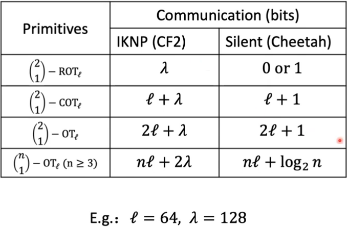

# Cheetah: Lean and Fast Secure 2PC DNN Inference

## Part 1 Background 

### About Secure NN Inference

Resnet50: one of the most popular DNN models

However, secure 2PC Resnet50 inference takes lots of time:

* Prior best work: CryptFLOW2
* 10 mins for 1 image(224*224 rbg) inference (LAN, 3Gbps)
* 20 mins for 1 image(224*224 rbg) inference (WAN, 300Mbps)

### Design  Chanllenges in 2PC Frameworks

* Optimize trade-offs among different primitives
* Adapt to concrete application

### Cheetah Protocol Architecture

### Additive Secret Sharing Recap

* Integer $a\in[0,P)$ is split into shares $a_1,a_2$
  * Computation party $P_i$ has share $a_i$
  * Satisfy $a_1+a_2\ mod\ P=a$
* Local Add/Sub computation
* 2 types of sharings depending on modulus P
  * P=2: Boolean share
  * P>2: Arithmetic share, typically, P is a prime or a power of 2

## Part 2 Linear Primitives

### Linear Layers: CONV, FC

* CONV/FC: Matrix Mult $\rightarrow$ Inner Product
* Input:
  * Alice(model owner): vector $\hat{a}$
  * Bob(data owner): vector $\hat{b}$
* Output:
  * Alice: r
  * Bob: $\hat{a}\cdot\hat{b}-r\ mod\ k$

Here, the encryption is HE

### Computation based on Polynomials

* Plaintext space for BFV: Polynomial Ring
  * Polynomial $Z_t(x)/(X^N+1)$
  * Degree of N-1. Each integer coeff in $[0,t-1]$
  * Ciphertext add/mul $\leftrightarrow$ Polynomial add/ mul
  * 

### Packing: CRT Batching

* Encode data into polynomials:
  * $x^n+1$ can be broken into the product of n polynomials: $x^n+1 = (x+a_1)(x+a_2)...(x+a_n)$
    * E.g.: t=17, n=2 $\rightarrow$ $x^2+1=(x-4)(x-13)$  // $x^2-17+25\ mod\ 17$
  * $f(x)\ mod\ (x^n+1)$ can be represent  n integers: $x_i = f(x)\ mod\ (x+a_i)$
    * E.g.: $x\ mod\ (x^2+1)\rightarrow x\ mod\ (x-4)\ \&\ x\ mod\ (x-13)$: $\ x\ mod\ (x^2+1)$ packs 4 and 13
* Given n integers, find  corresponding $f(x)$ to encode them by CRT
  * E.g.: $2x-7$ packs 1 and 2 // 2x-7 mod (x-4) = 1, 2x-7 mod (x-13) = 19 mod 17 = 2
* Packing keeps homomorphism modulo t
  * Add: $x+(2x-7)$ packs 5 and 15 // 3x-7 mod (x-4) = 5, 3x-7 mod (x-13) = 32 mod 17 = 15
  * Mul: x*(2x-7) packs 4 and 9 // $2x^2-7x\ mod\ (x^2+1) = -7x-2$, -7x-2 mod (x-4) = 4, -7x-2 mod (x-13) = -93 mod 17 = 9
* SIMD: 1 polynomial calculation completes n integer calculations

### Precondition of SIMD Packing in BFV

* Almost all efficient BFV applications use SIMD Packing

  * 1 poly mult $\rightarrow$ 1000+ plain integer mults
* SIMD requires plain modulus t to be a prime

  * Secret sharing has to work in prime field in a mixed protocol
  * Performance degrades significantly (60% more overhead in CryptFlow2)

### Inner Product 1st Try: SIMD Packing + Ciphertest Rotation

* A has a vector $a=(a_0,a_1,...,a_n)$, B has a vector $b=(b_0,b_1,...,b_n)$
* A SIMD packs a as a poly $A(x)/X^N+1$; B SIMD packs b as a poly $B(x)/X^N+1$;
* B uses its public key to encrypt $B(x)$, and send to A
* A performs homomorhic mult on Enc(B(x)) and A(x) $\rightarrow$ Obtains $Enc(C(x))/X^N+1$
  * C(x) packs $(a_0b_0,...,a_n,b_n)$
  * Innerproduct needs to sum those up
* A rotates the ciphertext Enc(C(x)), obtaing
  * 
  * then perform homomorphic add to get (ab,...,ab), sends to B, and B decrypts to get ab
* Needs log(n) rotates and n adds

### 2D Convolution

Multiplication between a long poly an d a shart poly $\rightarrow$ Convolution

Valid Padding

The whole tensor needs to be encoded into a poly of degree N

* HWC$ \ \leq$ N (valid padding)
* (H-h+1)(W-h+1)C$\ \leq$ N (valid still)
* (rare case) when stride s >= h, we can skip some computation

Big tensor (HWC>N) can be split into small tensors

* Along Channels: just a simple addition in the ends
* Along Height/Width: Might contain overlaps

## Part 3 Non-Linear Primitives

### OT (Primitive)

this section is discribed in "OT.md"

### Non-Linear Layer (ReLU, MaxPool)

ReLU = max(x,0)

* Input: Alice, Bob: Secret-shared x
* Output: Alice, Bob: Secret-shared DReLU(x)*x
* DReLU(x) = 0(if x<0), 1(otherwise)

### Millionaire problem

Solution 1: Boolean addition -a and b, then examine MSB

Solution 2: Comparison Tree (CryptFlow2)

Optimization: CTree down to 4 bit block comparison instead of 1 bit

This can Minimize comm. rounds and AND gates

Notice that CryptFlow2 uses classic IKNP-OT

In Cheetah, they use Silent OT based on VOLE (Ferret)

This approach can generate massive amount of RCOT with little comm.

We then use RCOT to generate other OT varient

### Primitives in Compare:

### Truncation

Motivation:

* Fixed point numbers for MPC
  * value is 0.5, scale is $2^{15}\rightarrow$ FP representation: $0.5\times2^{15}=16384$
* Problem: multiplication increases the scale
  * $0.5\times0.5\rightarrow16384\times16384=268435456=0.25\times2^{30}$
  * several mults would leads to an overflow
* Need a method to truncate secret-shared values to maintain the scale
  * plain truncation: x>>15
  * we cannot do it locally:
    * x=x1+x2 mod 2^k, therefore (x>>15) != (x1>>15) + (x2>>15)

Cheetah: Efficient silient OT-based truncation protocol

(1/2 probability with tiny one-bit LSB error)

## Part 4 Performance and Summary

### Performance

SqNet=SqueezeNet;  RN50=ResNet50;  DNet=DenseNet121

$SCI_{HE}$: CryptFlow

SecureQ8: State-of-art 3PC framework
