# CrypTFlow2: Practical 2-Party Secure Inference

### Part 0 Background and Motivation

    The prediction of neural network inference under 2PC is always a difficult research problem. The first difficulty is the huge cost of nonlinear computation, such as comparison and division. The other is the loss of accuracy.

    CrypTFlow2 proposes a new protocol for security comparison based on Oblivious Transfer (OT) and deeply optimizes the protocol. Furthermore, several operator protocols for neural networks are designed based on the comparison protocol, such as ReLU, Truncation, faithful Division (divisor is public), Avgpool, and Maxpool.

    In addition, two versions of the ring$\ \mathbb{Z}_L(L = 2^l)$ and $\mathbb{Z}_n$ (n is any large integer) are designed in this paper, so as to adapt the linear layer computation for OT and Homomorphic Encryption (HE).

    Finally, the code for this article has been open sourced, linked to:[https://github.com/mpc-msri/EzPC/tree/master/SCI]()

### Part 1 Premliminaries

    This paper is aimed at the semi-honest adversaries in two-party computation, mainly using the additive secret sharing under two parties, OT, OT constructed AND triples, Multiplexer, and B2A transformation, and HE, where secret sharing is already familiar, and HE is mainly used in the linear layer of neural networks. The core construction of this article is based on OT, and we mainly review the knowledge of OT here.

*Notation :*

* $$
  w\leftarrow^{s} W
  $$

  For a set W, w is an element randomly selected from W.
* $$
  [l]
  $$

  denotes the set of integers ${0,..,l-1}$
* $$
  1\{b\}
  $$

  denote the indicator function that is 1 when ? is true and 0 when ? is false.

##### 1.1 Oblivious Transfer

    OT is very clear in terms of its function. The standard definition of 1-out-of-2 OT involves two parties: the sender S holds two bits of information, and the receiver R holds a selection bit. After the OT protocol is executed,R can get the information of the index corresponding to the selection bit, but cannot get other information, and S does not know which information R selects. It can be generalized to 1-out-of-n OT, that is, the receiver needs to secretly obtain a certain information from the n messages of the sender. Similarly, it is further extended to k-out-of-n OT, that is, out of n messages from the sender, the receiver secretly obtains k messages.

    In the OT protocol, the sender has all the data rights, the receiver has the option of a single data, the data exchange is completed inadvertently, while ensuring the privacy of the private data of both sides.

##### 1.2 OT-based MUX and B2A

###### $F_{MUX}$:

* input: $\lang a\rang^n$ and $\lang c\rang^B$
* output: if c = 1, output $\lang a\rang^n$; otherwise, output shares over 0

Based on $\begin{pmatrix}2\\1\end{pmatrix}-OT_{\eta}$, $x_0 = -r_0 + c\cdot\lang a\rang^n_0$, $\ x_1 = -r_1 + c\cdot\lang a\rang^n_1$. Therefore, $z = z_0 + z_1 = c\cdot a$. Since OT is used twice, the communication expense is $2(\lambda + 2\eta)$.

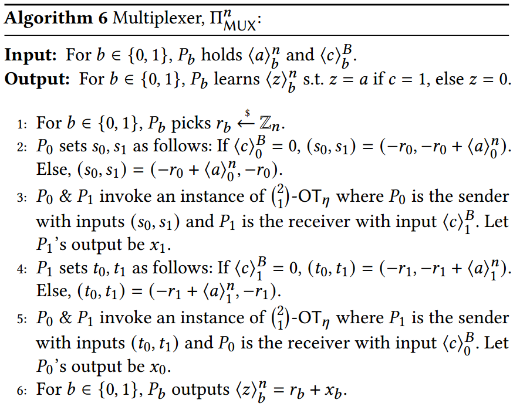

###### $F_{B2A}$:

* Input: $\lang c\rang^B$;
* output: $\lang d\rang^n$, which satisfies $d=c$.

Since $d = \lang c\rang^B_0 + \lang c\rang^B_1 - 2\lang c\rang^B_0 \cdot \lang c\rang^B_1$, the key is on the product term. Based on $\begin{pmatrix}2\\1\end{pmatrix}-OT_{\eta}$, $y_1 = x+\lang c\rang^B_0 \cdot \lang c\rang^B_1$. Therefore, $\lang d\rang^n_0 = \lang c\rang^B_0  + 2x$. Since OT is used twice, the communication expense is $\lambda + \eta$.

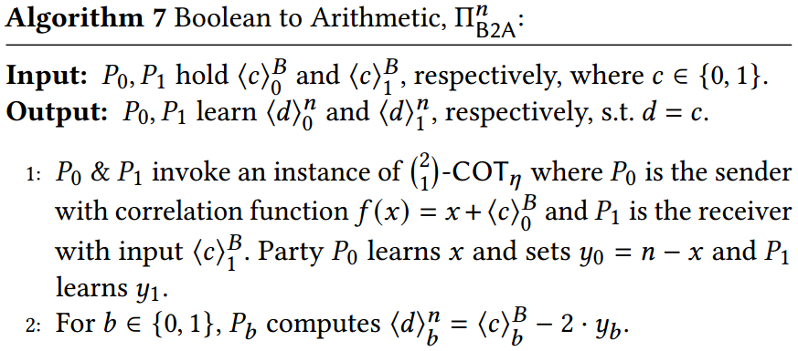

### Part 3 Millionaries' and DReLu Protocols (non-linear)

##### Millionaires' protocols

###### General idea

    Input :$ P_0$ has $x\in \{0,1\}^l$ and $ P_1$ has $y\in \{0,1\}^l$

    output :$P_0, P_1$ learn shares of $\{x>y\}$

for $x = x_1||x_0,\ \ y = y_1||y_0$ :

$$
\{x>y\} = \{x_1<y_1\}\oplus (\{x_1 = y_1\}\wedge\{x_0<y_0\})
$$

$$
\{x=y\} = (\{x_1 = y_1\}\wedge\{x_0=y_0\})
$$

> In GSV07, we conduct this comparison until the single bit-leaves

In CRTF2, however, we stop at $q = l/m$ leaves; $x_i,y_i\in\{0,1\}^m$ and conduct$2\times\begin{pmatrix} M\\ 1\end{pmatrix}-OT_1$  on each leaf; $M = 2^m$

    This change is efficient only for small bitlengths, such as$\ m=4$

Communications for $m = 4$: $6\lambda l\rightarrow2\lambda l$

After more optimizations: $2\lambda l\rightarrow\lambda l$

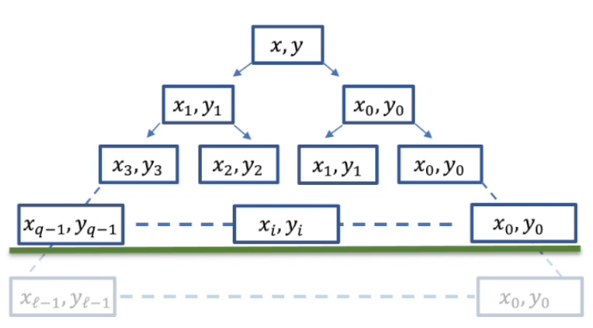

###### Protocol 

    As shown in the picture below. Let$\ M = 2^m$ and consider a simple case $q = l/m$, where q is to the power of 2. By recursing $log_2^q$ times, we obtain a tree with q leaves. Each leaf has m bits, i.e. $x = x_{q-1}||...||x_0$ and $y = y_{q-1}||...||y_0$, where $x_i,y_i\in\{0,1\}^m$. By doing so, both parties can take advantage of $\begin{pmatrix}M\\1\end{pmatrix}-OT$ and use its comparision function and equivalence function. After calculating those leaves, we can calculate AND and XOR recursively to the root node in order to get the final output.

详细的协议如下，下面介绍协议的具体内容：
输入：$P_0,\ P_1$ 分别输入x,y,这两个数都是l位的二进制串

输出：$P_0,\ P_1$ 分别得到比较结果的秘密分享值，一个比特位。

第一步：$P_0$把输入x分成q个子串，$P_1$把输入y分成q个子串，每个子串的大小是m。

第二步：设M=2^m
第三步：对于j=0到q-1进行循环。
第四步：$P_0$随机选择两个比特位。这两个比特位是用于得到结果的秘密分享的。

第五步：对于k=0到M-1循环.
第六步：$P_0$设置发送的$s_{j,k}$ ，s用于得到等式$x_j < k$的值

第七步：$P_0$设置发送的$t_{j,k}$ ，t用于得到等式$x_j = k$的值

第八步：结束k的循环
第九步：$P_0,\ P_1$调用1-out-of-M OT协议，即从M个数据$s_{j,k}$中选择一个。$P_0$作为发送方，输入是M个数据$s_{j,k}$，$P_1$作为接收方，输入是$y_j$

第十步：$P_0,\ P_1$调用1-out-of-M OT协议，即从M个数据$t_{j,k}$中选择一个。$P_0$作为发送方，输入是M个数据$t_{j,k}$，$P_1$作为接收方，输入是$y_j$

第十一步：结束j的循环
第十二步：对于i等于1到l $log_2q$
第十三步：对于j等于0到$\frac{q}{2^i}-1$
第十四步：计算等式和不等式的与
第十五步：本地进行异或操作就可以了。因为异或相当于相加，根据秘密分享的可加性，可以本地计算。
第十六步：计算等式和等式的与，用于上一层等式的判断。注意此时比特位的含义代表的是比较的结果，而非x，y本身的位。
第十七步：结束j的循环
第十八步：结束i的循环
第十九步：输出最后的结果。

*See the appendix for a detailed code-reading*

###### Security Proof

The author simply deduced that the resulting output could equal the result of the comparison. Security follows OT

and $F_{AND}$'s Security of hybrid protocols

###### Generalization

1. In the case that m does not divide l, for l mod m=r, which is the remainder of l divided by m, run it separately
2. If q is not a power of 2, consider $2^a < q \leq 2_{a+1}$, So let's take $2^a$ part as a fragment to build a perfect binary tree. Finally, compare the value of the perfect binary tree with the rest of the comparison.

###### Optimization

1. In steps 9 and 10, OT is used to combine two 1-bit $\begin{pmatrix}M\\1\end{pmatrix}-OT$ into a 2-bit $\begin{pmatrix}M\\1\end{pmatrix}-OT$. Because $P_1$'s input is still $y_j$
2. In steps 14 AND 16, we use AND. Use related AND, that is, the AND protocol with the same input, to save expenses.
3. For the entire binary tree, the least significant fork of the equation is never used, so it can be omitted.

###### Communication

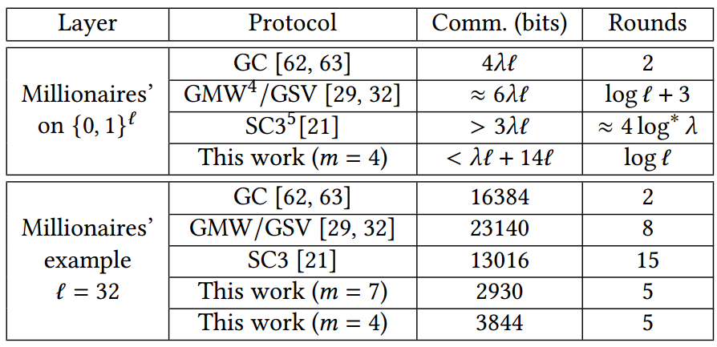

##### Protocol for DReLU

###### General idea

    Over$\ Z$, $DReLU(x) = \begin{cases}0,\ x<0\\1,\ x\geq0\end{cases}$

    Over$\ Z_n$, $DReLU(x) = \begin{cases}0,\ x\in[\lceil\frac{n}{2}\rceil,n)\\1,\ x\in[0,\lceil\frac{n}{2}\rceil)\end{cases}$

Input: $\ P_0 $ has $x_0 \in [0,n)$ and $\ P_1$ has $x_1\in[0,n)$; s.t. $x_0 + x_1 = x \ mod\ n $

Output: $P_0,\ P_1$ learn shares of $DReLu(x)$

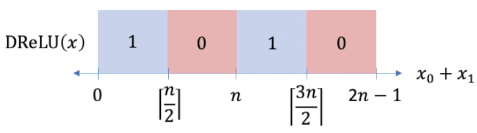

Computing DReLU(x):

* Simple: 3 calls to Millionaires'
* Optimized: 2 comparisons
* In particular: for $n = 2^l$, only needs 1 comparison

$$
lt: x_0 + x_1 \geq \lceil\frac{n}{2}\rceil \Leftrightarrow x_0 + \lfloor\frac{n}{2}\rfloor > n-1-x_1
$$

$$
wrap: x_0 + x_1 \geq n \Leftrightarrow x_0  > n-1-x_1
$$

$$
rt: x_0 + x_1 \geq \lceil\frac{3n}{2}\rceil \Leftrightarrow x_0  +\lfloor\frac{n}{2}\rfloor> 2n-1-x_1
$$

###### Protocol

Over$\ Z$, $x_0, x_1\in \{2^l\}$

We can use 2's complement to encode $a_0,a_1$, where $a = a_0\oplus a_1$

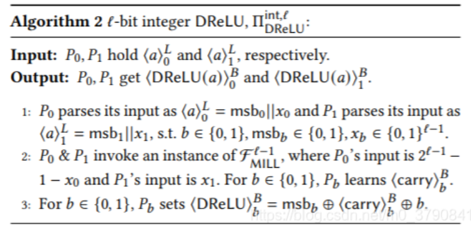

It is obvious that the result of DReLU can be deduced by the MSB of a. (the result is the inversion of the MSB for a)

    Step1:  we can divide a0 and a1 into 2 parts

    Step2: online, we only compare$2^{l-1} - 1 - x0$ and $x_1$ by Millionares'

    Step3: offline, we generate$[DReLU]_b = msb_b\oplus[carry]_b\oplus b$

The last b is used as an inversion of the MSB for a.

Over$\ Z_n$,

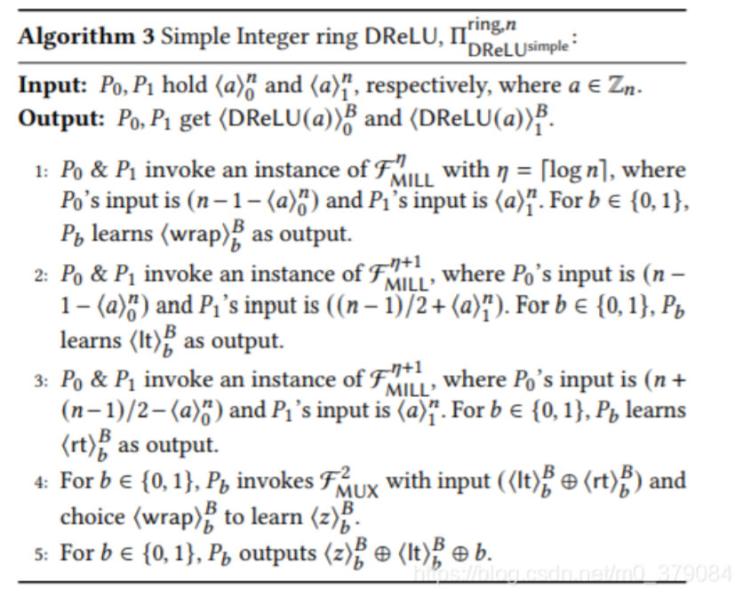

In the first 3 steps, we obtain the share of lt, wrap, and rt

    Step 4: if wrap = 1, z = lt XOR rt; else, z = 0, we can interpret as, [0,0,1,0]

    Step 5: Pb = z XOR lt XOR b , we can interpret as, [1,0,1,0]

###### Optimization

1. First let $P_1$ adjust the input of step 1, 2, 3 to be consistent, so that the leaf nodes in $F_{Mill}$ can be calculated together (step 9 & 10 algorithm 1). The specific method is to add $\frac{n-1}{2}$, to $P_1$ 's input of step 1&3 in algorithm 3;
2. Further, the $P_0$ reduces the execution of step 2 or step 3 according to its input. That is, if $\lang a\rang_0^n>\frac{n-1}{2}$, then $it = 1$ in step 2; Otherwise, $rt = 0$ in step 3.

    Correctness can be easily deduced if we take the input of$P_1$ in step14 into the OT protocol from step 5 to step 12.

    Since$\lang z\rang_0^B$ is completely random, the safety can be proved by $(F_{Mill}^{\eta+1},\begin{pmatrix}4\\1\end{pmatrix}-OT)$-hybird model.

    Algorithm 4 calls$\ F_{Mill}^{\eta+1}$ twice and $\ \begin{pmatrix}4\\1\end{pmatrix}-OT$ once. Total communication < $\frac{3}{2}\lambda(\eta+1) + 28(\eta + 1) + 2\lambda +4$, which is better than algorithm 3$\times$.

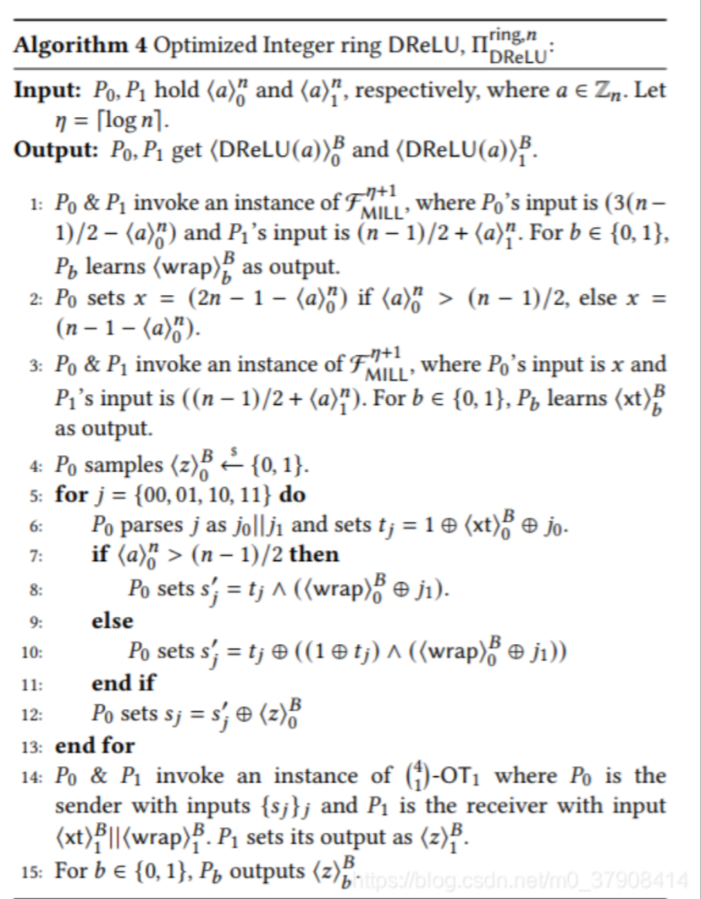

##### ReLU

Relu = DRelu * a. We can use DRelu's and Mux's protocol to caculate Relu

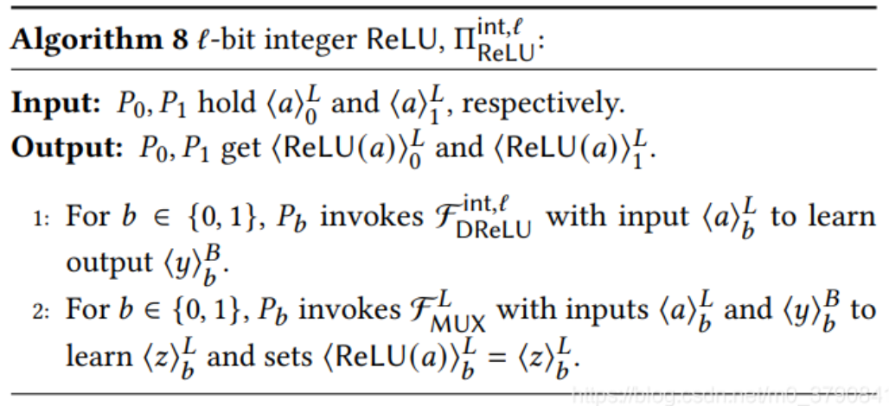

##### Maxpool layer

A pairwise comparison is used to select the largest method. Choose the two largest numbers first, and then compare them in turn.

For x,y are both at P0,P1 as the number of secret shares, first locally calculate the respective secret share x-y=w. Input the two secret shared w into the DRelu protocol to see if w is greater than 0, and the result is set to v. Using a data selector, t=wv. Finally each output z=y+t.

Consider that when v=0, t=0, the output z=y.

Consider v=1, t=w=x-y The output z=y+x-y=x.

### Part 4 Division and Truncation (linear)

##### 4.1 Expressing general division and truncation using arithmetic over secret shares

    Define$\ idiv:\mathbb{Z}\times\mathbb{Z}\rightarrow\mathbb{Z}$ as signed integer division, the quotient is prone to $-\infty$, the remainder have the same sign as divisor. Furthermore, define:

$$
rdiv(a,d)=idiv(a_u-1\{a_u\geq\lceil n/2\rceil\}\cdot n,d)\ mod\ n,
$$

    Here$\ a_u\in\{0,...,n-1\}$ is the unsigned exhibition for $a\in\mathbb{Z}_n$,  $0<d<n$.

###### Theorem 4.1.1

    Let$\ a\in\mathbb{Z}_n$ has its share as $\lang a\rang^n_0,\lang a\rang^n_1\in \mathbb{Z}_n$, $n = n^1\cdot d+n^0$. ($n^0,n^1,d\in\mathbb{Z}_n$ and $0\leq a_0^0,a_1^0<d)$.  Denote $n' = \lceil \frac{n}{2}\rceil\in\mathbb{Z}$. Define $corr,\ A,\ B,\ C$ as follows:

$$
corr = \begin{cases}-1,&(a_u\geq n')\wedge(a_0< n')\wedge(a_1<n')\\1,&(a_u< n')\wedge(a_0\geq n')\wedge(a_1\geq n')\\0,&otherwise\end{cases}
$$

$$
A = a_0^0 + a_1^0-(1\{a_0\geq n'\} + 1\{a_1\geq n'\})\cdot n^0
$$

$$
B = idiv(a_0^0-1\{a_0\geq n'\}\cdot n',d) + idiv(a_1^0-1\{a_1\geq n'\}\cdot n',d)
$$

$$
C = 1\{A<d\} + 1\{A<0\} + 1\{A<-d\}.
$$

Therefore we have:

$$
rdiv(\lang a\rang_0^n,d) + rdiv(\lang a\rang_1^n,d) + (corr\cdot n ^1 + 1-C-B)=_n rdiv(a,d)
$$

Proof 

* decompose $rdiv(\lang a\rang_i^n,d)$;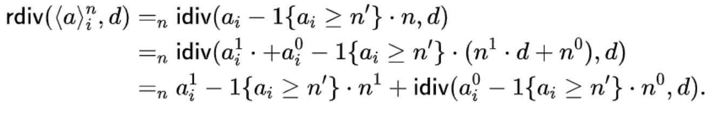
* $a_u = a_0 + a_1-w\cdot n$, where $w = 1\{a_0 + a_1\geq n\}$;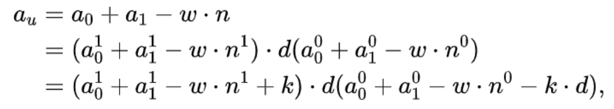
* Since $\leq a_0^0 + a_1^0-w\cdot n^0-k\cdot d<d$；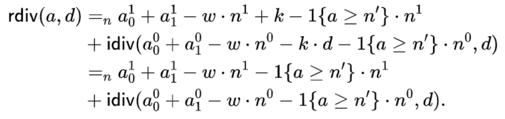
* Then we have: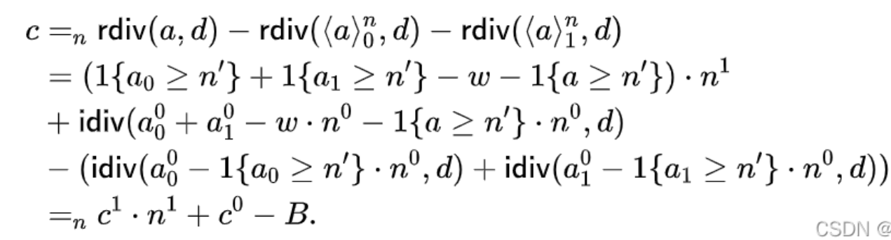
* Let $A_i' = idiv(a_0^0,a_1^0-i\cdot n^0,d)$;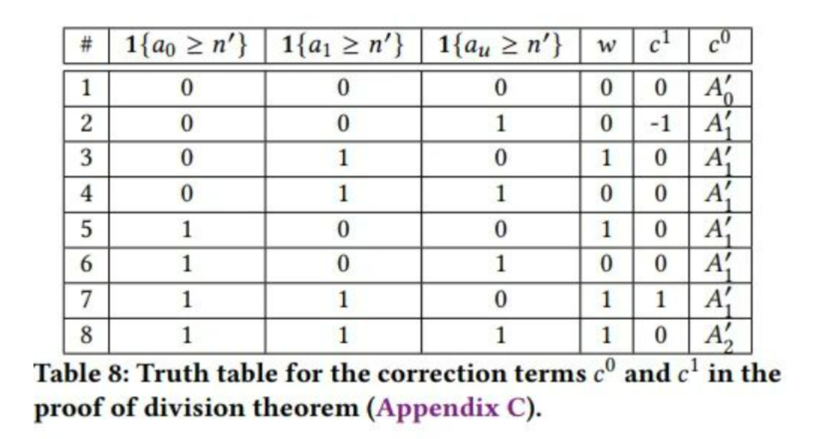

    From this table we know that$\ c^1 = corr$. Therefore $c =_n corr\cdot n^1+c^0 - B.$

    Let$\ C_0 = 1\{A<d\}$, $\ C_1 = 1\{A<0\}$, $\ C_0 = 1\{A<-d\}$, then $C = C_0 + C_1 + C_2$

    Row 1 corresponds to$A = a_0^0 + a_1^0$;

    Row 8 corresponds to$A = a_0^0 + a_1^0 - 2\cdot n^0$;

    Other rows correspond to$c^0 = idiv(A,d)$;

    It is obvious that$-2\cdot d+2\leq A\leq2\cdot d-2$, therefore $c^0\in\{-2,-1,0,1\}$

    Therefore,$c = _n corr\cdot n^1 + (1-C)-B$

Corollary 4.2: truncation for $l-bit$ integers can be simplified to:

$$
(a_0>>s) + (a_1>>s) + corr\cdot 2^{l-s} + 1\{a_0^0 + a_1^0\geq2^s\} = _L(a>>s)
$$

##### 4.2 Truncation of $l-bit$ Integer

    $F_{Trunc}^{int,l,s}$ is a function that performs on$\ l-bit$ integers and truncate its lower s bits. The result is exactly the same as cleartext.

    In the algorithm, step 1-15 calculate$\ corr$. Step 16 calculate $1\{a_0^0 + a_1^0\geq2^s\}$, and conduct $F_{B2A}$ at step 17.

    The complicated part is the verification of$\ corr$, especially the construction of $OT$ in step 15. By taking $P_1$'s input $\lang m\rang_1^m||x_1$ into step 15, we can verify its correctness. Since the calculation of $\ corr $ is completely random, the saftey can be proved by $(F_{DReLU}^{int,l}, \begin{pmatrix}4\\1\end{pmatrix}-OT, F_{Mill}^{s}, F_{B2A}^L)$-hybird model.

    Since$\ (F_{DReLU}^{int,l}, \begin{pmatrix}4\\1\end{pmatrix}-OT, F_{Mill}^{s}, F_{B2A}^L)$ are each conducted once, the communicationis less than $\lambda l + 2\lambda + 19l + communication\ for\ F_{Mill}^s$, which is mainly based on s.

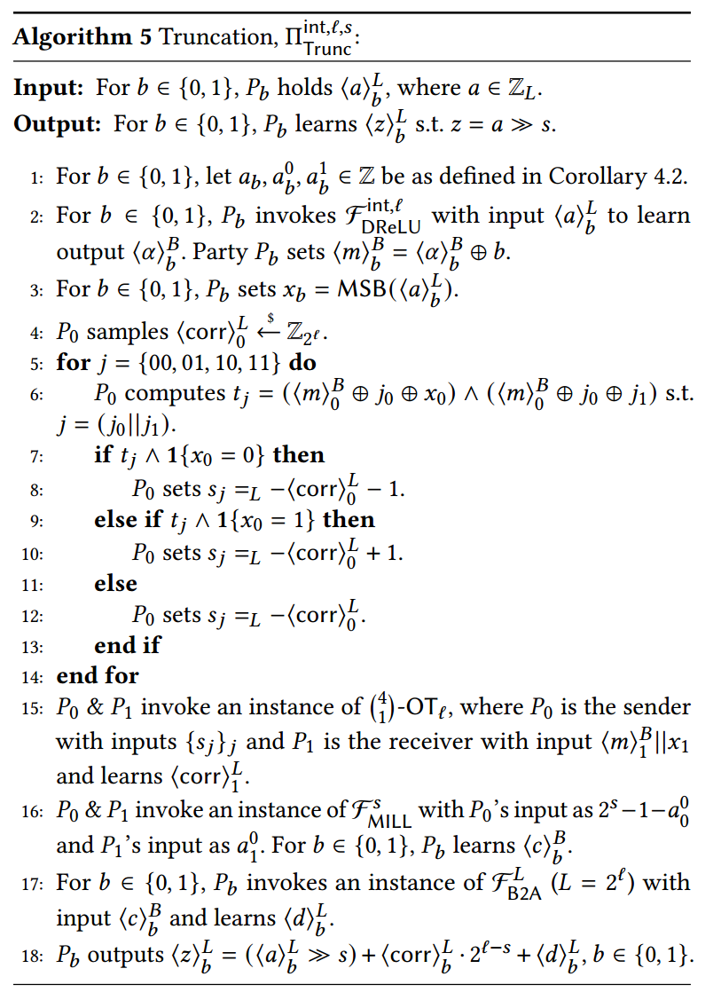

##### 4.3 Division

    $F_{Div}^{ring,n,d}$  stands for division on general ring. This protocol is similar to truncation protocol.  Since $-3d+2\leq A-d,A,A+d\leq3d-2$,  $C=(DReLU(A-d)\oplus1) + (DReLU(A+d)\oplus1)$ can be calculated in terms of $\delta = \lceil log_2^{6d}\rceil-bit$. Before calculate C, A needs to be calculated first. Therefore, calculate A on $\mathbb{Z}_n$ and $\mathbb{Z}_\Delta(\Delta = 2^\delta)$ simultaneously.

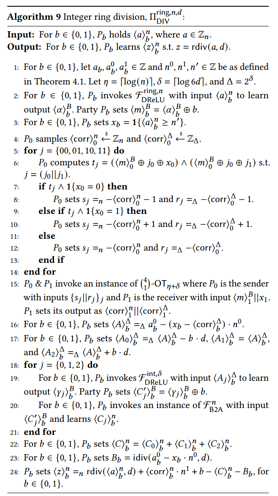

    Correctness verification is the same to truncation's. Safety check is based on$(\begin{pmatrix}4\\1\end{pmatrix}-OT_{\eta + \delta}, F_{DReLU}^{ring,n}, F_{B2A}^n)$-hybird model.

    The protocol calls$\begin{pmatrix}4\\1\end{pmatrix}-OT_{\eta + \delta}\ and\  F_{DReLU}^{ring,n}$ once, $F_{DReLU}^{\delta},\ and\  F_{B2A}^n$ 3 times. Total communication is less than $(\frac{3}{4}\lambda + 34)\cdot(\eta + 2\delta)$ bit.

    Improvement on Avgpool is listed below:

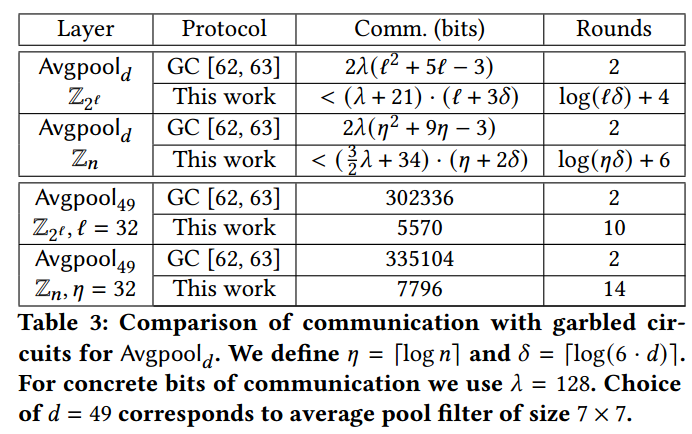

##### 4.4 Truncation Optimization

    For scenarios where$\ 2\cdot n^0\leq d = 2^s$ is satisfied, $\ A\geq -d$ always stands. Therefore $\ A\geq -d$ in the calculation of Ccan be omitted. Further decrease by $\delta = \lceil log_2(4d)\rceil$.

### Part 5 Secure Inference

The inference process of neural network model is carried out as follows

1. Linear layer: Call multiplication based on OT or multiplication based on HE, adjust according to the scene;
2. ReLU: invokes the ReLU protocol
3. Avgpool: Call division protocol
4. Truncation: Since the output of ReLU is non-negative, we can reduce calculation expense
5. Maxpool and Argmax: Millionaire's and $F_{MUX}$ in order

### Part 6 Evaluation

    In this paper, they implement OT based on EMP and chooses efficient AES. The HE is SEAL. They integrate those into CrypTFlow system. Firstly, the ReLU is calculated bu comparing with the GC-based method, raising it by 2-25$\times$.

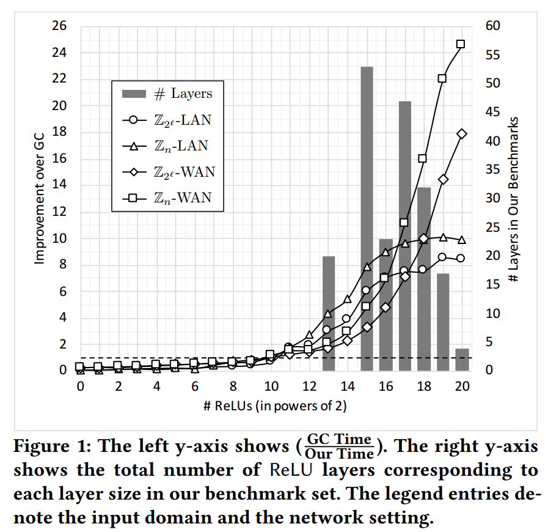

    Next, the ReLU in the real network is promoted as follows. In the local area network, improve the calculation 8-9$\times$, in the wide area network to improve the time 18-21$\times$, improve the communication 7-9$\times$.

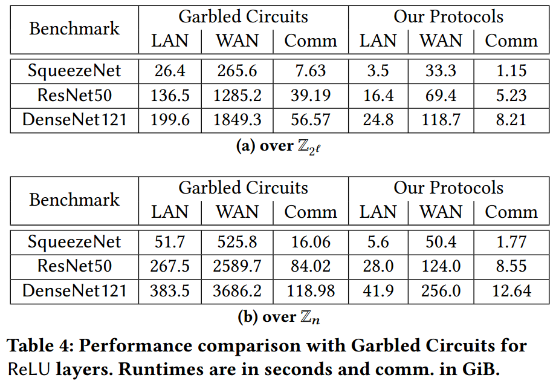

    For Avgpool, time is improved 51$\times$.

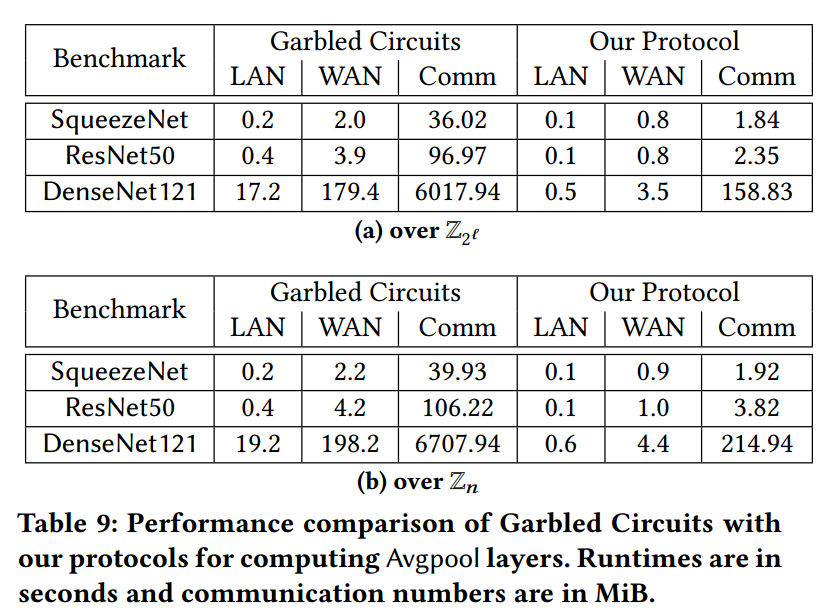

    Compared with Delphi, it is still greatly improved in both nonlinear layer and online calculation.

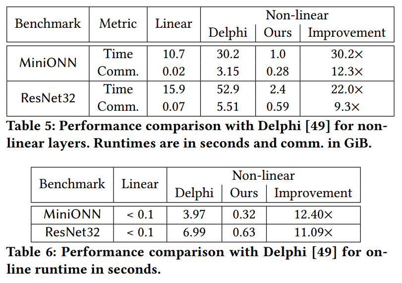

    Finally, for large networks, predictions can be made in 10min (LAN) and 20min (WAN).

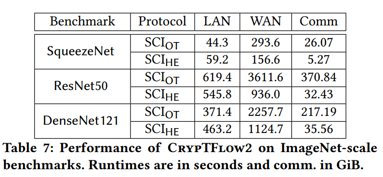

### Part 7 Conclusion

    This paper is one of the best two-party computational comparison protocols and is the basis of SIRNN. In this paper, an efficient calculation method of accurate truncation and division is presented. This ideas are very enlightening for later work.

### Appendix I: Code-reading

###### millionaire_with_equality.h:

[`MillionaireWithEquality`](command:_github.copilot.openSymbolFromReferences?%5B%22%22%2C%5B%7B%22uri%22%3A%7B%22scheme%22%3A%22file%22%2C%22authority%22%3A%22%22%2C%22path%22%3A%22%2Fezpc_dir%2FEzPC%2FSCI%2Fsrc%2FMillionaire%2Fmillionaire_with_equality.h%22%2C%22query%22%3A%22%22%2C%22fragment%22%3A%22%22%7D%2C%22pos%22%3A%7B%22line%22%3A28%2C%22character%22%3A29%7D%7D%5D%2C%229f65f91c-63ec-4475-aaf7-890aae28b581%22%5D "Go to definition") 是一个模板类，使用模板参数 [`IO`](command:_github.copilot.openSymbolFromReferences?%5B%22%22%2C%5B%7B%22uri%22%3A%7B%22scheme%22%3A%22file%22%2C%22authority%22%3A%22%22%2C%22path%22%3A%22%2Fezpc_dir%2FEzPC%2FSCI%2Fsrc%2FMillionaire%2Fmillionaire_with_equality.h%22%2C%22query%22%3A%22%22%2C%22fragment%22%3A%22%22%7D%2C%22pos%22%3A%7B%22line%22%3A28%2C%22character%22%3A19%7D%7D%5D%2C%229f65f91c-63ec-4475-aaf7-890aae28b581%22%5D "Go to definition")。这个类的主要目的是实现百万富翁问题的比较协议，并且支持相等性检查。类的公共成员变量如下：

- [`IO *io`](command:_github.copilot.openSymbolFromReferences?%5B%22%22%2C%5B%7B%22uri%22%3A%7B%22scheme%22%3A%22file%22%2C%22authority%22%3A%22%22%2C%22path%22%3A%22%2Fezpc_dir%2FEzPC%2FSCI%2Fsrc%2FMillionaire%2Fmillionaire_with_equality.h%22%2C%22query%22%3A%22%22%2C%22fragment%22%3A%22%22%7D%2C%22pos%22%3A%7B%22line%22%3A28%2C%22character%22%3A19%7D%7D%5D%2C%229f65f91c-63ec-4475-aaf7-890aae28b581%22%5D "Go to definition"): 一个指向 IO 对象的指针，用于处理输入输出操作。
- `sci::OTPack<IO> *otpack`: 一个指向 `sci::OTPack<IO>` 对象的指针，用于处理 Oblivious Transfer（OT）协议。
- [`TripleGenerator<IO> *triple_gen`](command:_github.copilot.openSymbolFromReferences?%5B%22%22%2C%5B%7B%22uri%22%3A%7B%22scheme%22%3A%22file%22%2C%22authority%22%3A%22%22%2C%22path%22%3A%22%2Fezpc_dir%2FEzPC%2FSCI%2Fsrc%2FMillionaire%2Fmillionaire_with_equality.h%22%2C%22query%22%3A%22%22%2C%22fragment%22%3A%22%22%7D%2C%22pos%22%3A%7B%22line%22%3A32%2C%22character%22%3A2%7D%7D%5D%2C%229f65f91c-63ec-4475-aaf7-890aae28b581%22%5D "Go to definition"): 一个指向 [`TripleGenerator<IO>`](command:_github.copilot.openSymbolFromReferences?%5B%22%22%2C%5B%7B%22uri%22%3A%7B%22scheme%22%3A%22file%22%2C%22authority%22%3A%22%22%2C%22path%22%3A%22%2Fezpc_dir%2FEzPC%2FSCI%2Fsrc%2FMillionaire%2Fmillionaire_with_equality.h%22%2C%22query%22%3A%22%22%2C%22fragment%22%3A%22%22%7D%2C%22pos%22%3A%7B%22line%22%3A32%2C%22character%22%3A2%7D%7D%5D%2C%229f65f91c-63ec-4475-aaf7-890aae28b581%22%5D "Go to definition") 对象的指针，用于生成三元组，这些三元组在协议中用于安全计算。
- [`MillionaireProtocol<IO> *mill`](command:_github.copilot.openSymbolFromReferences?%5B%22%22%2C%5B%7B%22uri%22%3A%7B%22scheme%22%3A%22file%22%2C%22authority%22%3A%22%22%2C%22path%22%3A%22%2Fezpc_dir%2FEzPC%2FSCI%2Fsrc%2FMillionaire%2Fmillionaire_with_equality.h%22%2C%22query%22%3A%22%22%2C%22fragment%22%3A%22%22%7D%2C%22pos%22%3A%7B%22line%22%3A33%2C%22character%22%3A2%7D%7D%5D%2C%229f65f91c-63ec-4475-aaf7-890aae28b581%22%5D "Go to definition"): 一个指向 [`MillionaireProtocol<IO>`](command:_github.copilot.openSymbolFromReferences?%5B%22%22%2C%5B%7B%22uri%22%3A%7B%22scheme%22%3A%22file%22%2C%22authority%22%3A%22%22%2C%22path%22%3A%22%2Fezpc_dir%2FEzPC%2FSCI%2Fsrc%2FMillionaire%2Fmillionaire_with_equality.h%22%2C%22query%22%3A%22%22%2C%22fragment%22%3A%22%22%7D%2C%22pos%22%3A%7B%22line%22%3A33%2C%22character%22%3A2%7D%7D%5D%2C%229f65f91c-63ec-4475-aaf7-890aae28b581%22%5D "Go to definition") 对象的指针，用于执行百万富翁比较协议。
- [`bool del_mill`](command:_github.copilot.openSymbolFromReferences?%5B%22%22%2C%5B%7B%22uri%22%3A%7B%22scheme%22%3A%22file%22%2C%22authority%22%3A%22%22%2C%22path%22%3A%22%2Fezpc_dir%2FEzPC%2FSCI%2Fsrc%2FMillionaire%2Fmillionaire_with_equality.h%22%2C%22query%22%3A%22%22%2C%22fragment%22%3A%22%22%7D%2C%22pos%22%3A%7B%22line%22%3A48%2C%22character%22%3A6%7D%7D%5D%2C%229f65f91c-63ec-4475-aaf7-890aae28b581%22%5D "Go to definition"): 一个布尔值，指示是否需要在析构函数中删除 [`mill`](command:_github.copilot.openSymbolFromReferences?%5B%22%22%2C%5B%7B%22uri%22%3A%7B%22scheme%22%3A%22file%22%2C%22authority%22%3A%22%22%2C%22path%22%3A%22%2Fezpc_dir%2FEzPC%2FSCI%2Fsrc%2FMillionaire%2Fmillionaire_with_equality.h%22%2C%22query%22%3A%22%22%2C%22fragment%22%3A%22%22%7D%2C%22pos%22%3A%7B%22line%22%3A49%2C%22character%22%3A6%7D%7D%5D%2C%229f65f91c-63ec-4475-aaf7-890aae28b581%22%5D "Go to definition") 对象。
- [`int party`](command:_github.copilot.openSymbolFromReferences?%5B%22%22%2C%5B%7B%22uri%22%3A%7B%22scheme%22%3A%22file%22%2C%22authority%22%3A%22%22%2C%22path%22%3A%22%2Fezpc_dir%2FEzPC%2FSCI%2Fsrc%2FMillionaire%2Fmillionaire_with_equality.h%22%2C%22query%22%3A%22%22%2C%22fragment%22%3A%22%22%7D%2C%22pos%22%3A%7B%22line%22%3A40%2C%22character%22%3A30%7D%7D%5D%2C%229f65f91c-63ec-4475-aaf7-890aae28b581%22%5D "Go to definition"): 表示参与方的编号，通常用于区分协议中的不同参与者。
- [`int l, r, log_alpha, beta, beta_pow`](command:_github.copilot.openSymbolFromReferences?%5B%22%22%2C%5B%7B%22uri%22%3A%7B%22scheme%22%3A%22file%22%2C%22authority%22%3A%22%22%2C%22path%22%3A%22%2Fezpc_dir%2FEzPC%2FSCI%2Fsrc%2FMillionaire%2Fmillionaire_with_equality.h%22%2C%22query%22%3A%22%22%2C%22fragment%22%3A%22%22%7D%2C%22pos%22%3A%7B%22line%22%3A62%2C%22character%22%3A36%7D%7D%5D%2C%229f65f91c-63ec-4475-aaf7-890aae28b581%22%5D "Go to definition"): 这些整数变量用于存储协议中的各种参数和中间计算结果。例如，[`l`](command:_github.copilot.openSymbolFromReferences?%5B%22%22%2C%5B%7B%22uri%22%3A%7B%22scheme%22%3A%22file%22%2C%22authority%22%3A%22%22%2C%22path%22%3A%22%2Fezpc_dir%2FEzPC%2FSCI%2Fsrc%2FMillionaire%2Fmillionaire_with_equality.h%22%2C%22query%22%3A%22%22%2C%22fragment%22%3A%22%22%7D%2C%22pos%22%3A%7B%22line%22%3A62%2C%22character%22%3A36%7D%7D%5D%2C%229f65f91c-63ec-4475-aaf7-890aae28b581%22%5D "Go to definition") 表示比特长度，[`beta`](command:_github.copilot.openSymbolFromReferences?%5B%22%22%2C%5B%7B%22uri%22%3A%7B%22scheme%22%3A%22file%22%2C%22authority%22%3A%22%22%2C%22path%22%3A%22%2Fezpc_dir%2FEzPC%2FSCI%2Fsrc%2FMillionaire%2Fmillionaire_with_equality.h%22%2C%22query%22%3A%22%22%2C%22fragment%22%3A%22%22%7D%2C%22pos%22%3A%7B%22line%22%3A62%2C%22character%22%3A40%7D%7D%5D%2C%229f65f91c-63ec-4475-aaf7-890aae28b581%22%5D "Go to definition") 表示基数，[`beta_pow`](command:_github.copilot.openSymbolFromReferences?%5B%22%22%2C%5B%7B%22uri%22%3A%7B%22scheme%22%3A%22file%22%2C%22authority%22%3A%22%22%2C%22path%22%3A%22%2Fezpc_dir%2FEzPC%2FSCI%2Fsrc%2FMillionaire%2Fmillionaire_with_equality.h%22%2C%22query%22%3A%22%22%2C%22fragment%22%3A%22%22%7D%2C%22pos%22%3A%7B%22line%22%3A178%2C%22character%22%3A42%7D%7D%5D%2C%229f65f91c-63ec-4475-aaf7-890aae28b581%22%5D "Go to definition") 表示 [`beta`](command:_github.copilot.openSymbolFromReferences?%5B%22%22%2C%5B%7B%22uri%22%3A%7B%22scheme%22%3A%22file%22%2C%22authority%22%3A%22%22%2C%22path%22%3A%22%2Fezpc_dir%2FEzPC%2FSCI%2Fsrc%2FMillionaire%2Fmillionaire_with_equality.h%22%2C%22query%22%3A%22%22%2C%22fragment%22%3A%22%22%7D%2C%22pos%22%3A%7B%22line%22%3A62%2C%22character%22%3A40%7D%7D%5D%2C%229f65f91c-63ec-4475-aaf7-890aae28b581%22%5D "Go to definition") 的幂。
- [`int num_digits, num_triples, log_num_digits`](command:_github.copilot.openSymbolFromReferences?%5B%22%22%2C%5B%7B%22uri%22%3A%7B%22scheme%22%3A%22file%22%2C%22authority%22%3A%22%22%2C%22path%22%3A%22%2Fezpc_dir%2FEzPC%2FSCI%2Fsrc%2FMillionaire%2Fmillionaire_with_equality.h%22%2C%22query%22%3A%22%22%2C%22fragment%22%3A%22%22%7D%2C%22pos%22%3A%7B%22line%22%3A64%2C%22character%22%3A34%7D%7D%5D%2C%229f65f91c-63ec-4475-aaf7-890aae28b581%22%5D "Go to definition"): 这些整数变量用于存储协议中的各种计数值。例如，[`num_digits`](command:_github.copilot.openSymbolFromReferences?%5B%22%22%2C%5B%7B%22uri%22%3A%7B%22scheme%22%3A%22file%22%2C%22authority%22%3A%22%22%2C%22path%22%3A%22%2Fezpc_dir%2FEzPC%2FSCI%2Fsrc%2FMillionaire%2Fmillionaire_with_equality.h%22%2C%22query%22%3A%22%22%2C%22fragment%22%3A%22%22%7D%2C%22pos%22%3A%7B%22line%22%3A64%2C%22character%22%3A34%7D%7D%5D%2C%229f65f91c-63ec-4475-aaf7-890aae28b581%22%5D "Go to definition") 表示数字的个数，[`num_triples`](command:_github.copilot.openSymbolFromReferences?%5B%22%22%2C%5B%7B%22uri%22%3A%7B%22scheme%22%3A%22file%22%2C%22authority%22%3A%22%22%2C%22path%22%3A%22%2Fezpc_dir%2FEzPC%2FSCI%2Fsrc%2FMillionaire%2Fmillionaire_with_equality.h%22%2C%22query%22%3A%22%22%2C%22fragment%22%3A%22%22%7D%2C%22pos%22%3A%7B%22line%22%3A277%2C%22character%22%3A25%7D%7D%5D%2C%229f65f91c-63ec-4475-aaf7-890aae28b581%22%5D "Go to definition") 表示三元组的数量。
- [`uint8_t mask_beta, mask_r`](command:_github.copilot.openSymbolFromReferences?%5B%22%22%2C%5B%7B%22uri%22%3A%7B%22scheme%22%3A%22file%22%2C%22authority%22%3A%22%22%2C%22path%22%3A%22%2Fezpc_dir%2FEzPC%2FSCI%2Fsrc%2FMillionaire%2Fmillionaire_with_equality.h%22%2C%22query%22%3A%22%22%2C%22fragment%22%3A%22%22%7D%2C%22pos%22%3A%7B%22line%22%3A169%2C%22character%22%3A51%7D%7D%5D%2C%229f65f91c-63ec-4475-aaf7-890aae28b581%22%5D "Go to definition"): 这些 8 位无符号整数用于存储掩码值，用于在协议中进行位操作。

这些成员变量共同构成了 [`MillionaireWithEquality`](command:_github.copilot.openSymbolFromReferences?%5B%22%22%2C%5B%7B%22uri%22%3A%7B%22scheme%22%3A%22file%22%2C%22authority%22%3A%22%22%2C%22path%22%3A%22%2Fezpc_dir%2FEzPC%2FSCI%2Fsrc%2FMillionaire%2Fmillionaire_with_equality.h%22%2C%22query%22%3A%22%22%2C%22fragment%22%3A%22%22%7D%2C%22pos%22%3A%7B%22line%22%3A28%2C%22character%22%3A29%7D%7D%5D%2C%229f65f91c-63ec-4475-aaf7-890aae28b581%22%5D "Go to definition") 类的基础，用于实现百万富翁问题的比较协议和相等性检查。

 [`MillionaireWithEquality`](command:_github.copilot.openSymbolFromReferences?%5B%22%22%2C%5B%7B%22uri%22%3A%7B%22scheme%22%3A%22file%22%2C%22authority%22%3A%22%22%2C%22path%22%3A%22%2Fezpc_dir%2FEzPC%2FSCI%2Fsrc%2FMillionaire%2Fmillionaire_with_equality.h%22%2C%22query%22%3A%22%22%2C%22fragment%22%3A%22%22%7D%2C%22pos%22%3A%7B%22line%22%3A40%2C%22character%22%3A2%7D%7D%5D%2C%2218b03e61-2d76-407c-a38e-1e2da2e2ce10%22%5D "Go to definition") 类的构造函数，用于初始化类的实例。它接受五个参数：

- [`party`](command:_github.copilot.openSymbolFromReferences?%5B%22%22%2C%5B%7B%22uri%22%3A%7B%22scheme%22%3A%22file%22%2C%22authority%22%3A%22%22%2C%22path%22%3A%22%2Fezpc_dir%2FEzPC%2FSCI%2Fsrc%2FMillionaire%2Fmillionaire_with_equality.h%22%2C%22query%22%3A%22%22%2C%22fragment%22%3A%22%22%7D%2C%22pos%22%3A%7B%22line%22%3A40%2C%22character%22%3A30%7D%7D%5D%2C%2218b03e61-2d76-407c-a38e-1e2da2e2ce10%22%5D "Go to definition"): 表示参与方的编号。
- [`io`](command:_github.copilot.openSymbolFromReferences?%5B%22%22%2C%5B%7B%22uri%22%3A%7B%22scheme%22%3A%22file%22%2C%22authority%22%3A%22%22%2C%22path%22%3A%22%2Fezpc_dir%2FEzPC%2FSCI%2Fsrc%2FMillionaire%2Fmillionaire_with_equality.h%22%2C%22query%22%3A%22%22%2C%22fragment%22%3A%22%22%7D%2C%22pos%22%3A%7B%22line%22%3A40%2C%22character%22%3A41%7D%7D%5D%2C%2218b03e61-2d76-407c-a38e-1e2da2e2ce10%22%5D "Go to definition"): 一个指向 IO 对象的指针，用于处理输入输出操作。
- [`otpack`](command:_github.copilot.openSymbolFromReferences?%5B%22%22%2C%5B%7B%22uri%22%3A%7B%22scheme%22%3A%22file%22%2C%22authority%22%3A%22%22%2C%22path%22%3A%22%2Fezpc_dir%2FEzPC%2FSCI%2Fsrc%2FMillionaire%2Fmillionaire_with_equality.h%22%2C%22query%22%3A%22%22%2C%22fragment%22%3A%22%22%7D%2C%22pos%22%3A%7B%22line%22%3A40%2C%22character%22%3A62%7D%7D%5D%2C%2218b03e61-2d76-407c-a38e-1e2da2e2ce10%22%5D "Go to definition"): 一个指向 `sci::OTPack<IO>` 对象的指针，用于处理 Oblivious Transfer（OT）协议。
- [`mill_in`](command:_github.copilot.openSymbolFromReferences?%5B%22%22%2C%5B%7B%22uri%22%3A%7B%22scheme%22%3A%22file%22%2C%22authority%22%3A%22%22%2C%22path%22%3A%22%2Fezpc_dir%2FEzPC%2FSCI%2Fsrc%2FMillionaire%2Fmillionaire_with_equality.h%22%2C%22query%22%3A%22%22%2C%22fragment%22%3A%22%22%7D%2C%22pos%22%3A%7B%22line%22%3A41%2C%22character%22%3A51%7D%7D%5D%2C%2218b03e61-2d76-407c-a38e-1e2da2e2ce10%22%5D "Go to definition"): 一个可选的指向 [`MillionaireProtocol<IO>`](command:_github.copilot.openSymbolFromReferences?%5B%22%22%2C%5B%7B%22uri%22%3A%7B%22scheme%22%3A%22file%22%2C%22authority%22%3A%22%22%2C%22path%22%3A%22%2Fezpc_dir%2FEzPC%2FSCI%2Fsrc%2FMillionaire%2Fmillionaire_with_equality.h%22%2C%22query%22%3A%22%22%2C%22fragment%22%3A%22%22%7D%2C%22pos%22%3A%7B%22line%22%3A41%2C%22character%22%3A26%7D%7D%5D%2C%2218b03e61-2d76-407c-a38e-1e2da2e2ce10%22%5D "Go to definition") 对象的指针，如果不提供，则默认为 [`nullptr`](command:_github.copilot.openSymbolFromReferences?%5B%22%22%2C%5B%7B%22uri%22%3A%7B%22scheme%22%3A%22file%22%2C%22authority%22%3A%22%22%2C%22path%22%3A%22%2Fezpc_dir%2FEzPC%2FSCI%2Fsrc%2FMillionaire%2Fmillionaire_with_equality.h%22%2C%22query%22%3A%22%22%2C%22fragment%22%3A%22%22%7D%2C%22pos%22%3A%7B%22line%22%3A41%2C%22character%22%3A61%7D%7D%5D%2C%2218b03e61-2d76-407c-a38e-1e2da2e2ce10%22%5D "Go to definition")。
- [`bitlength`](command:_github.copilot.openSymbolFromReferences?%5B%22%22%2C%5B%7B%22uri%22%3A%7B%22scheme%22%3A%22file%22%2C%22authority%22%3A%22%22%2C%22path%22%3A%22%2Fezpc_dir%2FEzPC%2FSCI%2Fsrc%2FMillionaire%2Fmillionaire_with_equality.h%22%2C%22query%22%3A%22%22%2C%22fragment%22%3A%22%22%7D%2C%22pos%22%3A%7B%22line%22%3A42%2C%22character%22%3A30%7D%7D%5D%2C%2218b03e61-2d76-407c-a38e-1e2da2e2ce10%22%5D "Go to definition"): 一个整数，表示比特长度，默认为 32。
- [`radix_base`](command:_github.copilot.openSymbolFromReferences?%5B%22%22%2C%5B%7B%22uri%22%3A%7B%22scheme%22%3A%22file%22%2C%22authority%22%3A%22%22%2C%22path%22%3A%22%2Fezpc_dir%2FEzPC%2FSCI%2Fsrc%2FMillionaire%2Fmillionaire_with_equality.h%22%2C%22query%22%3A%22%22%2C%22fragment%22%3A%22%22%7D%2C%22pos%22%3A%7B%22line%22%3A42%2C%22character%22%3A50%7D%7D%5D%2C%2218b03e61-2d76-407c-a38e-1e2da2e2ce10%22%5D "Go to definition"): 一个整数，表示基数，默认为 [`MILL_PARAM`](command:_github.copilot.openSymbolFromReferences?%5B%22%22%2C%5B%7B%22uri%22%3A%7B%22scheme%22%3A%22file%22%2C%22authority%22%3A%22%22%2C%22path%22%3A%22%2Fezpc_dir%2FEzPC%2FSCI%2Fsrc%2FMillionaire%2Fmillionaire_with_equality.h%22%2C%22query%22%3A%22%22%2C%22fragment%22%3A%22%22%7D%2C%22pos%22%3A%7B%22line%22%3A42%2C%22character%22%3A63%7D%7D%5D%2C%2218b03e61-2d76-407c-a38e-1e2da2e2ce10%22%5D "Go to definition")。

在构造函数中，首先将传入的参数赋值给类的成员变量。如果 [`mill_in`](command:_github.copilot.openSymbolFromReferences?%5B%22%22%2C%5B%7B%22uri%22%3A%7B%22scheme%22%3A%22file%22%2C%22authority%22%3A%22%22%2C%22path%22%3A%22%2Fezpc_dir%2FEzPC%2FSCI%2Fsrc%2FMillionaire%2Fmillionaire_with_equality.h%22%2C%22query%22%3A%22%22%2C%22fragment%22%3A%22%22%7D%2C%22pos%22%3A%7B%22line%22%3A41%2C%22character%22%3A51%7D%7D%5D%2C%2218b03e61-2d76-407c-a38e-1e2da2e2ce10%22%5D "Go to definition") 为 [`nullptr`](command:_github.copilot.openSymbolFromReferences?%5B%22%22%2C%5B%7B%22uri%22%3A%7B%22scheme%22%3A%22file%22%2C%22authority%22%3A%22%22%2C%22path%22%3A%22%2Fezpc_dir%2FEzPC%2FSCI%2Fsrc%2FMillionaire%2Fmillionaire_with_equality.h%22%2C%22query%22%3A%22%22%2C%22fragment%22%3A%22%22%7D%2C%22pos%22%3A%7B%22line%22%3A41%2C%22character%22%3A61%7D%7D%5D%2C%2218b03e61-2d76-407c-a38e-1e2da2e2ce10%22%5D "Go to definition")，则创建一个新的 [`MillionaireProtocol<IO>`](command:_github.copilot.openSymbolFromReferences?%5B%22%22%2C%5B%7B%22uri%22%3A%7B%22scheme%22%3A%22file%22%2C%22authority%22%3A%22%22%2C%22path%22%3A%22%2Fezpc_dir%2FEzPC%2FSCI%2Fsrc%2FMillionaire%2Fmillionaire_with_equality.h%22%2C%22query%22%3A%22%22%2C%22fragment%22%3A%22%22%7D%2C%22pos%22%3A%7B%22line%22%3A41%2C%22character%22%3A26%7D%7D%5D%2C%2218b03e61-2d76-407c-a38e-1e2da2e2ce10%22%5D "Go to definition") 对象，并将 [`del_mill`](command:_github.copilot.openSymbolFromReferences?%5B%22%22%2C%5B%7B%22uri%22%3A%7B%22scheme%22%3A%22file%22%2C%22authority%22%3A%22%22%2C%22path%22%3A%22%2Fezpc_dir%2FEzPC%2FSCI%2Fsrc%2FMillionaire%2Fmillionaire_with_equality.h%22%2C%22query%22%3A%22%22%2C%22fragment%22%3A%22%22%7D%2C%22pos%22%3A%7B%22line%22%3A48%2C%22character%22%3A6%7D%7D%5D%2C%2218b03e61-2d76-407c-a38e-1e2da2e2ce10%22%5D "Go to definition") 设置为 [`true`](command:_github.copilot.openSymbolFromReferences?%5B%22%22%2C%5B%7B%22uri%22%3A%7B%22scheme%22%3A%22file%22%2C%22authority%22%3A%22%22%2C%22path%22%3A%22%2Fezpc_dir%2FEzPC%2FSCI%2Fsrc%2FMillionaire%2Fmillionaire_with_equality.h%22%2C%22query%22%3A%22%22%2C%22fragment%22%3A%22%22%7D%2C%22pos%22%3A%7B%22line%22%3A48%2C%22character%22%3A17%7D%7D%5D%2C%2218b03e61-2d76-407c-a38e-1e2da2e2ce10%22%5D "Go to definition")，以便在析构函数中删除该对象。否则，将 [`mill_in`](command:_github.copilot.openSymbolFromReferences?%5B%22%22%2C%5B%7B%22uri%22%3A%7B%22scheme%22%3A%22file%22%2C%22authority%22%3A%22%22%2C%22path%22%3A%22%2Fezpc_dir%2FEzPC%2FSCI%2Fsrc%2FMillionaire%2Fmillionaire_with_equality.h%22%2C%22query%22%3A%22%22%2C%22fragment%22%3A%22%22%7D%2C%22pos%22%3A%7B%22line%22%3A41%2C%22character%22%3A51%7D%7D%5D%2C%2218b03e61-2d76-407c-a38e-1e2da2e2ce10%22%5D "Go to definition") 赋值给 [`mill`](command:_github.copilot.openSymbolFromReferences?%5B%22%22%2C%5B%7B%22uri%22%3A%7B%22scheme%22%3A%22file%22%2C%22authority%22%3A%22%22%2C%22path%22%3A%22%2Fezpc_dir%2FEzPC%2FSCI%2Fsrc%2FMillionaire%2Fmillionaire_with_equality.h%22%2C%22query%22%3A%22%22%2C%22fragment%22%3A%22%22%7D%2C%22pos%22%3A%7B%22line%22%3A49%2C%22character%22%3A6%7D%7D%5D%2C%2218b03e61-2d76-407c-a38e-1e2da2e2ce10%22%5D "Go to definition") 成员变量。

接下来，将 [`mill`](command:_github.copilot.openSymbolFromReferences?%5B%22%22%2C%5B%7B%22uri%22%3A%7B%22scheme%22%3A%22file%22%2C%22authority%22%3A%22%22%2C%22path%22%3A%22%2Fezpc_dir%2FEzPC%2FSCI%2Fsrc%2FMillionaire%2Fmillionaire_with_equality.h%22%2C%22query%22%3A%22%22%2C%22fragment%22%3A%22%22%7D%2C%22pos%22%3A%7B%22line%22%3A49%2C%22character%22%3A6%7D%7D%5D%2C%2218b03e61-2d76-407c-a38e-1e2da2e2ce10%22%5D "Go to definition") 对象的 [`triple_gen`](command:_github.copilot.openSymbolFromReferences?%5B%22%22%2C%5B%7B%22uri%22%3A%7B%22scheme%22%3A%22file%22%2C%22authority%22%3A%22%22%2C%22path%22%3A%22%2Fezpc_dir%2FEzPC%2FSCI%2Fsrc%2FMillionaire%2Fmillionaire_with_equality.h%22%2C%22query%22%3A%22%22%2C%22fragment%22%3A%22%22%7D%2C%22pos%22%3A%7B%22line%22%3A52%2C%22character%22%3A10%7D%7D%5D%2C%2218b03e61-2d76-407c-a38e-1e2da2e2ce10%22%5D "Go to definition") 成员变量赋值给类的 [`triple_gen`](command:_github.copilot.openSymbolFromReferences?%5B%22%22%2C%5B%7B%22uri%22%3A%7B%22scheme%22%3A%22file%22%2C%22authority%22%3A%22%22%2C%22path%22%3A%22%2Fezpc_dir%2FEzPC%2FSCI%2Fsrc%2FMillionaire%2Fmillionaire_with_equality.h%22%2C%22query%22%3A%22%22%2C%22fragment%22%3A%22%22%7D%2C%22pos%22%3A%7B%22line%22%3A52%2C%22character%22%3A10%7D%7D%5D%2C%2218b03e61-2d76-407c-a38e-1e2da2e2ce10%22%5D "Go to definition") 成员变量。最后，调用 [`configure`](command:_github.copilot.openSymbolFromReferences?%5B%22%22%2C%5B%7B%22uri%22%3A%7B%22scheme%22%3A%22file%22%2C%22authority%22%3A%22%22%2C%22path%22%3A%22%2Fezpc_dir%2FEzPC%2FSCI%2Fsrc%2FMillionaire%2Fmillionaire_with_equality.h%22%2C%22query%22%3A%22%22%2C%22fragment%22%3A%22%22%7D%2C%22pos%22%3A%7B%22line%22%3A53%2C%22character%22%3A4%7D%7D%5D%2C%2218b03e61-2d76-407c-a38e-1e2da2e2ce10%22%5D "Go to definition") 方法，使用传入的 [`bitlength`](command:_github.copilot.openSymbolFromReferences?%5B%22%22%2C%5B%7B%22uri%22%3A%7B%22scheme%22%3A%22file%22%2C%22authority%22%3A%22%22%2C%22path%22%3A%22%2Fezpc_dir%2FEzPC%2FSCI%2Fsrc%2FMillionaire%2Fmillionaire_with_equality.h%22%2C%22query%22%3A%22%22%2C%22fragment%22%3A%22%22%7D%2C%22pos%22%3A%7B%22line%22%3A42%2C%22character%22%3A30%7D%7D%5D%2C%2218b03e61-2d76-407c-a38e-1e2da2e2ce10%22%5D "Go to definition") 和 [`radix_base`](command:_github.copilot.openSymbolFromReferences?%5B%22%22%2C%5B%7B%22uri%22%3A%7B%22scheme%22%3A%22file%22%2C%22authority%22%3A%22%22%2C%22path%22%3A%22%2Fezpc_dir%2FEzPC%2FSCI%2Fsrc%2FMillionaire%2Fmillionaire_with_equality.h%22%2C%22query%22%3A%22%22%2C%22fragment%22%3A%22%22%7D%2C%22pos%22%3A%7B%22line%22%3A42%2C%22character%22%3A50%7D%7D%5D%2C%2218b03e61-2d76-407c-a38e-1e2da2e2ce10%22%5D "Go to definition") 参数进行配置。

这个构造函数确保了 [`MillionaireWithEquality`](command:_github.copilot.openSymbolFromReferences?%5B%22%22%2C%5B%7B%22uri%22%3A%7B%22scheme%22%3A%22file%22%2C%22authority%22%3A%22%22%2C%22path%22%3A%22%2Fezpc_dir%2FEzPC%2FSCI%2Fsrc%2FMillionaire%2Fmillionaire_with_equality.h%22%2C%22query%22%3A%22%22%2C%22fragment%22%3A%22%22%7D%2C%22pos%22%3A%7B%22line%22%3A40%2C%22character%22%3A2%7D%7D%5D%2C%2218b03e61-2d76-407c-a38e-1e2da2e2ce10%22%5D "Go to definition") 类的实例在创建时正确初始化所有必要的成员变量，并根据需要创建或使用现有的 [`MillionaireProtocol<IO>`](command:_github.copilot.openSymbolFromReferences?%5B%22%22%2C%5B%7B%22uri%22%3A%7B%22scheme%22%3A%22file%22%2C%22authority%22%3A%22%22%2C%22path%22%3A%22%2Fezpc_dir%2FEzPC%2FSCI%2Fsrc%2FMillionaire%2Fmillionaire_with_equality.h%22%2C%22query%22%3A%22%22%2C%22fragment%22%3A%22%22%7D%2C%22pos%22%3A%7B%22line%22%3A41%2C%22character%22%3A26%7D%7D%5D%2C%2218b03e61-2d76-407c-a38e-1e2da2e2ce10%22%5D "Go to definition") 对象。

[`bitlen_lt_beta`](vscode-file://vscode-app/d:/Program%20Files%20(x86)/Microsoft%20VS%20Code/resources/app/out/vs/code/electron-sandbox/workbench/workbench.esm.html) 是一个用于比较的函数，比较两个参与方的数据，并返回比较结果。该函数使用了安全多方计算（MPC）中的 Oblivious Transfer（OT）协议来实现百万富翁问题的比较。函数的参数如下：

* [`res_cmp`](vscode-file://vscode-app/d:/Program%20Files%20(x86)/Microsoft%20VS%20Code/resources/app/out/vs/code/electron-sandbox/workbench/workbench.esm.html): 一个指向 [`uint8_t`](vscode-file://vscode-app/d:/Program%20Files%20(x86)/Microsoft%20VS%20Code/resources/app/out/vs/code/electron-sandbox/workbench/workbench.esm.html) 类型数组的指针，用于存储比较结果。
* [`res_eq`](vscode-file://vscode-app/d:/Program%20Files%20(x86)/Microsoft%20VS%20Code/resources/app/out/vs/code/electron-sandbox/workbench/workbench.esm.html): 一个指向 [`uint8_t`](vscode-file://vscode-app/d:/Program%20Files%20(x86)/Microsoft%20VS%20Code/resources/app/out/vs/code/electron-sandbox/workbench/workbench.esm.html) 类型数组的指针，用于存储相等性检查结果。
* [`data`](vscode-file://vscode-app/d:/Program%20Files%20(x86)/Microsoft%20VS%20Code/resources/app/out/vs/code/electron-sandbox/workbench/workbench.esm.html): 一个指向 [`uint64_t`](vscode-file://vscode-app/d:/Program%20Files%20(x86)/Microsoft%20VS%20Code/resources/app/out/vs/code/electron-sandbox/workbench/workbench.esm.html) 类型数组的指针，包含要比较的数据。
* [`num_cmps`](vscode-file://vscode-app/d:/Program%20Files%20(x86)/Microsoft%20VS%20Code/resources/app/out/vs/code/electron-sandbox/workbench/workbench.esm.html): 一个整数，表示要进行比较的次数。
* [`bitlength`](vscode-file://vscode-app/d:/Program%20Files%20(x86)/Microsoft%20VS%20Code/resources/app/out/vs/code/electron-sandbox/workbench/workbench.esm.html): 一个整数，表示每个数据的比特长度。
* [`greater_than`](vscode-file://vscode-app/d:/Program%20Files%20(x86)/Microsoft%20VS%20Code/resources/app/out/vs/code/electron-sandbox/workbench/workbench.esm.html): 一个布尔值，指示比较的方向，默认为 [`true`](vscode-file://vscode-app/d:/Program%20Files%20(x86)/Microsoft%20VS%20Code/resources/app/out/vs/code/electron-sandbox/workbench/workbench.esm.html)。
* [`radix_base`](vscode-file://vscode-app/d:/Program%20Files%20(x86)/Microsoft%20VS%20Code/resources/app/out/vs/code/electron-sandbox/workbench/workbench.esm.html): 一个整数，表示基数，默认为 [`MILL_PARAM`](vscode-file://vscode-app/d:/Program%20Files%20(x86)/Microsoft%20VS%20Code/resources/app/out/vs/code/electron-sandbox/workbench/workbench.esm.html)。

函数首先计算 [`N`](vscode-file://vscode-app/d:/Program%20Files%20(x86)/Microsoft%20VS%20Code/resources/app/out/vs/code/electron-sandbox/workbench/workbench.esm.html) 和 [`mask`](vscode-file://vscode-app/d:/Program%20Files%20(x86)/Microsoft%20VS%20Code/resources/app/out/vs/code/electron-sandbox/workbench/workbench.esm.html)，其中 [`N`](vscode-file://vscode-app/d:/Program%20Files%20(x86)/Microsoft%20VS%20Code/resources/app/out/vs/code/electron-sandbox/workbench/workbench.esm.html) 是 2 的 [`bitlength`](vscode-file://vscode-app/d:/Program%20Files%20(x86)/Microsoft%20VS%20Code/resources/app/out/vs/code/electron-sandbox/workbench/workbench.esm.html) 次幂，[`mask`](vscode-file://vscode-app/d:/Program%20Files%20(x86)/Microsoft%20VS%20Code/resources/app/out/vs/code/electron-sandbox/workbench/workbench.esm.html) 是 [`N - 1`](vscode-file://vscode-app/d:/Program%20Files%20(x86)/Microsoft%20VS%20Code/resources/app/out/vs/code/electron-sandbox/workbench/workbench.esm.html)。这些值用于掩码操作，以确保数据在指定的比特长度内。

接下来，函数根据参与方的角色（[`party`](vscode-file://vscode-app/d:/Program%20Files%20(x86)/Microsoft%20VS%20Code/resources/app/out/vs/code/electron-sandbox/workbench/workbench.esm.html)）进行不同的操作。如果 [`party`](vscode-file://vscode-app/d:/Program%20Files%20(x86)/Microsoft%20VS%20Code/resources/app/out/vs/code/electron-sandbox/workbench/workbench.esm.html) 是 `sci::ALICE`，则生成随机数据填充 [`res_cmp`](vscode-file://vscode-app/d:/Program%20Files%20(x86)/Microsoft%20VS%20Code/resources/app/out/vs/code/electron-sandbox/workbench/workbench.esm.html) 和 [`res_eq`](vscode-file://vscode-app/d:/Program%20Files%20(x86)/Microsoft%20VS%20Code/resources/app/out/vs/code/electron-sandbox/workbench/workbench.esm.html) 数组。然后，为每个比较创建一个 [`leaf_messages`](vscode-file://vscode-app/d:/Program%20Files%20(x86)/Microsoft%20VS%20Code/resources/app/out/vs/code/electron-sandbox/workbench/workbench.esm.html) 数组，并调用 [`set_leaf_ot_messages`](vscode-file://vscode-app/d:/Program%20Files%20(x86)/Microsoft%20VS%20Code/resources/app/out/vs/code/electron-sandbox/workbench/workbench.esm.html) 方法设置叶节点的 OT 消息。根据 [`bitlength`](vscode-file://vscode-app/d:/Program%20Files%20(x86)/Microsoft%20VS%20Code/resources/app/out/vs/code/electron-sandbox/workbench/workbench.esm.html) 的值，选择不同的 OT 协议发送这些消息。最后，释放 [`leaf_messages`](vscode-file://vscode-app/d:/Program%20Files%20(x86)/Microsoft%20VS%20Code/resources/app/out/vs/code/electron-sandbox/workbench/workbench.esm.html) 数组的内存。

如果 [`party`](vscode-file://vscode-app/d:/Program%20Files%20(x86)/Microsoft%20VS%20Code/resources/app/out/vs/code/electron-sandbox/workbench/workbench.esm.html) 是 `sci::BOB`，则创建一个 [`choice`](vscode-file://vscode-app/d:/Program%20Files%20(x86)/Microsoft%20VS%20Code/resources/app/out/vs/code/electron-sandbox/workbench/workbench.esm.html) 数组，存储每个数据的掩码值。根据 [`bitlength`](vscode-file://vscode-app/d:/Program%20Files%20(x86)/Microsoft%20VS%20Code/resources/app/out/vs/code/electron-sandbox/workbench/workbench.esm.html) 的值，选择不同的 OT 协议接收比较结果。然后，更新 [`res_eq`](vscode-file://vscode-app/d:/Program%20Files%20(x86)/Microsoft%20VS%20Code/resources/app/out/vs/code/electron-sandbox/workbench/workbench.esm.html) 和 [`res_cmp`](vscode-file://vscode-app/d:/Program%20Files%20(x86)/Microsoft%20VS%20Code/resources/app/out/vs/code/electron-sandbox/workbench/workbench.esm.html) 数组，释放 [`choice`](vscode-file://vscode-app/d:/Program%20Files%20(x86)/Microsoft%20VS%20Code/resources/app/out/vs/code/electron-sandbox/workbench/workbench.esm.html) 数组的内存。

这个函数通过使用 OT 协议和随机数据生成，确保了比较过程的安全性和隐私性。

[`compare_with_eq`](vscode-file://vscode-app/d:/Program%20Files%20(x86)/Microsoft%20VS%20Code/resources/app/out/vs/code/electron-sandbox/workbench/workbench.esm.html) 函数用于比较两个参与方的数据，并返回比较结果和相等性检查结果。该函数使用安全多方计算（MPC）中的 Oblivious Transfer（OT）协议来实现百万富翁问题的比较。函数的参数如下：

* [`res_cmp`](vscode-file://vscode-app/d:/Program%20Files%20(x86)/Microsoft%20VS%20Code/resources/app/out/vs/code/electron-sandbox/workbench/workbench.esm.html): 一个指向 [`uint8_t`](vscode-file://vscode-app/d:/Program%20Files%20(x86)/Microsoft%20VS%20Code/resources/app/out/vs/code/electron-sandbox/workbench/workbench.esm.html) 类型数组的指针，用于存储比较结果。
* [`res_eq`](vscode-file://vscode-app/d:/Program%20Files%20(x86)/Microsoft%20VS%20Code/resources/app/out/vs/code/electron-sandbox/workbench/workbench.esm.html): 一个指向 [`uint8_t`](vscode-file://vscode-app/d:/Program%20Files%20(x86)/Microsoft%20VS%20Code/resources/app/out/vs/code/electron-sandbox/workbench/workbench.esm.html) 类型数组的指针，用于存储相等性检查结果。
* [`data`](vscode-file://vscode-app/d:/Program%20Files%20(x86)/Microsoft%20VS%20Code/resources/app/out/vs/code/electron-sandbox/workbench/workbench.esm.html): 一个指向 [`uint64_t`](vscode-file://vscode-app/d:/Program%20Files%20(x86)/Microsoft%20VS%20Code/resources/app/out/vs/code/electron-sandbox/workbench/workbench.esm.html) 类型数组的指针，包含要比较的数据。
* [`num_cmps`](vscode-file://vscode-app/d:/Program%20Files%20(x86)/Microsoft%20VS%20Code/resources/app/out/vs/code/electron-sandbox/workbench/workbench.esm.html): 一个整数，表示要进行比较的次数。
* [`bitlength`](vscode-file://vscode-app/d:/Program%20Files%20(x86)/Microsoft%20VS%20Code/resources/app/out/vs/code/electron-sandbox/workbench/workbench.esm.html): 一个整数，表示每个数据的比特长度。
* [`greater_than`](vscode-file://vscode-app/d:/Program%20Files%20(x86)/Microsoft%20VS%20Code/resources/app/out/vs/code/electron-sandbox/workbench/workbench.esm.html): 一个布尔值，指示比较的方向，默认为 [`true`](vscode-file://vscode-app/d:/Program%20Files%20(x86)/Microsoft%20VS%20Code/resources/app/out/vs/code/electron-sandbox/workbench/workbench.esm.html)。
* [`radix_base`](vscode-file://vscode-app/d:/Program%20Files%20(x86)/Microsoft%20VS%20Code/resources/app/out/vs/code/electron-sandbox/workbench/workbench.esm.html): 一个整数，表示基数，默认为 [`MILL_PARAM`](vscode-file://vscode-app/d:/Program%20Files%20(x86)/Microsoft%20VS%20Code/resources/app/out/vs/code/electron-sandbox/workbench/workbench.esm.html)。

函数首先调用 [`configure`](vscode-file://vscode-app/d:/Program%20Files%20(x86)/Microsoft%20VS%20Code/resources/app/out/vs/code/electron-sandbox/workbench/workbench.esm.html) 方法，根据传入的 [`bitlength`](vscode-file://vscode-app/d:/Program%20Files%20(x86)/Microsoft%20VS%20Code/resources/app/out/vs/code/electron-sandbox/workbench/workbench.esm.html) 和 [`radix_base`](vscode-file://vscode-app/d:/Program%20Files%20(x86)/Microsoft%20VS%20Code/resources/app/out/vs/code/electron-sandbox/workbench/workbench.esm.html) 参数进行配置。如果 [`bitlength`](vscode-file://vscode-app/d:/Program%20Files%20(x86)/Microsoft%20VS%20Code/resources/app/out/vs/code/electron-sandbox/workbench/workbench.esm.html) 小于或等于 [`beta`](vscode-file://vscode-app/d:/Program%20Files%20(x86)/Microsoft%20VS%20Code/resources/app/out/vs/code/electron-sandbox/workbench/workbench.esm.html)，则调用 [`bitlen_lt_beta`](vscode-file://vscode-app/d:/Program%20Files%20(x86)/Microsoft%20VS%20Code/resources/app/out/vs/code/electron-sandbox/workbench/workbench.esm.html) 函数进行比较，并返回结果。

接下来，函数确保 [`num_cmps`](vscode-file://vscode-app/d:/Program%20Files%20(x86)/Microsoft%20VS%20Code/resources/app/out/vs/code/electron-sandbox/workbench/workbench.esm.html) 是 8 的倍数，如果不是，则进行填充。然后，函数为每个比较创建一个扩展数据数组 [`data_ext`](vscode-file://vscode-app/d:/Program%20Files%20(x86)/Microsoft%20VS%20Code/resources/app/out/vs/code/electron-sandbox/workbench/workbench.esm.html)，并将原始数据复制到该数组中，填充部分用 0 补齐。

函数接着分配内存，用于存储从数据中提取的基数数字（[`digits`](vscode-file://vscode-app/d:/Program%20Files%20(x86)/Microsoft%20VS%20Code/resources/app/out/vs/code/electron-sandbox/workbench/workbench.esm.html)）、比较结果（[`leaf_res_cmp`](vscode-file://vscode-app/d:/Program%20Files%20(x86)/Microsoft%20VS%20Code/resources/app/out/vs/code/electron-sandbox/workbench/workbench.esm.html)）和相等性检查结果（[`leaf_res_eq`](vscode-file://vscode-app/d:/Program%20Files%20(x86)/Microsoft%20VS%20Code/resources/app/out/vs/code/electron-sandbox/workbench/workbench.esm.html)）。然后，函数从数据中提取基数数字，并存储在 [`digits`](vscode-file://vscode-app/d:/Program%20Files%20(x86)/Microsoft%20VS%20Code/resources/app/out/vs/code/electron-sandbox/workbench/workbench.esm.html) 数组中。

根据参与方的角色（[`party`](vscode-file://vscode-app/d:/Program%20Files%20(x86)/Microsoft%20VS%20Code/resources/app/out/vs/code/electron-sandbox/workbench/workbench.esm.html)），函数进行不同的操作。如果 [`party`](vscode-file://vscode-app/d:/Program%20Files%20(x86)/Microsoft%20VS%20Code/resources/app/out/vs/code/electron-sandbox/workbench/workbench.esm.html) 是 `sci::ALICE`，则生成随机数据填充 [`leaf_res_cmp`](vscode-file://vscode-app/d:/Program%20Files%20(x86)/Microsoft%20VS%20Code/resources/app/out/vs/code/electron-sandbox/workbench/workbench.esm.html) 和 [`leaf_res_eq`](vscode-file://vscode-app/d:/Program%20Files%20(x86)/Microsoft%20VS%20Code/resources/app/out/vs/code/electron-sandbox/workbench/workbench.esm.html) 数组，并调用 [`set_leaf_ot_messages`](vscode-file://vscode-app/d:/Program%20Files%20(x86)/Microsoft%20VS%20Code/resources/app/out/vs/code/electron-sandbox/workbench/workbench.esm.html) 方法设置叶节点的 OT 消息。然后，根据 [`bitlength`](vscode-file://vscode-app/d:/Program%20Files%20(x86)/Microsoft%20VS%20Code/resources/app/out/vs/code/electron-sandbox/workbench/workbench.esm.html) 和 [`r`](vscode-file://vscode-app/d:/Program%20Files%20(x86)/Microsoft%20VS%20Code/resources/app/out/vs/code/electron-sandbox/workbench/workbench.esm.html) 的值，选择不同的 OT 协议发送这些消息。最后，释放 [`leaf_ot_messages`](vscode-file://vscode-app/d:/Program%20Files%20(x86)/Microsoft%20VS%20Code/resources/app/out/vs/code/electron-sandbox/workbench/workbench.esm.html) 数组的内存。

如果 [`party`](vscode-file://vscode-app/d:/Program%20Files%20(x86)/Microsoft%20VS%20Code/resources/app/out/vs/code/electron-sandbox/workbench/workbench.esm.html) 是 `sci::BOB`，则根据 [`bitlength`](vscode-file://vscode-app/d:/Program%20Files%20(x86)/Microsoft%20VS%20Code/resources/app/out/vs/code/electron-sandbox/workbench/workbench.esm.html) 和 [`r`](vscode-file://vscode-app/d:/Program%20Files%20(x86)/Microsoft%20VS%20Code/resources/app/out/vs/code/electron-sandbox/workbench/workbench.esm.html) 的值，选择不同的 OT 协议接收比较结果。然后，更新 [`leaf_res_eq`](vscode-file://vscode-app/d:/Program%20Files%20(x86)/Microsoft%20VS%20Code/resources/app/out/vs/code/electron-sandbox/workbench/workbench.esm.html) 和 [`leaf_res_cmp`](vscode-file://vscode-app/d:/Program%20Files%20(x86)/Microsoft%20VS%20Code/resources/app/out/vs/code/electron-sandbox/workbench/workbench.esm.html) 数组，释放 `choice` 数组的内存。

这个函数通过使用 OT 协议和随机数据生成，确保了比较过程的安全性和隐私性。
