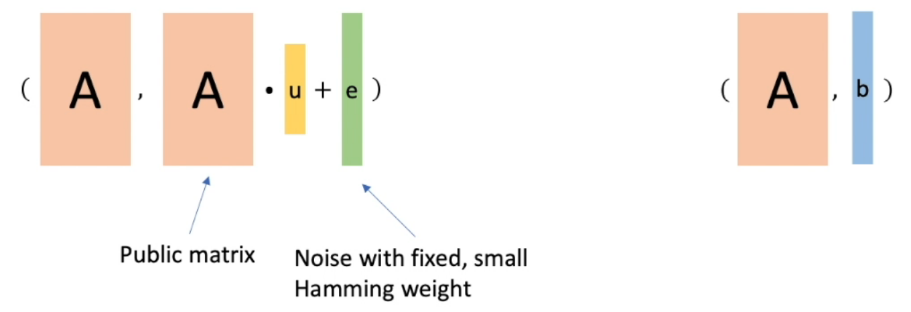
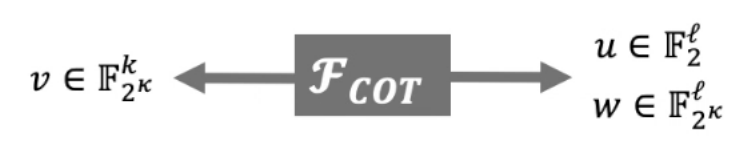
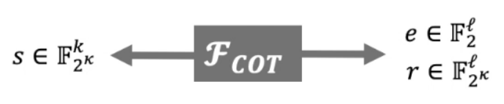
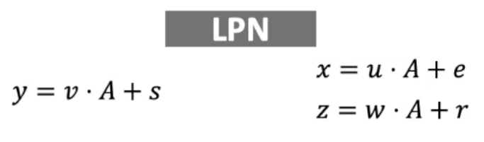
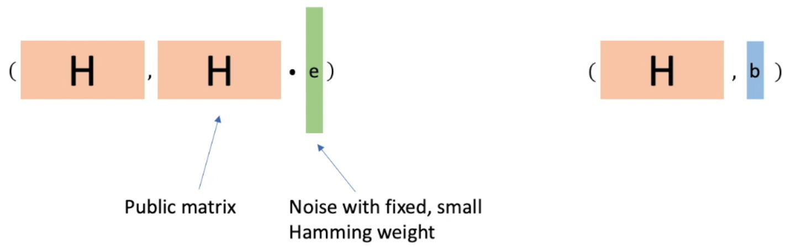
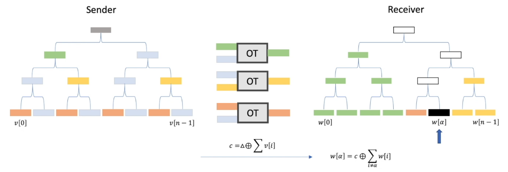
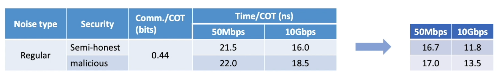
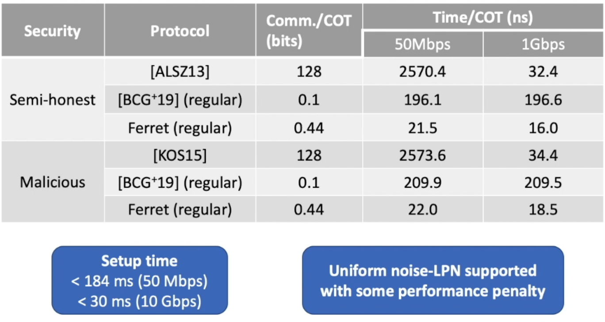
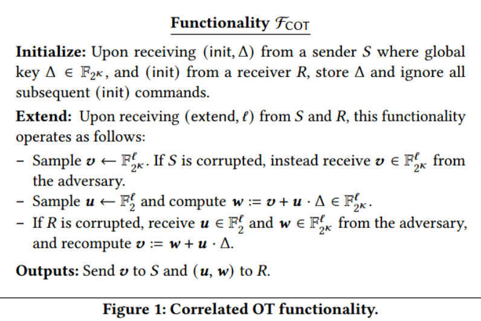
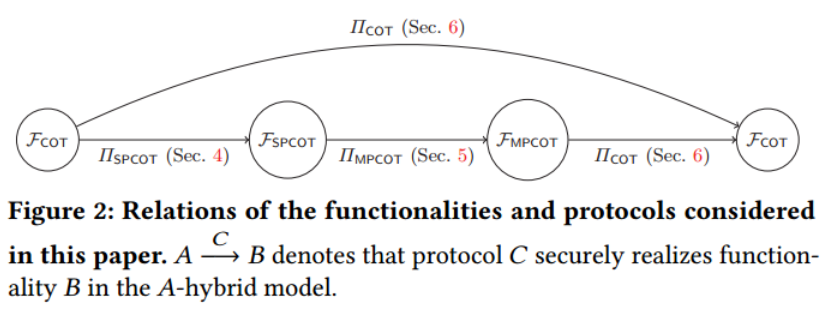

# Ferret: Fast extension for correlated OT with small communication

published at the 27th ACM Conference on Computer and Communications Security

## Part 0 Overview

##### Contributions

Protocol

* Efficient correlated OT for ***semi-honest*** and ***malicious security***
* Based on Learning Parity with Noise (LPN) assumption

Open-sourced ***implementation***

* Communication: 0.45 bits per COT
* Computation:
  * 50 Mbps = 17 ns per COT
  * 10 Gbps = 13 ns per COT

##### Pre-knowledge

###### Correlated Oblivious Transfer (COT)

Application:

* Other variations of OT, ROT, OT...
* Semi-honest protocols: Garbled Circuit, GWM, ...
* Malicious protocols: SPDZ(MASCOT), TinyOT, Authenticated Garbling, ...
* Zero-knowledge proofs: GC-based ZK, ...
* Specific protocols: PSI, threshold ECDSA, ...

###### The primal-LPN assumption

$$
\{(A,b)|A\leftarrow C(k,n,\mathbb{F}_2),\ e\in D_{k,n},\ u\in\mathbb{F}_{2}^k,\ b = u\cdot A+e \}\approx\{(A,b)|A\leftarrow C(k,n,\mathbb{F}_2),\ b\in\mathbb{F}_{2}^k\}
$$

Steps:

1. Obtain k COTs with choice bits **u.** (k<<n)
   * $w=v+u\cdot\Delta$;
   * 
2. Obtain n COTs with choice bits ***e***.  (Comm. = $O(log n)$)
   * $r = s + e\cdot\Delta$;
   * 
3. Combine them based on LPN assumption.
   * $z = y + x\cdot \Delta$;
   * 

###### The dual-LPN assumption

$$
\{(H,b)|H\leftarrow C^{\perp}(N,n,\mathbb{F}_2),\ e\in D_{k,n},\ u\in\mathbb{F}_{2}^k,\ b = e\cdot H \}\approx\{(H,b)|A\leftarrow C^{\perp}(N,n,\mathbb{F}_2),\ b\in\mathbb{F}_{2}^k\}
$$

Cheap communication: $O(t)$;

Heavy computation: e.g. FFT

##### Single-point correlated OT (SPCOT)

General idea: The receiver's choice bit is "1" at only one position

$$
w[i] = \begin{cases}v[i],&i\neq \alpha\\v[i]\oplus\Delta,&i=\alpha\end{cases}
$$

##### Result: VOLE based on LPN assumption

| Protocol                   | Assumption | Security    | Communication | Computation |
| -------------------------- | ---------- | ----------- | ------------- | ----------- |
| Boyle et al. [BCG19]       | Dual-LPN   | Malicious   | Low           | High        |
| Schoppmann et al. [SGRR19] | Primal-LPN | Semi-honest | High          | Low         |
| Ferret                     | Primal-LPN | Malicious   | Low           | Low         |

##### Key ideas

1. Iteration
2. SPCOT with malicious security for free (1ns)
   * Prior approach
     * Too many calls to PRG & hash a long string
   * Their approach - random correlation check
     * The S and R have
       * $v + w = I(n,\{\alpha\})\cdot \Delta$
     * Check the random linear combination
       * $\sum_{i\in[n]}x_i\cdot v[i] + \sum_{i\in[n]}x_i\cdot w[i] = x_\alpha\cdot\Delta$
   * Performance gain from local computation + hardware support

##### Performance

##### Follow up work

* Subfield VOLE for prime field $\mathbb{F}_p$. (malicious, $p = 2^{61}-1$)
  * 87 ns/field element at 50 Mbps
* Zero-knowledge proofs of boolean & arithmetic circuits
  * Information-Theoretic MACs
  * In the pre-processing model

| Circuit Type              | Bandwidth | Performance   |
| ------------------------- | --------- | ------------- |
| Binary                    | 50 Mbps   | <0.50 us/gate |
| Arithmetic (61-bit prime) | 500 Mbps  | <1 us/gate    |

## Part 1 Preliminaries

* $x\leftarrow S$: denotes sampling ? uniformly at random from a finite set S;
* $x\leftarrow D$: denotes sampling ? according to the distribution D;
* $u = I(n,S)$: For any $n\in\mathbb{N}$ and a subset $S\subseteq[n]$, u denotes an n-bit vector, where $u[i] = 0$ for all $i\in\{[n]\wedge\bar{S}\}$ and $u[i] = 1$ for all $i\in S$;
* $X\approx^c Y$: X and Y are computationally indistinguishable.
* 
* 

## Part 2 SPCOT

### General Idea:

> The semi-honest SPCOT protocol works by the sender computing a GGM tree with n leaves (namely {v[i]} iб╩ [n]) and the receiver obtaining all-but-one of the leaves (namely {v[i]}i б╩ [n]\\{$\alpha$}) using an OT protocol. Then the sender can send жд +$\sum_{i\in[n]}$v[i] to the receiver who can compute v[$\alpha$] + жд locally, which completes the semi-honest protocol.

### Detailed Protocol Discription:

#### Parameters

* a length doubling PRG $\ G: \{0,1\}^\kappa\rightarrow\{0,1\}^{2\kappa}$;
* a tweakble CRHF $H: \{0,1\}^{2\kappa}\rightarrow\{0,1\}^\kappa$;
* a cryptographic hash function $H': \mathbb{F}_{2^\kappa}\rightarrow\{0,1\}^{2\kappa}$ as a random oracle.

#### Inputs

Sender

* a gloabal secret key $\Delta\in\mathbb{F}_{2^\kappa}$;
* an integer $n = 2^h, h\in \mathbb{N}$.

Receiver

* same integer $n = 2^h, h\in \mathbb{N}$;
* a single point $\alpha\in [n]$.

#### Protocol

Initialize: (one time only execution)

* S sends (init, жд) to $F_{COT}$;
* R sends (init) to $F_{COT}$.

Extend: (multiple execution allowed)

1. This step is preparing the corelated vectors over $\mathbb{F}^\kappa_b$. Later in step 3 we will use those vectors to mask the information online, and reconstruct the GGM tree locally at the receiver site in step 4.
   * S and R send (extend, h) to $F_{COT}$;
   * The functionality returns $q_i\in\{0,1\}^\kappa$ to S;
   * The functionality returns $(r_i,t_i)\in\{0,1\}\times\{0,1\}^\kappa$ to R, where $t_i = q_i\oplus r_i\cdot\Delta $, for $i\in\{1,...,h\}$.
2. This step is generating the GGM tree by using a length doubling PRG, and compute seeds $K_0^i$ and $K_1^i$ both locally at the sender's site.
   * S picks a random $s_0^0\in\{0,1\}^\kappa$.
   * S computes $(s^i_{2j},s^i_{2j+1}) = G(s_j^{i-1})$, for each $i\in \{1,...,h\}, j\in[2^{i-1}]$;
   * S computes $K_0^i = \oplus_{j\in[2^i-1]}s^i_{2j}$, and $K_1^i = \oplus_{j\in[2^i-1]}s^i_{2j+1}$;
   * (need a picture here)
3. 

### Part 3 MPCOT

### Part 4 Final COT

### Part 5 Evaluation
