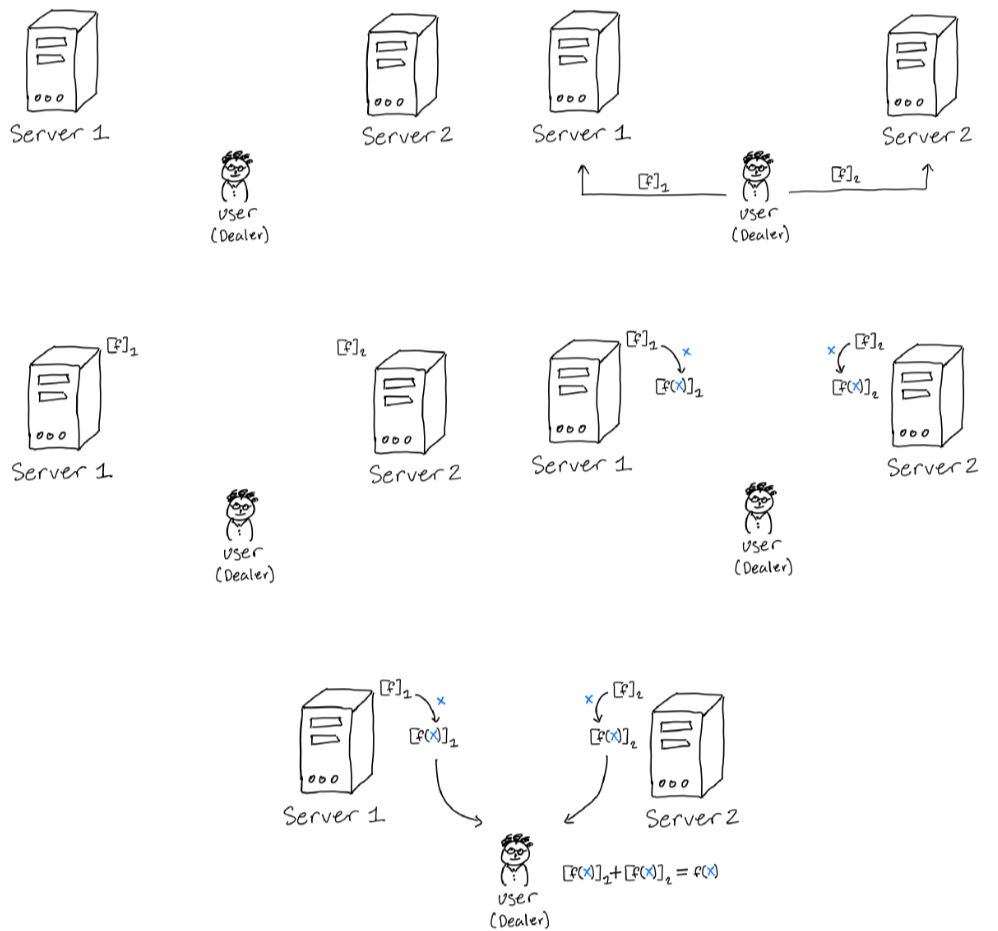
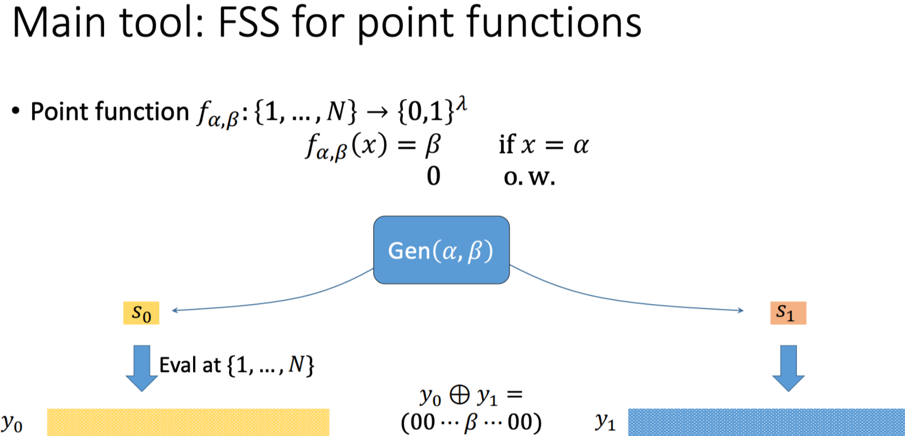
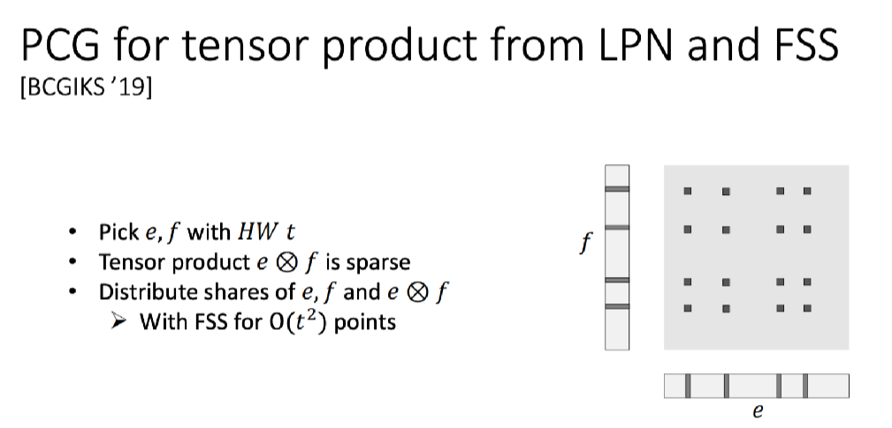
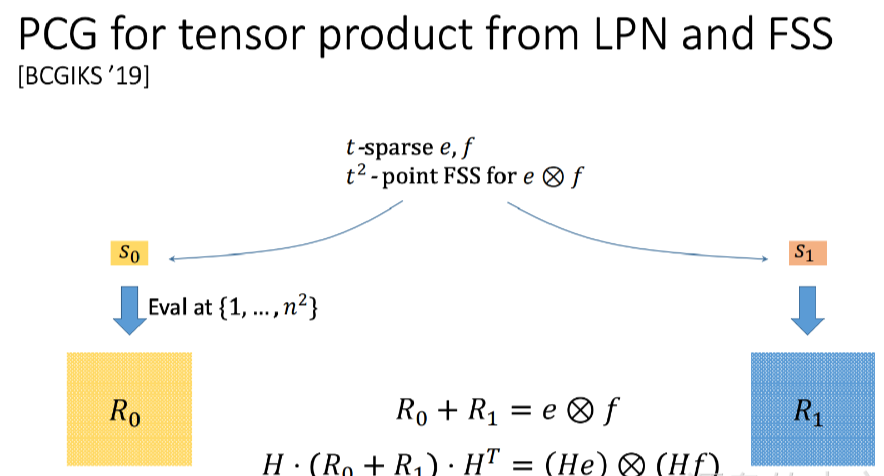
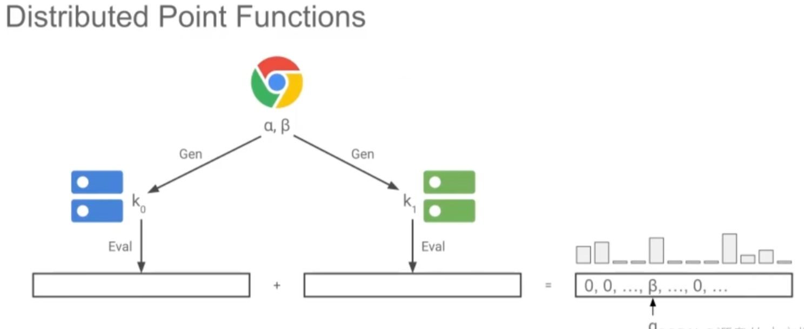

# Functional Secret Sharing, FSS

## Part 1 Definition

    Secret sharing is a method of splitting a value into multiple shares, which can take many forms. Here we focus on additive secret sharing so that the shares can be recombined to restore the secret value. Any strict subset of shares cannot reveal any information about the secret value.

    We use$\ v[i]$ to indicate the ith share of v, use + as reconstruction: $v[1]+v[2] = v$.

    Function secret sharing has a additional requirement that the share of the function$\ f_i$ can be calculate on input $\ x$ to get the result's shares $\ f(x)_i$, where $f(x) = \sum_i f(x)_i$.

    For function as$\ f:\{0,1\}^n\rightarrow\{0,1\}^*$ and p parties, we have:

* $Gen(1^\lambda,f)\rightarrow(f_1,...,f_p)$: partition the function into a compact set of secret shares;
* $Eval([f_i],x)\rightarrow[f(x)]_i$: use secret shares and the secret share of input x and output $[f(x)]_i$;
* $Recover([f(x)]_i)\rightarrow f(x)$: recover f(x) from p secret shares.

## Part 2 Motivation

    Suppose a client wants to run a function on data stored in the cloud, but does not want to expose the function to the cloud server?

Solution: Assume no collusion between servers and use FSS to hide functions.

1. The client uses FSS to secretly share function f and distribute it to the cloud server.
2. the cloud server performs the calculation on the function f of the secret share and returns the result f(x) to the client.
3. the client recombines these shares locally to obtain f(x).

    In addition, FSS is very useful in building privacy-protecting a system:

* Private reading distributed databases (private information retrieval): for example: private keyword searches on remote databases.
* Private write to distributed database (private information write): for example: anonymous communication.
* MPC: For example, generate preprocessing for multiparty computation (Silent OT extension).

## Part 3 FSS and DPF

    The above introduces FSS, which is a general technique for splitting arbitrary functions into secret shares so that these shares can be computed in a distributed environment without revealing the function itself.Each participant holds a share of the function, and through local computation and communication, can calculate the results of the function on some input value, and finally combine these results to restore the output of the function.

    DPF (Distributed Point Function) is a specific form of FSS, specifically for sharing point functions.

    A point function is a very simple function of the form:

$$
DPF(x) = \begin{cases}v,&if\ x = x_0\\0,&otherwise\end{cases}
$$

    DPF allows multiple participants to calculate the function without leaking 2o and v, and recombine to get the correct point function output when needed. Due to the simplicity of the point function, DPF is generally more efficient and has less computational overhead, and is especially suitable for applications where a specific location or value needs to be queried, such as private information retrieval (PIR).

    The distributed point function contains two algorithms (Gen and Eval):

* $Gen(y)\rightarrow (k_a,k_i) $: generate secret keys for y;
* $Eval(k_a,x')\rightarrow y'$: assess DPF on input x.

## Part 4 Reference

[1] [https://sachaservanschreiber.com/slides/pacls.pdf](https://sachaservanschreiber.com/slides/pacls.pdf)

[2] [https://cris.csa.iisc.ac.in/MPCWorkshop/ppts/Talk3_3.pdf](https://cris.csa.iisc.ac.in/MPCWorkshop/ppts/Talk3_3.pdf)

[3] [https://slideplayer.com/slide/15682146/](https://slideplayer.com/slide/15682146/)
