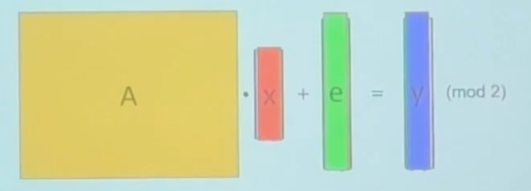
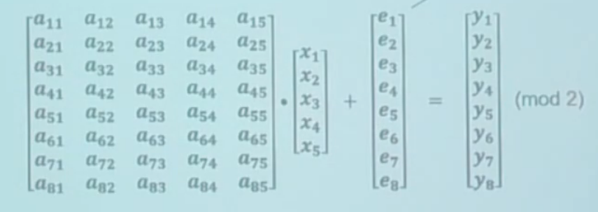

# Learning Party with Noise (LPN)

## Problem Discription

For  $A\leftarrow^{\$}\mathbb{Z}_2^{m\times n}$,$\ x\leftarrow^{\$}\mathbb{Z}_2^{ n}$, $e\sim Bern_\mu^m,\ \hat{y} =_{mod\ 2} Ax+e$;

Given $A,x$, find out $x$; $\Leftrightarrow_{poly}$ Distinguish between $(A,y)\&(A,z\leftarrow^{\$}\mathbb{Z}_2^n)$

noise rate: $Pr(e_i = 1) = \mu$£»

## Evaluation

However, this is a very hard question. The complexity of this problem is based on different noise rates and assumptions:

| Noise rate$\ \mu$     | Assumption              |                                          | Attack                       |
| --------------------- | ----------------------- | ---------------------------------------- | ---------------------------- |
| 0<O(1)<0.5            | Standard LPN            | Sub-exp LPN                              | BKW attack                   |
|                       | $\geq n^{\omega(1)}$    | $\geq 2^{\Omega(n^{0.5})}$               | $\leq2^{O(\frac{n}{log n})}$ |
| $\frac{1}{\sqrt{n}}$  | Low-noise LPN           | Sub-exp low-noise LPN                    | best attack                  |
|                       | $\geq n^{\omega(1)}$    | $\leq2^{\Omega(\frac{\sqrt{n}}{log n})}$ | $\leq2^{O(\sqrt{n})}$        |
| $\frac{(log n)^2}{n}$ | Extremely low-noise LPN |                                          | best attack                  |
|                       | $\geq n^{\omega(1)}$    |                                          | $\leq2^{O(logn)}$            |
