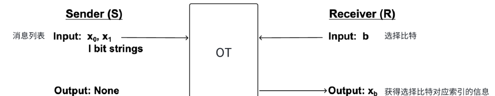

# OT &  OT Extension

    Oblivious Transfer (OT), also known as Oblivious Transfer, plays a very important role as a fundamental functional component in secure multi-party computation (SMPC). It has applications in garble circuits, anonymous queries, and multi-party secure computation.

### Part1: Definition of OT

    OT is very clear in terms of its function. The standard definition of 1-out-of-2 OT involves two parties: the sender S holds two bits of information, and the receiver R holds a selection bit. After the OT protocol is executed,R can get the information of the index corresponding to the selection bit, but cannot get other information, and S does not know which information R selects. It can be generalized to 1-out-of-n OT, that is, the receiver needs to secretly obtain a certain information from the n messages of the sender. Similarly, it is further extended to k-out-of-n OT, that is, out of n messages from the sender, the receiver secretly obtains k messages.

    In the OT protocol, the sender has all the data rights, the receiver has the option of a single data, the data exchange is completed inadvertently, while ensuring the privacy of the private data of both sides.

### Part2:
