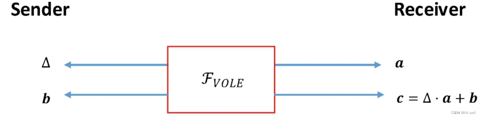
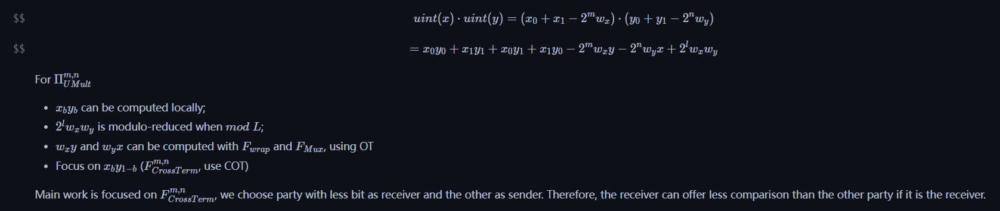

# VOLE (Vector Oblivious Linear Evaluation)

## Part 1 VOLE's General Idea

VOLE sends $\Delta$ and b to the sender, a and c to the receiver with linearity of c,b,a: $c = \Delta\cdot a + b$

Nowadays, the mainstream VOLE is based on LPN assumption.

At abstract level:

## Part 2 VOLE's construction based on LPN assumption

### 2.1 Pre-Knoeledge

1. LPN assumption: go to file: [LPN.md]()
2. FSS (Functional Secret Sharing): go to file: [FSS.md]()
3. VOLE generator
   * VOLE defines 2 algorithm, i.e. VOLE = (Setup,Expand)
     * $Setup(1^\lambda,\mathbb{F},n,x)$ returns a pair of seeds $(seed_0,seed_1)$, where $seed_1$ includes x
     * $Expand(\sigma,seed_{\sigma})$, if $\sigma = 0$, it returns $(u,v)$; otherwise, it returns $w$.
   * Correctness:
     * $(u,v)\leftarrow Expand(0,seed_0)$;
     * $w\leftarrow Expand(1,seed_1)$, where $w = u\cdot x + v$.
   * Saftey
     * for different input x', we have computationally indistinguishable $(seed_0,seed_1)$:
     * The vector $(u,v)$ returned by $Expand(0,seed_{0})$ and random vector $(u',v')$ are computationally indistinguishable.

### 2.2 VOLE's construction

1. First attempt
   * for setup, we have: (a and b are random vectors, hence c is also random)
     * $seed_0\leftarrow(a,b)\in_R\mathbb{F}^k\times\mathbb{F}^k$;
     * $seed_1\leftarrow(c = a\cdot x + b,x)\in\mathbb{F}^k\times\mathbb{F}^k$~~;~~
   * for expand, we have: ($C_{k,n}\in\mathbb{F}^{k\times n}(k<n)$, is a broadcast parameter matrix)
     * $Expand(0,seed_0) = (a\cdot C_{k,n},b\cdot C_{k,n})$;
     * $Expand(1,seed_1) = c\cdot C_{k,n}$
2. Second attempt
   * In the above attempt, Expand maintains a linear relationship, but the resulting strings are not (pseudo-) random. Try to solve this problem with the help of the LPN hypothesis, defining the new Expand algorithm as follows:
   * randomly generate a matrix $C_{k,n}\in\mathbb{F}^{k\times n}(k<n)$ and broadcast them, then use FSS to generate a set of random vectors $\mu,v_b,v_c$ ($v_b + v_c = x\cdot\mu$)
     * $Expand(0,seed_0) = (a\cdot C_{k,n}+\mu,b\cdot C_{k,n}-v_b)$;
     * $Expand(1,seed_1) = c\cdot C_{k,n}+v_c$
   * It's easy to verify that the output of Expand is (pseudo-) random. the Linearity is guaranteed by $\ `v_b + v_c = x\cdot\mu`$.
3. Formal construction based on formal 2 attempts
   * Suppose under LPN assumption, we have public parameters $\mathbb{F},k,n,t = rn,C\in\mathbb{F}^{k\times n}$, then the generator of VOLE canbe defined as:
     * $Setup(1^{\lambda},x)$:
       1. randomly generate $(a,b)\in\mathbb{F}^k\times\mathbb{F}^k,\ \mu\in\mathbb{F}^n$, which satisfy $HW(\mu) = t$;
       2. calculate $c = a\cdot b$;
       3. $(K_0,K_1)\leftarrow FSS.Gen(1^{\lambda},f)$, which satisfy $FSS.Eval(0,K_0) + FSS.Eval(1,K_1) = x\cdot \mu$;
       4. $seed_0\leftarrow(K_0,\mu,a,b),\ seed_1\leftarrow(K_1,x,c)$;
       5. output $(seed_0,seed_1)$.
     * $Expand(\sigma,seed_\sigma)$:
       1. if $\sigma = 0,\ seed_0 = (K_0,\mu,a,b)$, calculate $v_0\leftarrow FSS.Eval(0,K_0)$, output $(u,v)\leftarrow(a\cdot C+\mu,b\cdot C-v_0)$;
       2. if $\sigma = 1,\ seed_1 = (K_1,x,C)$, calculate $v_1\leftarrow FSS.Eval(1,K_1)$, output $w\leftarrow c\cdot C+v_1$;

## Part 3 VOLE's application in MPC, Multipication

Recall that in the multipication gate, how to calculate cross term is a difficult problem.

In sirnn.md, crossterm is addressed by COT. However, it can also be tackled by VOLE. Take $x_0y_1$ as an example:

* $P_0$ has input $x_0$, $P_1$ has input $y_1$;
* Let $P_0$ calculate $v = b\cdot C-v_0$ with $Expand()$ locally;
* Let $P_1$ calculate $w = c\cdot C-v_1$ with $Expand()$ locally;
* therefore, $x_0y_1 = w-v = v_0 + v_1 + c\cdot C-b\cdot C$.

## Part 4 Use VOLE generator to generate VOLE

The VOLE generator is essentially a pseudo-random number generator that generates two strings of pseudorandom numbers that happen to be linearly correlated.

### Pre-calculate:

1. From Tursted Third Party (TTP) draw random number $r_x\leftarrow^R\mathbb{F}$;
2. use VOLE generator to calculate the seeds: $(seed_0,seed_1)\leftarrow^RG.setup(1^\lambda,r_x)$;
3. output $seed_0$ to P0, $(seed_1,r_x)$ to P1.

### Offline:

1. P0 calculate $(r_u,r_v)\leftarrow G.Expand(0,seed_0)$;
2. P1 calculate $r_w\leftarrow G.Expand(1,seed_1)$;

### Online:

Now, P0 has private input (u,v), P1 has w

1. P1 sends $m_x\leftarrow x-r_x$ to P0
2. P0 sends $m_u\leftarrow u-r_u,\ m_v\leftarrow m_x\cdot r_u + v-r_v$ back to P1
3. P1 calculate $w\leftarrow m_u\cdot x+m_v +r_w$;

### Correctness:

Discuss the correctness of VOLE protocol. The random vector computed in the offline calculation stage meets $r_xr_u +r_v=r_w$, so the vector w computed in the online calculation stage P1 meets:

$$
w = m_ux+m_vx+r_w = (u-r_ux)+(m_xr_u + v-r_v) + (r_xr_u + r_v) = ux+v
$$

## Reference:

[https://zhuanlan.zhihu.com/p/606020139?utm_id=0](https://zhuanlan.zhihu.com/p/606020139?utm_id=0)
