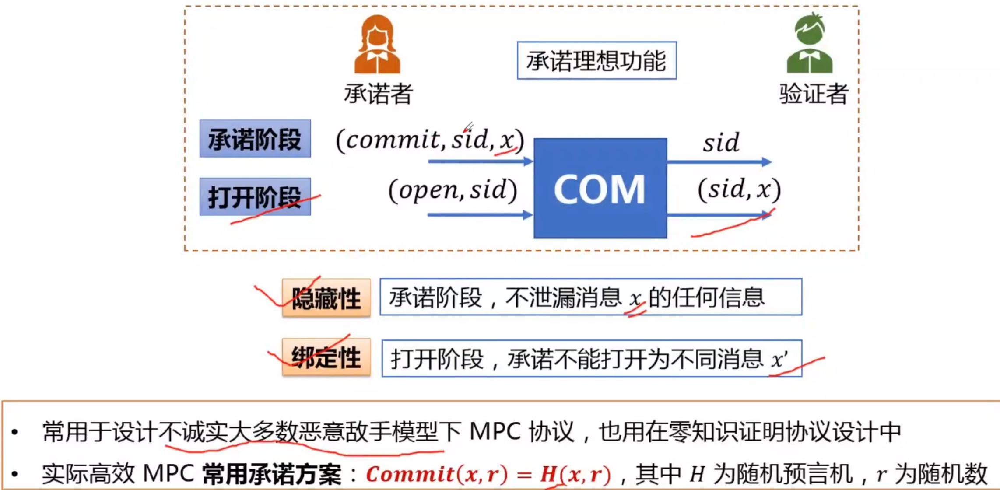
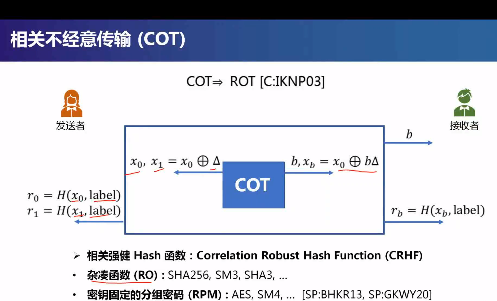

# 安全多方计算 MPC(Muti-Party Computing)

### 定义与运用

两大要素：

隐私性：除了函数输出之外，不泄露任何输入数据的信息

正确性：保证协议输出为指定函数的计算结果

MPC安全定义――基于模拟的安全模型

我们总是希望现实世界中的交互，和拥有理想第三方进行交互的结果是一样的。安全性的证明，就是证明MPC协议的计算概率分布和拥有可信第三方的理想模型是一致的，计算不可分的。

一些历史：

安全多方计算应用

打破数据孤岛，实现安全数据流通

### MPC分类

1，敌手行为

半诚实敌手：按照协议描述执行，但是试图从协议记录中获取信息

恶意敌手：可以执行任何攻击，发送任意消息

2，腐化门限t

t：不诚实参与方总数的上界

3，输出的可达性

中止安全（Security with abort）：腐化实体获得输出后，可以阻止诚实实体获得输出

公平性（Fairness）：要么腐化实体和诚实实体均获得输出，要么他们均没有输出

保证输出传送（Guaranteed output Delivery）：所有诚实实体总是获得输出

腐化实体：被敌手腐化堕落的实体

4，计算模型

5，敌手计算能力

概率多项式时间（ppt）：任意PPT敌手不能打破协议安全性

无线计算能力（信息论安全或无条件安全）：即使无限计算能力的敌手也不能打破协议安全性（抵抗量子计算机攻击）

信息论安全MPC协议需要在诚实大多数模型下设计

6，腐化策略

静态腐化（Static Corruption）：协议运行前，敌手决定腐化哪些实体

自适应腐化（Adaptive Corruption）：在协议运行过程中，敌手能够自适应决定腐化哪些实体

已知高效的MPC协议均考虑静态腐化

7，网络模型

8，MPC设计方法：

### MPC基础组件

线性秘密分享

Linear Secure Share Scheme：

IT-MAC

### 零知识证明

x：定理或者命题

w：证据

和证明者交互之后，验证者不会获得w

完备性：执行协议，验证者可以在不知道w的情况下相信x

可靠性：恶意的证明者不会让验证者去相信x

零知识性：交互记录和模拟器的交互记录在计算上不可区分

### 混淆电路

### 承诺方案

### 投币协议

### 同态加密HE

### 不经意传输OT及其算术变形

安全性：

发送者并不知道b

接收者只能直到消息集合中的一部分

OT依赖于公钥密码组件

OT能够基于不同困难假设构造

Naor-Pinkas协议

1. **输入的秘密共享** ：

* 每个参与者（例如，Alice和Bob）将自己的输入分成多个部分，通常称为“分享”。这些分享可以通过一个秘密共享方案生成，比如Shamir的秘密共享方案。
* 例如，Alice将她的输入 xx**x** 分成 nn**n** 份，只有当至少 tt**t** 个参与者合作时，才能恢复 xx**x**。

1. **加密和随机化** ：

* 每个参与者将自己的分享进行加密，这样即使某个参与者恶意地尝试查看其他人的分享，仍然无法获得真实的输入信息。
* 通常使用同态加密，使得可以在加密状态下进行某些计算。

1. **计算步骤** ：

* 参与者按照预定的协议进行计算。计算通常是通过在每个分享上进行相同的操作来完成的，这样可以保证最终结果的正确性。
* 例如，在加法计算中，参与者可以将各自的分享相加，得到一个新的分享，最终再通过组合这些分享来获得结果。

1. **结果的合并** ：

* 经过计算后，参与者将自己的结果分享组合在一起，最终得到完整的计算结果。
* 只有当足够多的参与者参与时，才能恢复这个结果，从而确保隐私。

1. **安全性保证** ：

* 协议的安全性基于一些假设，比如参与者之间不可信，以及攻击者无法获取足够的分享来恢复输入。
* 通过随机化和加密，协议能够在任何参与者中保持输入的私密性。

在设计OT协议的过程中，我们通常会先设计COT协议，也就是相关OT协议，这一步是简单的，然后可以通过程序化的方法将COT转化为ROT协议，也就是随机OT协议，最后用程序化的方法转化成经典OT

ROT=》OT

对于ROT模块而言，发送者会受到两个随机数$r_0,r_1$，并且接收者会收到一个随机index，c和其中一个值$r_c$。

利用这个ROT模块，我们将随机数当作掩码mask，首先是接收者返回他选定的索引b与收到的索引c的异或的结果，记为e，然后发送者将信息$m_0,m_1$用掩码$r_e,r_{e\oplus1}$异或加密，并返回给接收者，接收者用$r_c$解密

整个过程发送者不知道接收者给他的索引index，接收者也不知道全部的信息(只能解密自己想知道的，而不是自己不应该直到的)

COT=>ROT

其中$x_0,x_1$具有$\Delta$相关性，b是随机索引，将这种相关性转化为random的方式就是通过相关强健Hash Function

VOLE

OLE

