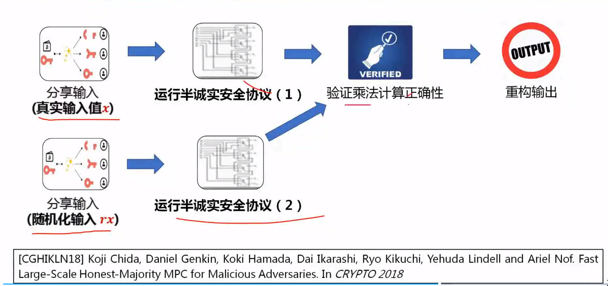

# 基于秘密分享办法的MPC协议

### 基本框架

以上构造建立在安全信道上，其中分享效率和乘法子协议的效率强相关。

### 诚实大多数、半诚实安全的MPC

shamir分享回顾

核心：利用次数为t的随机多项式进行加密，利用拉格朗日插值进行重构

换一种思路，假定我们有n = 2t+1个party其中希望t方参与

我们可以先生成t个域元素，在用这些元素确定系数$\alpha_i$和多项式，继而确定其余t+1个份额

这样的好处是可以利用PRG优化，将通性效率从2t降为t轮通信，也就是分享其余t+1轮通信所需要的通信轮数

而一开始t个随机种子的发放，由于可以用于计算多个shamir，所以可以作为固定沉默成本，在多次生成的平摊中忽略不计

需要注意的是，由于每一个party在各自执行完Share之后，都会收到别的party传来的分享$r_i$，所以可以进行本地计算，而诚实参与方发存在可以保证最终$r$是均匀随机的

第二种办法：范德蒙矩阵

核心：这种方法可以将原本[u]中n-t个诚实参与方发随机性均匀扩散到输出分享$[r_1,...,r_{n-t}]$中

乘法子协议：

零分享指的是零和，但是每一份的值都是随机的

有4个问题：本地计算份额为什么会算出来$[z]_{2t}$

    为什么要随机化

    A是怎么构造的

    如何证明数学上的一致性，即：$[x * y] = reconst(x_i * y_i)$

### 诚实大多数假设下乘法验证技术

加法和数乘可以在本地运行，有正确性保障

但是乘法需要乘法门协议通信，所以需要乘法正确性验证技术来保障乘法协议免受恶意敌手攻击

对偶验证技术

有效率问题，验证一次乘法，需要多引入两次乘法

需要优化

为什么引入投币协议会优化效率？

但是f可能依赖$\alpha_i$，故而无法证明安全性

敌手映入e，d，f来破坏乘法门的正确性，如何保证e，d，f是独立的？

换而言之，验证一次乘法，需要第三方第四方来提供对偶乘法，我们是否有假设，即第四方第三方是独立的，不是联合攻击的？

### 半诚实安全GMW协议及其优化

经过观察，P0并不知道P1选择了穷举之后的哪一种情况，他只知道$x_0,y_0$而P1也只知道$x_1,y_1$

经过随机选取$Z_0$，P0确定了$z_0$，通过这个协议，也可以让P1知道$Z_1$

图上的示例给出了一个分享$x_0\land y_1$

分享$x_1\land y_0$也是如此

推广到n-party：

$$
[a],[b],[c]
$$

是随机生成的beaver三元组

### 恶意安全SPDZ协议

其中，双方括号指的是x的认证分享，里面都是加法分享，包括认证码分享，源信息分享和全局密钥分享

SPDZ认证分享具有可以本地计算的加法同态性，认证码的打开过程分为两步

一个是打开x，另一个是检查认证分享值为0

SPDZ认证分享的批量打开可以优化

SDPZ协议的效率瓶颈

基本思想就是通过牺牲了牺牲三元组的正确性，来验证被验证三元组的正确性

$$
\eta=r\cdot x-a
$$

