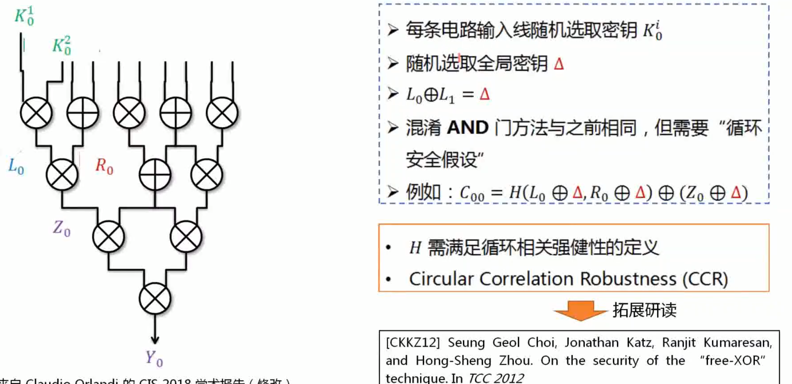
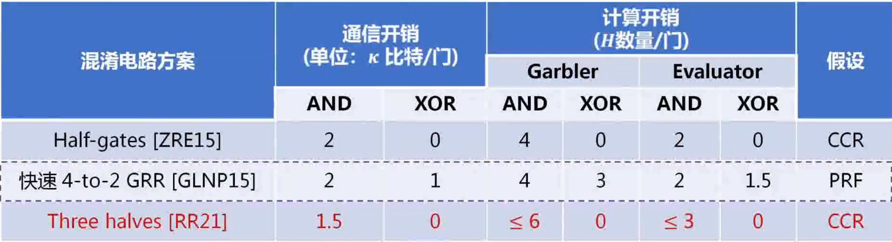

# 基于混淆电路方法的安全多方计算协议

### 内容概要

本讲主要介绍安全两方计算(2PC)协议的设计方法，重点涉及混淆电路的构造方法

2PC只有两方，分为混淆方和计算方

本讲介绍的MPC协议具有0(1)轮数的复杂度，与电路深度d无关

第二讲介绍的MPC协议要求0(d)轮数复杂度

### 常数轮的MPC协议

常数轮安全多方计算(n>2)

* 不同于两方情况，在多方情况下，存在多个参与方合谋
* 不能让任何一方计算整个混淆电路，需要所有参与方共同分布式计算混淆电路

### Yao的半诚实安全两方协议

混淆电路基本定义：

* f为电路，F为混淆电路
* e编码信息，d解码信息
* x电路输入，y电路输出
* X输入编码，Y输出编码
* Garble混淆算法
* Encode编码算法
* Eval计算算法
* Decode解码算法

混淆电路的模拟安全定义：

若约等号左右两边在计算上不可区分，则混淆电路满足模拟安全定义：

Yao半诚实安全两方协议的核心思想，就是实现z=f(x,y)的安全两方计算，他的步骤如下：

1. 首先利用Garble算法将函数$f(x,y)$转化为混淆电路F，编码信息e和解码信息d
2. 在离线阶段计算方获得F和d，混淆方拥有解码信息e
3. 进行两方OT协议，计算方输入为y，混淆方输入为e，最终计算方获得y的输出编码Y
4. 混淆方在本地用e编码x，获得输出编码X
5. 在线阶段混淆方将X发送给计算方
6. 计算方本地执行Eval算法，输入为F，X，Y，输出为z的编码Z
7. 最终计算方在本地执行Decode算法，输入为d和Z，输出为Z

   上面这个流程描述的是输出被计算方独享的半诚实安全两方协议，实际上也有流程可以将上述方法转变为混淆方和计算方都拥有输出的半诚实安全两方协议，只有两轮通信。造成Yao半诚实安全两方协议的效率瓶颈在于混淆电路的尺寸。

### 混淆电路的构造和效率的比较

#### 混淆电路的基础框架

Garble混淆算法

* 对于每一条电路线，选取密钥($K_0^i,\ K_1^i$)
* 对于每一个电路门：
  * 左输入线密钥$(L_0,\ L_1)$
  * 右输入线密钥$(R_0,\ R_1)$
  * 输出线密钥$(Z_0,\ Z_1)$
  * 计算混淆门$gg\leftarrow Gb(g,L_0,L_1,R_0,R_1,Z_0,Z_1)$
* 电路输入线的密钥构成编码信息$e=\{(K_0^i,\ K_1^i)\}$
* 电路输出线的密钥构成解码信息$d = (Y_0,Y_1)$
* 所有混淆门构成混淆电路$F = \{gg^i\}$

Encode算法

$$
X\leftarrow Encode(e,x)
$$

输入： $e = \{(K_0^i,K_1^i)\}$和$x = (x_1,...,x_m)$

输出：$X = (K_{x_1}^1,...,K_{x_m}^m)$

Decode算法

$$
y\leftarrow Decode(d,Y)
$$

输入：$d = \{Y_0, Y_1\}$和Y

输出：若$Y = Y_0$，则输出$y=0$；若$Y=Y_1$，则输出$y=1$；否则，输出中止符$\perp$

$$
Y\leftarrow Eval(F,X)
$$

#### 混淆单个电路门

核心思想，选取密钥之后，密钥的下标满足电路门的运算规则

##### TextbookYao混淆电路

核心在于利用H()作为密钥导出函数，保证加密安全性

然后利用H()将输入密钥加密输出密钥得到$C_{ab}$

最后通过模加的形式得到Z

问题在于，当我们使用Eval算法的时候，是已经知输入a，b了

所以输入信息和输出信息会泄露

一个很自然的想法就是置换查找表的行，但明显这会导致无法判断密文解密的正确性

###### 第一种解决思路：K-bit 0字串

核心思想是不再利用H函数单独加密Z

而是加密Z合并一个K-bit0字符串的尾巴

这样我们无论怎么置换查找表，也可以通过解密后，密钥的尾巴0的数量来判断是否解密正确

不过这就需要我们挨个解密，直到找到正确的结果

因此通信开销和计算数量大

###### 第二种解决思路：点置换优化

核心思想是不再采用0字符串作为尾巴，而是采用1-bit的置换bit作为判断依据

其中$\alpha,\beta,\gamma$可以是随机生成的，但为了简化运算量，我们可以用密钥的最低bit作为置换比特，并在最后当尾巴

需要注意的是，置换bit在混淆电路生成时就存在了

我们给到Eval函数的输入值是$a\oplus\alpha,b\oplus\beta$

实际的门运算逻辑体现在a，b，c上（c=ab）

这样我们就采用了置换bit达到了密文替换的效果

##### 混淆电路计算效率的改进

###### 基于H函数的改进：

当然也可以采用AES算法的加密换算实现电路中的特殊Hash函数

也可以基于硬件指令(AES-NI)加速，混淆电路的效率瓶颈是通信开销

###### 混淆行约化技术：基于密钥选择的改进

选取Z0直接就是H(L0,R0)

###### Free XOR技术：基于本地门计算的改进

核心思想也是更改密钥的选取，区别在于密钥之间都是通过全局密钥delta来建立相关性

这样的计算缺点在于H()的选择需要满足一个更强的条件

关于本地计算的证明，可以发现XOR不需要通信，密钥之间异或就可以了

###### 优化结果：

进一步优化：

# MPC综述论文推荐：

