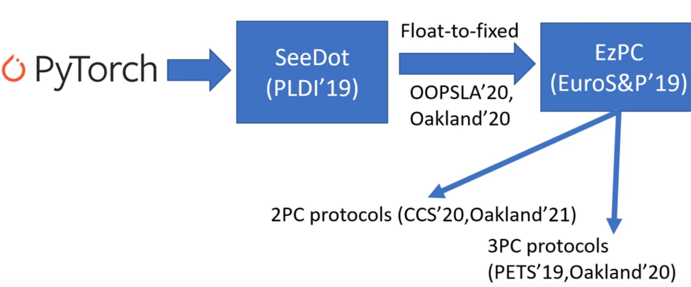
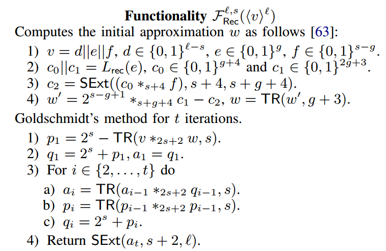

# SIRNN: A Math Library for Secure RNN Inference

this is published at Oakland'21

### Part 0: Overview

##### Background

Secure inference in PPML, which is a typical situation for Secure 2-Party Computation(2PC)

Hospital should learn no information about client's data

Bob: should only learn model output

##### Goal

Push-button solution to run secure inference of arbitrary ML models

##### Overall System

Poster: Multi institution AI validation without data sharing

##### Motivation by Industry practices

1. Secure inference accuracy should match insecure inference
2. Retraining a more 2PC-friendly model is not an option
   * The model training team is disjoint from the model deployment team
   * Getting permission to onboard training dataset is a long lengthy legal process
3. Minimize total runtime per inference

##### Application Senarios

Head detection in images: combine CNNs and RNNs to go beyond classification

##### Challenges

* Uses floating-point arithmetic
  * With current techniques, secure floating-point is inefficient
  * Solution: float-to-fixed converters
* Running fixed-point code securely has 2 challenges
  1. Use of math functions
     * Accurate math functions require high bitwidths
  2. Use of mixed-bitwidths
     * All prior works use uniform bitwidth
     * Uniform bitwidth pays the cost of largest bitwidth everywhere
     * Performance depends cirtically on bitwidths
       * degrades at least linearly; quadratically for mutiplication

##### Contributions

* Create SIRNN, a library for semi-honest secure inference
* Support for mixed-bitwidth arithmetic
  * New 2PC building blocks
* Support for math functions
  * New math implementations for sigmoid/tanh, exponentiation, and reciprocal sqrt
  * Efficient to implement using those building blocks
  * Provably precise
* No loss in inference accuracy
* First to run RNNs securely on speech data and head detection in images
  * SIRNN is 2 magnitude faster than prior work

##### Components' Hierarchy

* Extension: y=x

  * Zero Extension: y = ZExt(x,n)
* Truncation: $y = \lfloor\frac{x}{2^s}\rfloor$

  * Logical Right-shift: $y = x>>_L s$
  * Truncate-Reduce:$y = TR(x,s)$   
* Mutiplication:$z = x\cdot y\ mod \ 2^l $

  * Unsigned Mutilication: $z = x*_ly$  
* Digit Decomposition: $x = x_{l/d-1}||...||x_0,\ x_i\in\{0,1\}^d$
* Performance:

Fixed-point code is mixture of 8/16/32/64-bits

* Uniform bitwidth 2PC is about 3 times slower
* Half time spent in sigmoid/tanh

##### Potential Improvements

* Post-training quantization (float-to-fixed) is brittle
* Limited to security against semi-honest adversaries
* Large inference tasks exceed available RAM

### Part 1: Notations

* 1{b}: return 1 when b is true
* $\zeta_{l,m}(x)$: for $x\in \mathbb{Z}_L$, map $x$ to $\mathbb{Z}_{M}$, $m\geq l$
* int(x) and uint(x): for $x\in \mathbb{Z}_L$, refer to the sign and unsign values in $\mathbb{Z}$, $int(x) = uint(x)-MSB(x)\cdot L$: the upper half range is negative, the lower half range is positive.
* $F^{l}_{Mill}(x,y): \lang z\rang^B = 1\{x<y\}^a$;
* $F^l_{Wrap}(x,y) = F^l_{Mill}(L-1-x,y):\ w=wrap(x,y,L)$
* $e = 1\{(x+y\ \ mod\ L)=L-1\}$, check whether x+y is all 1s string on the ring
* $F^l_{Wrap\ \&All1s}(x,y) = (\lang w\rang^B||\lang e\rang^B)$, this is the combo of the former 2, return a 2-bit string. *There 's no possibility for (11)*
* $L = 2^l,\ M = 2^m,\ N = 2^n$

$$
x<y = (x_0<y_0)\vee((x_0=y_0)\wedge(x_1 < y_1)),\ x = x_0||x_1,\ y = y_0||y_1
$$

### Part 2: Extension

##### 2.1 Zero extension

$$
F^{m,n}_{ZExt}:y = ZExt(x,m,n)\in\mathbb{Z}_N\ with\ uint(y) = uint(x),\ n>m
$$

* $\lang x\rang^m\in\mathbb{Z}_M$, we have ***equation (1)***

  $$
  x = \lang x\rang^N_0+\lang x\rang^N_1-w\cdot M
  $$

  where w is in $\lang \cdot\rang^B$;
* $F^{n-m}_{B2A}(\lang w\rang^B)=\lang w\rang^{n-m}\in\mathbb{Z}_{2^{n-m}} $;

  * $w = \lang w \rang_0^{n-m} + \lang w\rang_1^{n-m} - 2^{n-m}\cdot\ wrap(\lang w \rang_0^{n-m} ,\ \lang w\rang_1^{n-m} ,\ 2^{n-m})$;
  * $M*_nw = M*_n(\lang w \rang_0^{n-m} + \lang w\rang_1^{n-m})$, where $x*_ny = x\cdot y\ mod\ N$;
* Let

$$
y = \sum^1_{b = 0}(\lang x\rang^m_b - M\cdot\lang w\rang_b^{n-m})\ mod\ N
$$

    we have$x\ mod\ N = y$;

    The ring conversion for the share of x can be easily done locally, however, the convertion for w can be optimized by not converting to n ring, but converting to n-m ring instead, which is the same in terms of math and saves communication expense.

##### 2.2 Signed Extension

$$
F^{m,n}_{SExt}:y = SExt(x,m,n)\in\mathbb{Z}_N\ with\ int(y) = int(x),\ n>m
$$

$$
int(x) = uint(x') - 2^{m-1}\ for\ x' = x + 2^{m-1}\ mod\ M
$$

Proof

* $x<2^{m-1}:\ x + 2^{m-1} < M$, we thus have $x' = x + 2^{m-1}$ in Z.
  * Therefore, $int(x) = x = uint(x') - 2^{m-1}$
* $x\geq2^{m-1}:\ x + 2^{m-1}\leq M$, we thus have
  * $x' = x + 2^{m-1}-2^m = x-2^{m-1}\ in\ \mathbb{Z}$, since $int(x)= x - 2^m = (x-2^{m-1})-2^{m-1} = x' - 2^{m-1}\ in\ \mathbb{Z}$, we have $int(x) = uint(x') - 2^{m-1}$

Thus, we implement $F_{SExt}^{m,n}$ based on $F_{ZExt}^{m,n}$ as $F_{SExt}^{m,n}(x) = F_{ZExt}^{m,n}(x') - 2^{m-1}$ without increase communication spense

Here, x is the real number with sign, $x\in[-2^{m-1},2^{m-1}-1]$, x' is the unsigned number

### Part 3: Truncation

##### 3.1 Logial Right Shift: $\rang\rang_L$

For $x\in\mathbb{Z}_L$, $x = \lang x\rang_0^l + \lang x\rang_1^l\ mod\ L$, denote $\lang x\rang_b^l = u_b||v_b$, where $u_b\in \{0,1\}^{l-s}$ and $v_b\in \{0,1\}^s$, based on ***equation (1)***, we have ***equation (2)***

$$
x\rang\rang_L s = u_0 + u_1 - 2^{l-s}\cdot \ wrap(\lang x\rang_0^l,\ \lang x\rang_1^l,\ L) + wrap(v_0,\ v_1,\ 2^s)
$$

A trivial solution is compute $wrap(\lang x\rang_0^l,\ \lang x\rang_1^l,\ L) $ and  $wrap(v_0,\ v_1,\ 2^s)$ directly.

Optimization: Use $\lang u \rang^{l-s}$ and $\lang v \rang^{s}$ compute $wrap(\lang x\rang_0^l,\ \lang x\rang_1^l,\ L)$ in order to save communication spense

Lemma:

Let $x\in\mathbb{Z}_L$, where $u_b\in \{0,1\}^{l-s}$ and $v_b\in \{0,1\}^s$. Define $c = wrap(v_0,\ v_1,\ 2^s) $, $d = wrap(u_0,\ u_1,\ 2^{l-s})$, $e = 1\{(u_0+u_1\ \ mod\ 2^{l-s})=2^{l-s}-1\}$, and $w = wrap(\lang x\rang_0^l,\ \lang x\rang_1^l,\ L) $, then $w = d\oplus(c\wedge e)$

Proof:

Let $x_b = \lang x\rang_b^l$, then in $\mathbb{Z}$ we have $x_b = u_b\cdot2^S + v_b$, and

$$
x_0 + x_1 = (v_0 + v_1) + (u_0 + u_1)\cdot2^s
$$

$$
=(v_0 + v_1 - c\cdot2^s) + (u_0 + u_1-d\cdot2^{l-s})\cdot2^s + c\cdot2^s + d\cdot L
$$

$$
= v' + (u' + c)\cdot2^s + d\cdot L
$$

Let $w' = 1\{u'+c > 2^{l-s}-1\}$, we have ***equation (3)***

$$
x_0+x_1 = v' + (u' + c-w'\cdot2^{l-s})\cdot2^s + (d+w')\cdot L
$$

* $d = 1\Rightarrow u_0 + u_1\geq2^{l-s}(\Leftrightarrow u_0 + u_1 > 2^{l-s}-1)\Rightarrow e = 0\ (because\ u' = u_0 + u_1 + 1\cdot2^{l-s}.\ u_0, u_1 \leq 2^{l-s}-1, u'\leq2^{l-s}-2)$. Thus, $w' = 0$, no matter c= {1,0};
* $d = 0\Rightarrow u_0 + u_1\leq2^{l-s}-1\Rightarrow w' = 1\ iff\ (u' = 2^{l-s}-1) \wedge(c = 1) \Leftrightarrow (e = 1) \wedge(c = 1).\ Otherwise, w' = 0$

Therefore, at most one of d and w' is 1. Thus

$$
x_0+x_1 = v' + (u' + c-w'\cdot2^{l-s})\cdot2^s + (d\oplus(c\wedge e))\cdot L
$$

Since $v'<2^s$ and $u' + c - w'\cdot 2^{l-s} < 2^{l-s}$,  therefore $v' + (u' + c-w'\cdot2^{l-s})\cdot2^s < 2^l$, we have

$$
w = d\oplus(c\wedge e)
$$

##### 3.2 Arithmetic Right Shift: $\rang\rang_A$ & Truncate and Reduce $\lang TR(x,s)\rang^{l-s}$

Recall that $int(x) = uint(x') - 2^{m-1}\ for\ x' = x + 2^{m-1}\ mod\ M$.

$$
\Rightarrow x\rang\rang_A = (x' \rang\rang_L s)- 2^{l-s-1}
$$

From ***equation (2)***, we have $\lang TR(x,s)\rang^{l-s} = u_0 + u_1 + wrap(v_0,\ v_1,\ 2^s)$, since $2^{l-s}*_l wrap(\lang x\rang_0^l,\ \lang x\rang_1^l,\ L)\ mod\ 2^{l-s} = 0$.

##### 3.3 Division by power-of-2

In C++ convention, we have

$$
F_{DivPow2}^{l,s}(x) = \begin{cases}\lceil\frac{int(x)}{2^s}\rceil\ mod\ L,\ x<0\\\lfloor\frac{int(x)}{2^s}\rfloor\ mod\ L,\ x \geq0\end{cases}
$$

Let $sign(x) = 1\{x\geq2^{l-s}\}$, $c = 1\{x\ mod\ 2^s \neq 0\}$, we have

$$
DivPow2(x,s) = (x\rang\rang_A s) + sign(x)\wedge c
$$

### Part 4: Multiplication with non-uniform bitwidths

##### 4.1 Unsigned Mutiplication

For $F_{UMult}^{m,n}$

* Input $\lang x\rang^m$ and $\lang y\rang^n$;
* Output $\lang z\rang^{l}$ with $z = uint(x)*_luint(y)$ and $l = m+n$.

$$
uint(x)\cdot uint(y) = (x_0 + x_1 - 2^mw_x)\cdot(y_0 + y_1-2^nw_y)
$$

$$
= x_0y_0 + x_1y_1 + x_0y_1 + x_1y_0 - 2^mw_xy - 2^nw_yx + 2^lw_xw_y
$$

For $\Pi^{m,n}_{UMult}$

* $x_by_b$ can be computed locally;
* $2^lw_xw_y$ is modulo-reduced when $mod\ L$;
* $w_xy$ and $w_yx$ can be computed with $F_{wrap}$ and $F_{Mux}$, using OT
* Focus on $x_by_{1-b}$ ($F_{CrossTerm}^{m,n}$, use COT)

Main work is focused on $F_{CrossTerm}^{m,n}$, we choose party with less bit as receiver and the other as sender. Therefore, the receiver can offer less comparison than the other party if it is the receiver.

##### 4.2 Signed Multiplication

For $F_{SMult}^{m,n}$

* Input $\lang x\rang^m$ and $\lang y\rang^n$;
* Output $\lang z\rang^{l}$ with $z = int(x)*_lint(y)$ and $l = m+n$.

Firstly, compute $x' = x + 2^{m-1}\ mod\ M$ and $y' = y + 2^{n-1}\ mod\ N$ with $x' = x_0' + x_1'\ mod\ M $ and $y' = y_0' + y_1'\ mod\ N$, then

$$
int(x)\cdot int(y) = (x'-2^{m-1})\cdot(y'-2^{n-1}) = x'\cdot y' - 2^{m-1}(y_0' + y_1'-2^nw_{y'}) - 2^{n-1}(x_0' + x_1'-2^mw_{x'}) + 2^{m+n-2}
$$

* $x'y'$ can be computed using $F_{UMult}^{m,n}$;
* $2^{l-1}(w_{x'} + w_{y'}):\ 2^{l-1}w_{x'} = 2^{l-1}(\lang w_{x'}\rang^B_0 + \lang w_{x'}\rang^B_1 - 2\lang w_{x'}\rang^B_0\lang w_{x'}\rang^B_1)$, the last term can be modulo-reduced when $mod\ L$.

##### 4.3 Matrix Multiplication and Convolution

$C = AB$ with $A\in \mathbb{Z}^{d_1\times d_2}_{M},\ B\in \mathbb{Z}^{d_2\times d_3}_{N},\ C\in \mathbb{Z}^{d_1\times d_3}_{L}$, and $l=m+n$

* Addition introduces overflow;
  * $log_2d$-bits extension.
* Immediate-values element-wise extension: $d_1d_2d_3\times $extension.
* Optimization: In $F_{CrossTerm}$, 2 parties extend the larger-bit input by $log_2d$-bits. This approach is faster than perform $F_{SExt}$ to the data in the matrices in the first place

Multiply and Truncate: $l\leq m+n$.

By using img2col, convolution and mutiplication are the same.

### Part5: Digit Decomposition & MSNZB

##### 5.1 Digit Decomposition

For $F_{DigDec}^{l,\{d_i\}_{i\in[c]}}$

* Input $\lang x\rang^l$;
* Output $\lang z_{c-1}\rang^{d_{c-1}},...,\lang z_{0}\rang^{d_{0}}$ with $x = z_{c-1}||...||z_0$.

Considering $d|l$ and $c=l/d$.  Denote $\lang x\rang_b^l = y_{b,c-1}||...||y_{b,0}$ and $Y_{b,i} = y_{b,i}||...||y_{b,0}$.

$$
z_i = y_{0,i} + y_{1,i} + carry_i\ mod\ 2^d
$$

where $carry_i = Y_{0,i-1} + Y_{1,i-1}\geq2^{id}\ (\Leftrightarrow wrap(Y_{0,i-1},\ Y_{1,i-1},\ 2^{id}))$. However we can optimize this by using recursion according to the previous lemma.

$c = wrap(Y_{0,i-2},\ Y_{1,i-2}, 2^{(i-1)d}),\ d = wrap(y_{0,i-1}, y_{1,i-1},2^d), e = 1\{(y_{0,i-1} + y_{1,i-1\ mod\ 2^d}) = 2^d-1\}$, and $carry_i = wrap(Y_{0,i-1},Y_{1,i-1},2^{ib})$, we have $carry_i = d\oplus(c\wedge e)$.

##### 5.2 Most Significant Non-Zero Bit (MSNZB)

For $F^l_{MSNZB}$

* Input $\lang x\rang^l$;
* Output $k\in[l]$ with $x_k = 1$ and $x_j = 0$ for $j<k$.

$F^{l,d}_{DigDec}(x) = {y_i}_{i\in[c]}\Rightarrow MSNZB(x) = MSNZB(y_i) + id$ with $y_i\neq 0$ and $y_j = 0$ for $j>i$;

Wisdom of division and conquer

Solution:

* Let $\iota = log_2l,\ F_{MSNZB-P}^{d,l,i}(\lang y_i\rang^d) = \lang u_i\rang^\iota$ with $2^{u_i-id}\leq y_i<2^{u_i-id+1}$;
* $F_{Zeros}^d(\lang y_i\rang^d): v_i = 1\{y_i = 0\}$;
* $z_i'=u_i\cdot(1\oplus v_i)\cdot\Pi_{j>i}v_j,$ such that $z_i' = u_i$, iff. $y_i\neq0$ and $y_j = 0$ for $j\neq i$
* $MSNZB(x)=\sum_i(z_i' + id)$
* For $F_{MSNZB-P}^{d,l,i}(\lang y_i\rang^d)$, we use OT and LUT

### Part6: MSB to Wrap Optimization

* $w = wrap(\lang x\rang^l_0,\ \lang x\rang^l_1,\ L)$;
* $m_x = MSB(x)$ is known or $\lang m_x\rang^B$ is known;
* $w = ((1\oplus m_x)\wedge(m_0\oplus m_1)\oplus(m_0\wedge m_1))$;
* $\begin{pmatrix}4\\1\end{pmatrix}-OT_1$ or $\begin{pmatrix}2\\1\end{pmatrix}-OT_1$

### Part7: Math Library

    By using those building blocks mentioned ahead, we can implement math functions like exponential, sigmoid, tan hyperbolic (tanh), and reciprocal square root. The key is to break down the problem into small ones. And then use LUT to tackle them. Mathmatical techniques like Goldenschmidt's also help. Note that these functions are impossible to implement exactly using finite-bit arithmetic, and hence, our implementations realize them approximately.

    For a functionality$\ f$ that takes as input the shares $\lang x\rang^m$ and outputs $\lang y\rang^n$ such that:

$$
srt_{n,s'}(y) = f(srt_{m,s}(x))
$$

##### 7.1 Expotential

    The protocol for this functionality can be built easily relying on the protocols described above.

* Step 1 can be implemented by a call to the digit decomposition functionality, $F_{DicDec}$;
* The LUTs in Step 2 can be looked up using $F_{LUT}$;
* These (s'+2)-bit values are multiplied using a tree-based multiplication using $F_{SMultTR}^{s'+2,s'+2,2s'+2,s'}$ to get an (s'+2)-bit number with scale s' in Step 3.
* Finally, Step 4 extends g to an n-bit value using $F_{SExt}^{s'+2,n}$.

##### 7.2 Sigmoid and Tanh

    Consider the math functionality$\ F_{sigmoid}^{m,s,n,s'}$ where $sigmoid(z) = \frac{1}{1+e^{-z}}$ can be written as

$$
sigmoid(z) = \begin{cases}0.5,&z=0\\\frac{1}{1+rExp(z)},&z>0\\rExp(z)\cdot\frac{1}{1+rExp(z)},&z<0\end{cases}
$$

Hence, sigmoid can be built by extending the math functionality $F_{h}^{m,s,n,s'}$ such that $h(z) = \frac{1}{1+rExp(z)}$ described in Figure 4. This functionality calls $F_{rExp}$ that we described above, followed by a call to a functionality to approximate the reciprocal that we describe next.

Tanh. The math functionality $F_{tanh}^{m,s,n,s'}$ where $tanh(z) = \frac{e^z-e^{-z}}{e^z+e^{-z}} = 2\cdot sigmoid(2z)-1$ can be realized using $F_{sigmoid}$.

##### 7.3 Reciprocal of Square Root

    In order to compute$\ rsqrt(x) = \frac{1}{\sqrt{x}}$, we add a small value to the denominator $\frac{1}{\sqrt{x+\epsilon}}$

$$
L_{rsqrt}(e||B) = Fix(\frac{1}{(B+1)(1+urt_{(g,g)}(e))},g+4,g+2)
$$

##### 7.4 Evaluation

    By using exhaustive testing, they prove that our math implementations are precise for chosen parameters and provide standard precision guarantees that are expected from math libraries.
